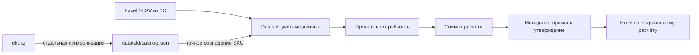

# Umytpa — рекомендованные заказы поставщикам

Сервис для менеджера закупа ТОО «Электрокомплект»: читает выгрузки продаж и запасов, рассчитывает пополнение по артикулу и складу, объясняет количество, позволяет исправить и утвердить позиции, экспортирует результат в Excel. Кейс HackAlem AI: [relly-problem.md](relly-problem.md).

**Для запуска прототипа установка или подключение 1С не нужны.** Достаточно приложенных Excel-файлов и Python/Node.js. Сейчас приложение читает файлы, а не работающую базу 1С. Для регулярной эксплуатации потребуется согласованное обновление учётных данных; варианты описаны в [ИНТЕГРАЦИЯ_1С.md](docs/ИНТЕГРАЦИЯ_1С.md).

## Два независимых источника

| Источник | Для чего используется |
|---|---|
| Выгрузки 1С: Excel или CSV | Продажи, остатки, ожидаемые приходы, поставщики, MOQ/кратность, сезонность. Они задают числа для расчёта. |
| Публичный каталог ekt.kz: локальный JSON | Товарная категория, подкатегория, характеристики и ссылка на карточку для существующих SKU. Это обогащение справочника. |

Каталог сайта не заменяет историю продаж, обезличенных клиентов, периоды отсутствия, доступные складские остатки или договорные сроки закупки. Обогащение не меняет количества, единицы, цены, MOQ и сроки поставки. Внутренняя `category` из 1С и товарная `product_category` сайта хранятся отдельно.



Во время расчёта и экспорта запросов к ekt.kz нет. Подробнее: [КАТАЛОГ_EKT.md](docs/КАТАЛОГ_EKT.md).

Снимок каталога от **2026-09-23T10:25:22Z** получен ограниченным проходом: 160 страниц разделов и 80 попыток чтения карточек. В JSON сохранено 800 записей; к учётным данным применено **773 из 3 907 SKU (19,8%)**, доступно 9 товарных групп. 200 кодов оставлены на ручную проверку сборщиком, ещё 27 записей не применены из-за несовпадения артикула. Покрытие **частичное**: у 3 134 SKU обогащения нет.

В проверенном полном расчёте описания добавлены к 118 из 430 строк; количества и состав рекомендаций сохранились. Подробный аудит и ограничения снимка — в разделе [«Зафиксированный результат»](docs/КАТАЛОГ_EKT.md#зафиксированный-результат-ограниченного-прохода).

## Возможности и границы

- Расчёт отдельно по `(sku, warehouse)`; фильтры склада, внутренней категории и товарной категории сайта.
- Сезонность, линейный тренд, страховой запас, MOQ и кратность. Месячные итоги приняты основным источником объёма; транзакции служат для поиска крупных заказов. Вычитание опта из месяца допускается только после сверки сумм двух отчётов.
- Детекция крупных заказов по документу или клиенту/дню: минимум пять наблюдений, одновременно порог Тьюки и восемь медиан.
- В дневном режиме — восстановление упущенного спроса по явно заданным периодам отсутствия. В приложенных реальных файлах таких периодов нет; месячный режим не выполняет восстановление stockout.
- Поставки уменьшают потребность только при ETA в горизонте расчёта. Поздний приход не скрывает дефицит до его даты.
- Правки и утверждение менеджера попадают в экспорт по `calculation_id`, без повторного прогноза. Исходный расчёт сохраняется в SQLite; правки страницы не являются постоянной историей согласования.
- Обоснование по шаблону либо через OpenAI API при включённой опции и ключе. Заказ поставщику не отправляется.

Excel-экспорт — таблица для проверки и передачи. Загрузчик заказа в конкретную конфигурацию 1С пока не реализован, совместимость без доработок не заявляется.

## Данные и ограничения

В комплекте — 12 файлов, по шесть для IEK и Systeme Electric. Зафиксированный импорт содержит **3 907 SKU**, **248 467 положительных транзакций** за 2025-01-04 — 2026-09-22 и месячные матрицы продаж/остатков. Для этих файлов дата расчёта по умолчанию — **2026-09-23**, а не дата запуска приложения.

В выгрузках нет обезличенных клиентов и точных интервалов отсутствия. Часть остатков устарела или неизвестна; сроки новых заказов 21/35 дней — допущения до подтверждения. Предупреждения, даты и счётчики качества доступны в интерфейсе и `/api/meta`. Количество рекомендаций зависит от параметров и версии данных; точность прогноза на отложенном периоде ещё не измерялась.

## Быстрый запуск

Требуются Python 3.10+ и Node.js **20.19+ в ветке 20.x либо 22.12+** согласно `engines` установленного Vite. 1С, ключ OpenAI и доступ к сайту для расчёта по готовым файлам не обязательны.

```bash
cd backend
python3 -m venv .venv
./.venv/bin/pip install -r requirements.txt
cp .env.example .env
./.venv/bin/python -m uvicorn app.main:app --port 8017 --reload
```

Во втором терминале:

```bash
cd frontend
npm ci
npm run dev
```

Интерфейс: [localhost:5173](http://localhost:5173). OpenAPI: [localhost:8017/docs](http://localhost:8017/docs).

По умолчанию `DATA_SOURCE=excel`; папки `IEK/` и `Systeme electric/` читаются из корня проекта. Для демо доступен `DATA_SOURCE=synthetic`, для подготовленных CSV — `DATA_SOURCE=csv`. Обогащение подключено к Excel-режиму; CSV и синтетика продолжают работать без него. Настройки каталога: `EKT_CATALOG_ENABLED` (по умолчанию `true`), `EKT_CATALOG_PATH`. Настройки источников и расчёта перечислены в [SOLUTION.md](SOLUTION.md) и [DEPLOY.md](docs/DEPLOY.md).

Синхронизация справочника запускается отдельно. Из корня проекта перейдите в `backend`; параметры доступны через:

```bash
cd backend
./.venv/bin/python -m scripts.sync_ekt_catalog --help
```

## Проверки

```bash
cd backend
./.venv/bin/python -m unittest discover -s tests -v
RUN_REAL_EXCEL_TESTS=1 ./.venv/bin/python -m unittest tests.test_excel_import -v
./.venv/bin/python -m tests.validate_must_have

cd ../frontend
node --test src/orderUtils.test.js
npm run lint
npm run build
```

Пять Must-have-сценариев проверяются **на синтетике**. Регрессионные проверки и smoke-тест реальных файлов подтверждают конкретные свойства кода и формата; они не доказывают точность прогнозов или полноту реальных данных. Текущий состав и результаты тестов определяются запуском команд выше.

Проверка версии от 23.09.2026: 58 backend-тестов (включая реальные Excel), 8 frontend-тестов, сборка и lint прошли. Через интерфейс скачан и прочитан XLSX с одной утверждённой позицией: исходная рекомендация 206, ручное количество 210, товарная группа и ссылка EKT сохранены. Изменение фильтра без нового расчёта не изменило параметры экспортируемого снимка.

## Документация

| Документ | Содержание |
|---|---|
| [SOLUTION.md](SOLUTION.md) | Методология, параметры, ограничения и экспорт |
| [ИНТЕГРАЦИЯ_1С.md](docs/ИНТЕГРАЦИЯ_1С.md) | Нужна ли 1С, контракт учётных данных и варианты последующей интеграции |
| [КАТАЛОГ_EKT.md](docs/КАТАЛОГ_EKT.md) | Локальный JSON, сопоставление кодов, происхождение и покрытие обогащения |
| [АРХИТЕКТУРА.md](docs/АРХИТЕКТУРА.md) | Слои, потоки, модель данных, сохраняемые результаты |
| [БЭКЕНД.md](docs/БЭКЕНД.md) | API, источники и расчётные модули |
| [ФРОНТЕНД.md](docs/ФРОНТЕНД.md) | Фильтры, таблицы, корректировка, утверждение и экспорт |
| [Дизайн_фронтенда.md](docs/Дизайн_фронтенда.md) | Целевое оформление интерфейса |
| [ML_И_ДАННЫЕ.md](docs/ML_И_ДАННЫЕ.md) | Дневная/месячная модели, сезонность, опт и stockout |
| [РЕЕСТР_ДАННЫХ.md](docs/РЕЕСТР_ДАННЫХ.md) | Файлы, происхождение и ограничения качества |
| [ТЗ_платформы.md](docs/ТЗ_платформы.md) | Требования кейса и состояние реализации |
| [КОНЦЕПЦИЯ_СИСТЕМЫ_РК.md](docs/КОНЦЕПЦИЯ_СИСТЕМЫ_РК.md) | Назначение и развитие системы |
| [DEPLOY.md](docs/DEPLOY.md) | Подготовка окружения и запуск |
