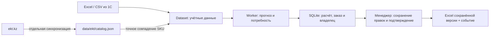

# Umytpa — платформа планирования и согласования закупок

Сервис для менеджера закупа ТОО «Электрокомплект»: читает выгрузки продаж и запасов, рассчитывает пополнение по артикулу и складу, объясняет количество, позволяет исправить и утвердить позиции, экспортирует результат в Excel. Кейс HackAlem AI: [relly-problem.md](relly-problem.md).

**Статус:** интегрирована ветка `baitc/frontend` (`5a0ace2`) с новым интерфейсом и сервисной частью. Работают именной вход, роли `manager/admin`, постоянные заказы и правки в SQLite, история действий, проверка версии, отдельный worker, резервные копии и экспорт сохранённых решений. Улучшения Excel/EKT основной ветки сохранены. Полное production-ТЗ ещё не выполнено: независимого согласования, пяти бизнес-ролей, складских областей доступа и управляемой активации входных партий пока нет.

## Задание на production-платформу

Основной документ — [ТЗ платформы, версия 2.0](docs/ТЗ_платформы.md): роли и права, ежедневные сценарии, версии заказов, свежесть данных, фоновые расчёты, эксплуатация, этапы и критерии приёмки. [Контракт интерфейса](docs/ИНТЕРФЕЙС_ПЛАТФОРМЫ.md) описывает назначение каждого экрана, данные, действия, ошибки и мобильное поведение. [Дизайн Umytpa](docs/Дизайн_фронтенда.md) переводит визуальное направление в компоненты закупочной платформы.

Предлагаемая нагрузка первого выпуска: **20 аккаунтов / 10 одновременных пользователей / 2 расчёта**. Это параметры будущего испытания, а не известный штат или подтверждённая производительность. Предусмотрены менеджер закупок, руководитель, аналитик данных, администратор и наблюдатель компании/спонсора. Последний получает разрешённый обзор реальных агрегатов; закупщики и руководители работают с заказами по своим правам.

В ТЗ явно разделены существующие возможности, требования первого production-выпуска и вопросы владельцу процесса. Сейчас действуют **две роли и один последовательный worker**, а подтверждение строки выполняет сам менеджер; это не независимое согласование руководителем. Вход, сохранение заказов, очередь и эксплуатационные инструменты уже реализованы. Остальные целевые роли и процессы остаются этапами развития.

**Для запуска по готовым файлам установка или подключение 1С не нужны.** Достаточно приложенных Excel-файлов и Python/Node.js. Сейчас приложение читает файлы, а не работающую базу 1С. Для регулярной эксплуатации потребуется согласованное обновление учётных данных; варианты описаны в [ИНТЕГРАЦИЯ_1С.md](docs/ИНТЕГРАЦИЯ_1С.md).

## Два независимых источника

| Источник | Для чего используется |
|---|---|
| Выгрузки 1С: Excel или CSV | Продажи, остатки, ожидаемые приходы, поставщики, MOQ/кратность, сезонность. Они задают числа для расчёта. |
| Публичный каталог ekt.kz: локальный JSON | Товарная категория, подкатегория, характеристики и ссылка на карточку для существующих SKU. Это обогащение справочника. |

Каталог сайта не заменяет историю продаж, обезличенных клиентов, периоды отсутствия, доступные складские остатки или договорные сроки закупки. Обогащение не меняет количества, единицы, цены, MOQ и сроки поставки. Внутренняя `category` из 1С и товарная `product_category` сайта хранятся отдельно.



Во время расчёта и экспорта запросов к ekt.kz нет. Подробнее: [КАТАЛОГ_EKT.md](docs/КАТАЛОГ_EKT.md).

Снимок каталога от **2026-09-23T10:25:22Z** получен ограниченным проходом: 160 страниц разделов и 80 попыток чтения карточек. В JSON сохранено 800 записей; к учётным данным применено **773 из 3 907 SKU (19,8%)**, доступно 9 товарных групп. 200 кодов оставлены на ручную проверку сборщиком, ещё 27 записей не применены из-за несовпадения артикула. Покрытие **частичное**: у 3 134 SKU обогащения нет.

В проверенном полном расчёте описания добавлены к 118 из 430 строк; количества и состав рекомендаций сохранились. Подробный аудит и ограничения снимка — в разделе [«Зафиксированный результат»](docs/КАТАЛОГ_EKT.md#зафиксированный-результат-ограниченного-прохода).

## Возможности и границы

- Расчёт отдельно по `(sku, warehouse)`; фильтры склада, внутренней категории и товарной категории сайта.
- Сезонность, линейный тренд, страховой запас, MOQ и кратность. Месячные итоги приняты основным источником объёма; транзакции служат для поиска крупных заказов. Вычитание опта из месяца допускается только после сверки сумм двух отчётов.
- Детекция крупных заказов объединяет клиент/день и документ/день в пределах SKU×склад: минимум пять наблюдений, одновременно порог Тьюки и восемь медиан. Разбиение крупной покупки клиента на документы не скрывает её; строки не вычитаются дважды.
- Дневная и месячная компенсация stockout по **явно переданным** интервалам отсутствия, с сохранением наблюдённых продаж и предупреждениями о предпосылках. В приложенных реальных Excel таких интервалов нет; нулевые месячные остатки их не заменяют.
- Поставки уменьшают потребность только при ETA в горизонте расчёта. Поздний приход не скрывает дефицит до его даты.
- Постоянные заказы, сохранение правок, история действий и optimistic `revision`: устаревшая команда получает 409. Правка количества снимает подтверждение. Excel использует сохранённую версию, содержит ID заказа/расчёта и не запускает новый прогноз. Неизвестная единица не допускает подтверждения положительной позиции.
- Именные сессии, CSRF, owner/admin-доступ, ограниченная очередь, отмена/таймаут и восстановление незавершённых заданий после перезапуска. Шаблонное объяснение работает без сети; OpenAI по умолчанию выключен, при явном включении ограничен таймаутом и бюджетом. Заказ поставщику не отправляется.

Excel-экспорт — таблица для проверки и передачи. Загрузчик заказа в конкретную конфигурацию 1С пока не реализован, совместимость без доработок не заявляется.

## Данные и ограничения

В комплекте — 12 файлов, по шесть для IEK и Systeme Electric. Зафиксированный импорт содержит **3 907 SKU**, **248 467 положительных транзакций** за 2025-01-04 — 2026-09-22 и месячные матрицы продаж/остатков. Для этих файлов дата расчёта по умолчанию — **2026-09-23**, а не дата запуска приложения.

В выгрузках нет обезличенных клиентов и точных интервалов отсутствия. Часть остатков устарела или неизвестна; сроки новых заказов 21/35 дней — допущения до подтверждения. Предупреждения, даты и счётчики качества доступны в интерфейсе и `/api/meta`. Количество рекомендаций зависит от параметров и версии данных; для зафиксированных исходников и стандартных параметров полный расчёт содержит **430 строк**. Историческая проверка месячного прогноза теперь выполнена и опубликована, но превосходство над простым базовым методом для всего ассортимента не подтверждено.

## Проверка ветки `alish` и подготовка ML

Проверен `baitc/alish` на коммите `5facda2` — `Add new data files for machine learning model training and quality issues`. Это полезная подготовка данных IEK и отчёты о качестве. Шесть исходных Excel совпадают с файлами основной ветки по SHA-256: новой истории, других городов и обученной модели в коммите нет.

В проект выборочно добавлены скрипты очистки и подготовки `scripts/`, их тесты и инструкции. Результаты создаются в `data/clean/iek/` и `data/ml/iek/`; коммит `c7062f9` добавил большие производные CSV в Git для проверки жюри. Основной расчёт продолжает читать Excel через `ExcelDataSource`. Файлы ML имеют другой контракт и не подключаются через `DATA_SOURCE=csv`.

У подготовленной выборки есть существенное ограничение: при исходной политике «пусто = неизвестно» все **28 979 целей строго положительны**. Это не полная выборка спроса с периодами без продаж. Также сверка обнаружила **7 414 расхождений в 21 262 сопоставимых SKU-месяцах (34,87%)**. До обучения нужно подтвердить смысл пустот и область отчётов. Подробности, происхождение и применение файлов: [АУДИТ_ВЕТКИ_ALISH.md](docs/АУДИТ_ВЕТКИ_ALISH.md).

Команды из корня проекта после установки зависимостей backend:

```bash
backend/.venv/bin/python scripts/clean_monthly_data.py
backend/.venv/bin/python scripts/prepare_ml_data.py --as-of 2026-09-23
backend/.venv/bin/python -m unittest discover -s scripts -p 'test_*.py' -v
```

Полный контракт и варианты обработки пропусков: [CLEANING.md](scripts/CLEANING.md), [ML_PREPARATION.md](scripts/ML_PREPARATION.md). Подготовка признаков не обучает модель и не измеряет её точность.

## Проверка прогноза на отложенном периоде

[`scripts/backtest_forecast.py`](scripts/backtest_forecast.py) сравнивает текущий месячный прогноз с предыдущим месяцем и тем же месяцем прошлого года на одинаковых строках. История ограничена прошлым относительно каждой даты; validation — январь–июнь 2026, test — июль–август 2026. Нули, неизвестные ячейки, покрытие и единицы учитываются явно. Используются две политики чтения пустот, а не две независимые выборки.

**Результат не подтверждает общего превосходства модели:** на опубликованном тесте текущий метод проигрывает предыдущему месяцу в штуках и упаковках, выигрывает в метрах. Это проверка функции прогноза, а не всей политики заказа, скрытого спроса или экономии компании. Протокол, ограничения и результаты — [BACKTEST.md](scripts/BACKTEST.md); машинные артефакты — [data/evaluation](data/evaluation/).

```bash
backend/.venv/bin/python scripts/backtest_forecast.py
```

## Города и склады

На сайте перечислены Алматы, Астана, Шымкент, Тараз, Атырау, Актау, Караганда, Талдыкорган и Усть-Каменогорск. В текущих учётных данных подтверждён только склад **Алматы**. Месячные отчёты и путь не имеют отдельного поля склада, поэтому их отнесение к Алматы остаётся допущением.

Остальные восемь городов не добавлены как действующие склады без данных: выбор города на сайте не даёт историю продаж, остатки и ETA по этому городу. Список складов интерфейса строится из загруженных учётных таблиц. Для расширения нужны идентификаторы складов 1С и их связь с городами, продажи/запасы/приходы отдельно по складу и сроки маршрутов. План подключения и состояние каждого города: [ГОРОДА_И_СКЛАДЫ.md](docs/ГОРОДА_И_СКЛАДЫ.md).

## Быстрый запуск

### Через Docker (одна команда, рекомендуется для проверки)

Нужен только **Docker** с плагином **Compose**:

```bash
docker compose up --build
```

Откройте [localhost:5173](http://localhost:5173), вход **`admin` / `admin`**. Автоматически поднимаются API, worker, SQLite, фронтенд и включённые данные партнёра (`init` применяет миграции и создаёт администратора). Ключ OpenAI не обязателен. Подробнее и параметры — в [DEPLOY.md](docs/DEPLOY.md), раздел 0.

### Локально (без Docker)

Нужны **Python 3.12**, **Node.js 22.19+ в ветке 22.x или 24.x** и npm. 1С, ключ OpenAI и доступ к ekt.kz для расчёта по готовым файлам не обязательны. Используйте закреплённые зависимости; подробнее локальная установка и Linux/systemd/nginx описаны в [DEPLOY.md](docs/DEPLOY.md).

Из корня проекта:

```bash
cd backend
python3.12 -m venv .venv
.venv/bin/python -m pip install -r requirements-dev.txt
cp .env.example .env
```

Для локального HTTP измените в `backend/.env` три значения:

```dotenv
APP_ENV=development
APP_ORIGIN=http://127.0.0.1:5173
OPENAI_API_KEY=
```

Оставьте `DATA_SOURCE=excel` и `DATA_DIR=.` для реальных файлов проекта. API, worker и административные команды должны использовать одинаковые настройки и путь БД. Первый администратор создаётся один раз; пароль вводится скрыто, стандартного пароля нет. Следующий блок выполняйте в том же терминале, уже находясь в `backend/`:

```bash
.venv/bin/python -m app.manage migrate
.venv/bin/python -m app.manage create-admin --username admin
```

Запустите три терминала, каждый из корня проекта:

```bash
# 1. API
cd backend
.venv/bin/python -m uvicorn app.main:app --host 127.0.0.1 --port 8017 --no-access-log
```

```bash
# 2. Worker — без него расчёт не принимается
cd backend
.venv/bin/python -m app.worker
```

```bash
# 3. Интерфейс
cd frontend
npm ci
npm run dev -- --host 127.0.0.1
```

Откройте [127.0.0.1:5173](http://127.0.0.1:5173), войдите и создайте менеджеров в разделе сотрудников. Не смешивайте `localhost` и `127.0.0.1`: origin должен совпадать с настройкой. [Swagger API](http://127.0.0.1:8017/docs) включён только в development. `/api/ready` проверяет БД, heartbeat worker и наличие обязательных файлов, но не подтверждает их свежесть или полное качество.

Для отдельной демонстрации доступны:

| Настройка | Данные и дата |
|---|---|
| `DATA_SOURCE=synthetic` | Детерминированные тестовые товары с явными единицами; стандартная дата 2026-09-23 |
| `DATA_SOURCE=csv`, `DATA_DIR=data/sample_csv` | [Готовый пример](data/sample_csv/README.md): шесть обязательных CSV и `catalog.csv` с единицами м/шт |
| `DATA_AS_OF=2026-09-23` | Явная дата для Excel, CSV или synthetic; без неё Excel/CSV используют день после последней продажи |

При смене режима перезапустите API и worker. Синтетика и пример CSV не являются дополнительными наблюдениями партнёра или подтверждёнными данными других городов. ML-файлы из `data/ml/iek` не соответствуют контракту CSV-источника.

EKT подключён к Excel-режиму через `EKT_CATALOG_ENABLED` и `EKT_CATALOG_PATH`. CSV и synthetic не обращаются к сайту или этому справочнику. Синхронизация запускается отдельно:

```bash
cd backend
.venv/bin/python -m scripts.sync_ekt_catalog --help
```

## Проверки

```bash
cd backend
RUN_REAL_EXCEL_TESTS=1 .venv/bin/python -m unittest discover -s tests -v
.venv/bin/python -m tests.validate_must_have
```

Из корня проекта:

```bash
backend/.venv/bin/python -m unittest discover -s scripts -p 'test_*.py' -v
backend/.venv/bin/python qa/smoke_service.py
backend/.venv/bin/python qa/smoke_service.py --real-data
```

```bash
cd frontend
npm test
npm run lint
npm run build
```

Must-have-проверки используют контролируемые наборы и матрицу влияния входов. Регрессии покрывают месячный stockout, крупного клиента с несколькими документами, даты/склады, MOQ, единицы, сохранение, доступ и экспорт. HTTP smoke запускает настоящие API/worker с временной БД; исходные Excel не меняет. Браузерный сценарий — `qa/browser_smoke.mjs`. CI-конфигурация включена в репозиторий; удалённый успешный запуск не заявляется только по наличию файла workflow.

Актуальная оценка **обоих** наборов критериев, выполненные проверки и остающиеся ограничения приведены в [ОТЧЁТ_ПО_КРИТЕРИЯМ.md](docs/ОТЧЁТ_ПО_КРИТЕРИЯМ.md). Проходящие сценарии доказывают конкретные свойства реализации, но не полноту рабочих данных, преимущество прогноза, экономию или завершение всего production-ТЗ.

## Документация

| Документ | Содержание |
|---|---|
| [ОТЧЁТ_ПО_КРИТЕРИЯМ.md](docs/ОТЧЁТ_ПО_КРИТЕРИЯМ.md) | Две независимые оценки, свежие проверки, реальные пробелы и приоритеты; без оценки красоты дизайна |
| [ТЗ_платформы.md](docs/ТЗ_платформы.md) | Основной production-контракт: пользователи, права, процессы, нагрузка, этапы и приёмка |
| [ИНТЕРФЕЙС_ПЛАТФОРМЫ.md](docs/ИНТЕРФЕЙС_ПЛАТФОРМЫ.md) | Экраны, данные и действия по ролям, состояния и мобильные сценарии |
| [SOLUTION.md](SOLUTION.md) | Методология, параметры, ограничения и экспорт |
| [ИНТЕГРАЦИЯ_1С.md](docs/ИНТЕГРАЦИЯ_1С.md) | Нужна ли 1С, контракт учётных данных и варианты последующей интеграции |
| [КАТАЛОГ_EKT.md](docs/КАТАЛОГ_EKT.md) | Локальный JSON, сопоставление кодов, происхождение и покрытие обогащения |
| [АРХИТЕКТУРА.md](docs/АРХИТЕКТУРА.md) | Слои, потоки, модель данных, сохраняемые результаты |
| [БЭКЕНД.md](docs/БЭКЕНД.md) | API, источники и расчётные модули |
| [ФРОНТЕНД.md](docs/ФРОНТЕНД.md) | Фильтры, таблицы, корректировка, утверждение и экспорт |
| [Дизайн_фронтенда.md](docs/Дизайн_фронтенда.md) | Целевая визуальная система Umytpa, компоненты и адаптивность |
| [ML_И_ДАННЫЕ.md](docs/ML_И_ДАННЫЕ.md) | Дневная/месячная модели, сезонность, опт, stockout и отдельная подготовка ML |
| [BACKTEST.md](scripts/BACKTEST.md) | Временная оценка текущего прогноза, базовые методы, покрытие и ограничения |
| [АУДИТ_ВЕТКИ_ALISH.md](docs/АУДИТ_ВЕТКИ_ALISH.md) | Проверенный коммит, полезные артефакты, качество и ограничения обучающей выборки |
| [ГОРОДА_И_СКЛАДЫ.md](docs/ГОРОДА_И_СКЛАДЫ.md) | Девять городов сайта, реальные склады и контракт региональных данных |
| [РЕЕСТР_ДАННЫХ.md](docs/РЕЕСТР_ДАННЫХ.md) | Файлы, происхождение и ограничения качества |
| [КОНЦЕПЦИЯ_СИСТЕМЫ_РК.md](docs/КОНЦЕПЦИЯ_СИСТЕМЫ_РК.md) | Назначение и развитие системы |
| [DEPLOY.md](docs/DEPLOY.md) | Подготовка окружения и запуск |


## Проверенная поставка и демонстрация

Итог 23.09.2026: **124 backend + 23 проверки скриптов + 35 frontend unit + 19 UI**,
пять строгих Must-have-групп, lint/build, оба HTTP smoke и браузерный сценарий
на реальных Excel проходят. Проверены сохранение после перезагрузки, конфликт
двух вкладок, точное количество в XLSX и мобильные ширины 320–1440 px.
На телефоне показывается пять карточек поставщика, на desktop — двадцать строк.

Команды, среда и границы проверки — [ПРИЕМКА](docs/ПРИЕМКА.md).
Для показа партнёру и пилотного замера подготовлен [сценарий демонстрации](docs/ДЕМОНСТРАЦИЯ.md).
Обновлённый [отчёт по двум критериям](docs/ОТЧЁТ_ПО_КРИТЕРИЯМ.md) разделяет закрытые
дефекты и незавершённую внешнюю приёмку; хакатонные баллы не означают готовность
полного production-ТЗ. Текущие изменения проверены локально, удалённое развёртывание
и запуск CI не заявляются.
