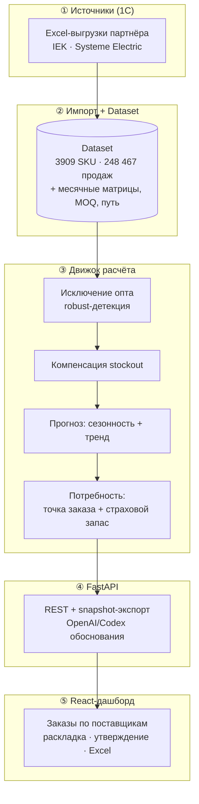

# HackAlem AI — Кейс ЭКТ: Автозаказы поставщикам 🚚

> **Umytpa — Replenishment Intelligence:** сервис автоматического формирования рекомендованных заказов поставщикам для пополнения склада на основе прогноза спроса, сезонности и реальных выгрузок 1С.

AI/Data-кейс трека **05 · Логистика**. Партнёр — **ТОО «Электрокомплект» (ekt.kz)**. Хакатон **HackAlem AI**, powered by **OpenAI**. Астана · EXPO · 23.09.2026.

## 📚 Документация

Полная документация вынесена в папку [`docs/`](docs/). Начните с архитектуры, затем — по слоям.

| Документ | Что внутри |
|---|---|
| 🏗 **[docs/АРХИТЕКТУРА.md](docs/АРХИТЕКТУРА.md)** | Слоистая архитектура, mermaid-схемы (слои, потоки данных, модель Dataset, sequence расчёта, деплой), структура репозитория, НФТ |
| ⚙️ **[docs/БЭКЕНД.md](docs/БЭКЕНД.md)** | FastAPI, перечень эндпоинтов, движок расчёта, snapshot-экспорт, три источника данных (excel/csv/synthetic) |
| 🖥 **[docs/ФРОНТЕНД.md](docs/ФРОНТЕНД.md)** | React/Vite, экраны, клиент API, состояния, взаимодействие с бэкендом |
| 🎨 **[docs/Дизайн_фронтенда.md](docs/Дизайн_фронтенда.md)** | Дизайн-система, токены, цветовые статусы срочности |
| 🧠 **[docs/ML_И_ДАННЫЕ.md](docs/ML_И_ДАННЫЕ.md)** | Реальные датасеты 1С, ETL из Excel, признаки, модель прогноза (сезонность+тренд), исключение выбросов, компенсация stockout, метрики Must-have |
| 📈 **[scripts/SYSTEME_TRAINING.md](scripts/SYSTEME_TRAINING.md)** | Подготовка и обучение Systeme Electric, отдельные модели и проверка точности |
| 🔌 **[ml_api/README.md](ml_api/README.md)** | HTTP API обученных моделей IEK и Systeme: запуск, контракт и пример подключения backend |
| 📊 **[scripts/DECOMPOSITION.md](scripts/DECOMPOSITION.md)** | Уровень, сезонность, устойчивый тренд и кандидаты на исключительные заказы |
| 📈 **[scripts/IEK_TRAINING.md](scripts/IEK_TRAINING.md)** | Обучение и временная проверка прогноза IEK, метрики, сохранённые модели и ограничения горизонта 35 дней |
| 📥 **[docs/ВХОДЫ_ЗАКАЗА_IEK.md](docs/ВХОДЫ_ЗАКАЗА_IEK.md)** | Подтверждённые параметры IEK, проверка входов заказа, остатки, единицы и шаблоны недостающих данных |
| 📄 **[docs/КОНЦЕПЦИЯ_СИСТЕМЫ_РК.md](docs/КОНЦЕПЦИЯ_СИСТЕМЫ_РК.md)** | Концепт автономного пополнения для дистрибьюторов РК, роли, месячные итоги как источник истины |
| 📄 **[docs/ТЗ_платформы.md](docs/ТЗ_платформы.md)** | Техническое задание сервиса, функциональные модули, потоки данных |
| 🗂 **[docs/РЕЕСТР_ДАННЫХ.md](docs/РЕЕСТР_ДАННЫХ.md)** | Реестр выгрузок партнёра, качество данных, допущения, пересборка |
| 🚀 **[docs/DEPLOY.md](docs/DEPLOY.md)** | Инструкция по развёртыванию |

### Архитектура в одной схеме



> Подробные схемы (потоки данных, модель Dataset, sequence расчёта, деплой) — в **[docs/АРХИТЕКТУРА.md](docs/АРХИТЕКТУРА.md)**.

---

## 🔑 Ключевые возможности

### 1. Рекомендованные заказы поставщикам
* Расчёт потребности по каждому артикулу: **точка заказа** (спрос за горизонт `срок поставки + период проверки`) + **страховой запас** по уровню сервиса.
* Учёт **всех источников**: история продаж, месячные итоги, остатки, товары в пути, MOQ/кратность, сезонность, тренд.
* Группировка по поставщикам (**IEK**, **Systeme Electric**) с итогами и сортировкой по срочности.

### 2. Прогноз спроса (сезонность + устойчивый рост)
* Декомпозиция ряда на уровень, сезонные коэффициенты по месяцам и линейный тренд.
* Месячные матрицы 1С — **источник истины по количеству**; транзакции используются для выявления исключительных заказов.

### 3. Обработка «грязных» данных 1С
* Исключение **разовых оптовых заказов** (robust-детекция Тьюки + медиана + концентрация).
* Компенсация **упущенного спроса** в периоды отсутствия товара.
* Отрицательные значения = возвраты; пустые продажи = 0, пустые остатки = «неизвестно»; устаревшие снимки остатков помечаются.

### 4. Объяснимость и человек-в-контуре
* По каждой строке — прозрачная раскладка + текстовое обоснование (**OpenAI/Codex** с офлайн-фолбэком).
* Заказ **не отправляется автоматически**: менеджер корректирует и утверждает вручную.
* **15 честных предупреждений** о допущениях по данным передаются в UI.

### 5. Экспорт в учётную систему
* Выгрузка утверждённого/чернового заказа в **Excel** (совместимость с 1С), экспорт по snapshot расчёта.

---

## 📊 Данные и методология

Основано на **6 реальных выгрузках 1С** по каждому из двух поставщиков (динамика продаж, месячные продажи/остатки за 2 года, MOQ, товары в пути, сезонность):

* **Продажи:** 248 467 транзакций, период 2025-01-04 → 2026-09-22.
* **Каталог:** 3 909 артикулов; месячные матрицы: 99 561 (продажи) + 84 471 (остатки).
* **Товары в пути:** 313 позиций с распарсенными датами поступления.
* **Расчёт:** 430 позиций к заказу (IEK — 339, Systeme Electric — 91).

**Проверка требований кейса (Must-have):** 5/5 PASS. Тесты: `pytest` — 33 passed + 6 real-data smoke. Подробности — в **[docs/ML_И_ДАННЫЕ.md](docs/ML_И_ДАННЫЕ.md)**.

---

## 🏗 Структура репозитория

```
├── docs/                        # Документация (архитектура, бэкенд, фронт, ML, деплой)
├── IEK/ · Systeme electric/     # Реальные выгрузки 1С (xlsx)
├── ml_api/                      # Отдельный HTTP API обученных моделей: /v1/forecast
├── backend/                     # FastAPI + движок расчёта (Python)
│   ├── app/
│   │   ├── main.py              # FastAPI-приложение, CORS, роутер
│   │   ├── config.py            # Настройки (DATA_SOURCE, сроки, уровень сервиса)
│   │   ├── schemas.py           # Pydantic-контракты
│   │   ├── api/routes.py        # REST: /meta /recommend /recommend/export
│   │   ├── core/               # Движок: outliers, stockout, forecasting,
│   │   │                       # replenishment, recommend, explain, export, snapshots
│   │   └── data/               # Источники: excel (1С), csv, synthetic + adapter
│   └── tests/                   # Импорт Excel, расчёт, экспорт, Must-have
├── frontend/                    # React (Vite): дашборд заказов
│   └── src/                     # App.jsx, api.js, orderUtils.js, стили
├── relly-problem.md             # Первоисточник кейса партнёра
└── SOLUTION.md                  # Краткая методология и запуск
```

---

## 🚀 Быстрый запуск

### 1. Backend (Python 3.9+)
```bash
cd backend
python3 -m venv .venv
./.venv/bin/pip install -r requirements.txt
cp .env.example .env            # ключ OpenAI не обязателен — работает без него
./.venv/bin/python -m uvicorn app.main:app --port 8017 --reload
```
* API-документация (Swagger): **http://localhost:8017/docs**
* По умолчанию `DATA_SOURCE=excel` — читает реальные `IEK/` и `Systeme electric/`.

### 2. Frontend (Node 18+)
```bash
cd frontend
npm install
npm run dev                     # http://localhost:5173 (проксирует /api → :8017)
```

### 3. Проверка требований кейса
```bash
cd backend
./.venv/bin/python -m tests.validate_must_have    # 5/5 PASS
./.venv/bin/python -m pytest -q                    # 33 passed, 1 skipped
```

---

## 🔗 Ссылки
- Кейс партнёра: [relly-problem.md](relly-problem.md) · Методология: [SOLUTION.md](SOLUTION.md)
- Хакатон: https://hackalem.ai/ · Партнёр: https://ekt.kz · Контакт: team@baitc.org
