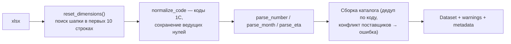

# Машинное обучение, прогнозирование и данные

Как из «сырых» выгрузок 1С получается рекомендованный заказ: источники, ETL, признаки, модель прогноза, обработка аномалий и метрики.

---

## 1. Данные

### 1.1. Источники (реальные выгрузки 1С партнёра ЭКТ)

По каждому поставщику — **6 файлов** в папках `IEK/` и `Systeme electric/`:

| Файл (тип) | Содержание | Роль в расчёте |
|---|---|---|
| Динамика продаж 2025-2026 | Транзакции: дата, код, номенклатура, склад, количество | Выявление опта, дневной ряд |
| Ежемесячные продажи (2 года) | Матрица SKU × месяц | **Источник истины по количеству** |
| Ежемесячные остатки (2 года) | Матрица SKU × месяц | Фолбэк-остаток (начальный баланс месяца) |
| MOQ | Мин. к отгрузке / кратность | Ограничения заказа |
| Путь / Товар в пути (на дату) | Приходы с датами поступления + свободный остаток | Товары в пути + актуальный остаток |
| Сезонность | 12 коэффициентов по месяцам | Сезонная составляющая прогноза |

### 1.2. Фактический объём (проверено на загрузке)

| Показатель | Значение |
|---|---|
| Транзакции продаж | **248 467** (2025-01-04 → 2026-09-22) |
| Каталог артикулов | **3 909** |
| Месячные продажи / остатки | 99 561 / 84 471 строк |
| Остатки (снимок + фолбэк) | 3 459 |
| Товары в пути | 313 |
| Коэффициенты сезонности | 24 (12 × 2 поставщика) |
| Поставщики | IEK (срок 21 дн), Systeme Electric (35 дн) — допущения |
| `as_of` | 2026-09-23 |

---

## 2. ETL (`backend/app/data/excel.py`)

Read-only импорт (`openpyxl`, `data_only=True`, `keep_links=False` — формулы по сохранённым значениям, внешние ссылки не обновляются):



**Ключевые правила очистки:**
- Пустая ячейка месячных **продаж** = `0` (разрежённая выгрузка); пустой **остаток** = «неизвестно» (не ноль).
- **Отрицательные** транзакции — возвраты/корректировки, исключаются из спроса; отрицательный месячный итог ограничивается нулём, но `raw_qty` сохраняется.
- ETA берётся из заголовка «поступление до …» (приоритет над датой заказа).
- Остаток: приоритет — «свободный остаток» из файла «Путь …»; фолбэк — последний начальный баланс месяца (помечается устаревшим).
- Категории IEK отсутствуют; у Systeme Electric берутся из «Категория 2026».

Всё это фиксируется в **15 предупреждениях** (`Dataset.warnings`) и счётчиках качества (`Dataset.metadata`).

---

## 3. Признаки (features)

По каждому `(sku, warehouse)`:
- дневной/месячный ряд спроса (после исключения опта и компенсации stockout);
- десезонализированный **уровень** (среднее за последние 90 дней);
- **сезонные коэффициенты** по месяцам (из файла сезонности поставщика);
- **тренд** — наклон недельного ряда;
- **σ** дневного спроса — для страхового запаса;
- остаток, товары в пути (в окне ETA), MOQ/кратность, срок поставки.

---

## 4. Модель прогноза

Не «чёрный ящик», а **объяснимая декомпозиция** (требование кейса — объяснимость):

```
прогноз_день = уровень × сезонность(горизонт) × тренд
прогноз(H)   = прогноз_день × H,   H = срок поставки + период проверки
```

- **Сезонность (MH#2):** коэффициенты по месяцам, а не среднее по всей истории — для сезонного товара прогноз повторяет паттерн.
- **Тренд (MH#2):** линейная составляющая (`numpy.polyfit`, статистически согласуется со statsmodels Holt) — устойчивый рост/спад учитывается.
- Опционально — LightGBM как альтернативный движок (Roadmap).

---

## 5. Обработка аномалий

### 5.1. Разовый опт (MH#4) — `outliers.py`
Транзакция считается оптовой, если объём одновременно: выше границы Тьюки `Q3 + 3·IQR` **и** ≥ 8× медианы, либо покрывает > 40 % объёма по артикулу. Исключается из регулярного спроса; число/объём — в раскладке.

### 5.2. Упущенный спрос (MH#3) — `stockout.py`
Дни отсутствия товара замещаются оценкой ожидаемого спроса (уровень × сезонность), потребность корректируется вверх относительно «сырых» продаж.

> В реальных выгрузках точных интервалов stockout нет — они не восстанавливаются из месячных остатков (честно отражено в warnings). Механизм проверен на синтетике и готов к данным с явными stockout.

---

## 6. Потребность и страховой запас (MH#1) — `replenishment.py`

```
потребность = прогноз(H) + z(SL)·σ·√H − остаток − товары_в_пути
```
Округление до кратности, подъём до MOQ. `z` — квантиль нормали по уровню сервиса (0.90–0.99).

---

## 7. Объяснимость

По каждой строке — `Rationale` (все компоненты расчёта) + текстовое обоснование от **OpenAI/Codex** (при наличии ключа) или детерминированный шаблон. Пример на реальных данных:

> «Трубы гибкая двустенная … IEK (50)»: рекомендуем заказать 6989 м. Прогноз спроса на 35 дн. — 6527.8 м; сезонность выше среднего (×1.18); тренд — рост (×1.47); исключены разовые оптовые заказы …

---

## 8. Соответствие требованиям кейса (Must-have)

Автопроверка `backend/tests/validate_must_have.py` — **5/5 PASS**:

| Must-have | Проверка | Результат |
|---|---|---|
| MH#1 учёт всех источников | рост товаров в пути ↓ потребность | PASS (2130 → 270) |
| MH#2 сезонность | сезонный коэффициент ≠ 1 | PASS (×1.07) |
| MH#3 упущенный спрос | uplift > 0 при stockout | PASS (+742 ед.) |
| MH#4 исключение опта | опт не раздувает регулярную потребность | PASS (исключено) |
| MH#5 группировка + обоснование | заказ по поставщикам, каждая строка объяснена | PASS |

Тестовый набор: `pytest` — **33 passed, 1 skipped**; real-data smoke (`RUN_REAL_EXCEL_TESTS=1`) — **6 passed**.

---

## 9. Реестр данных и воспроизводимость

Импорт кешируется по fingerprint файлов (путь + mtime + размер). Подробный реестр выгрузок, качество данных и порядок обновления — в [РЕЕСТР_ДАННЫХ.md](РЕЕСТР_ДАННЫХ.md). Синтетический источник (`synthetic.py`) детерминирован (seed) и закладывает сезонность, тренд, stockout и опт — для демо и тестов Must-have.
