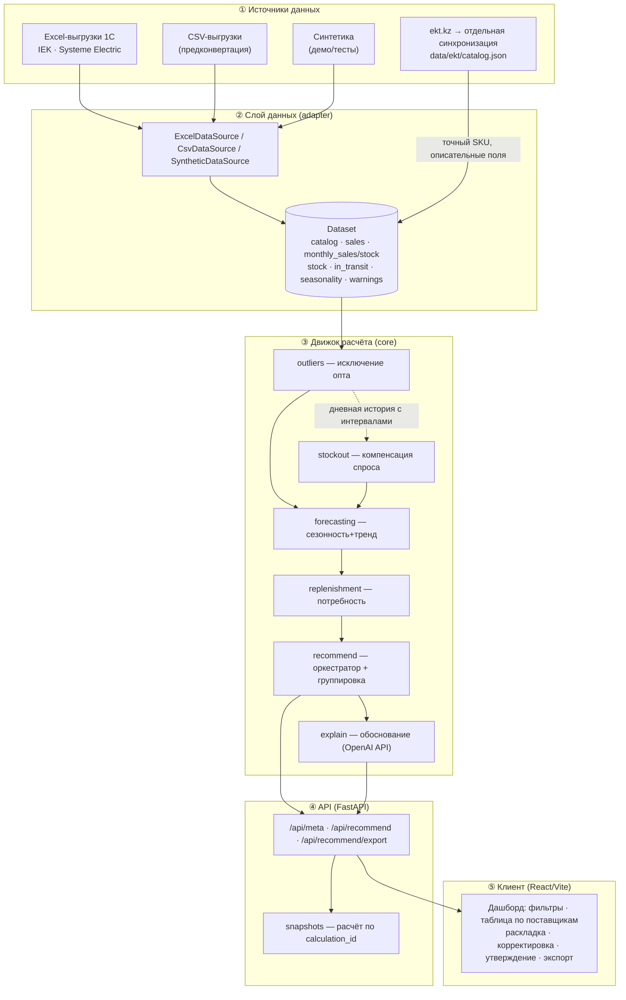
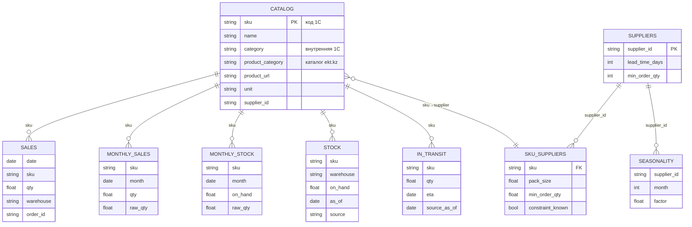
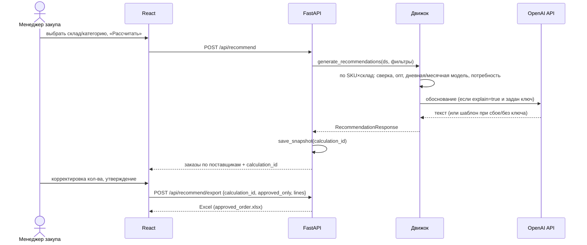
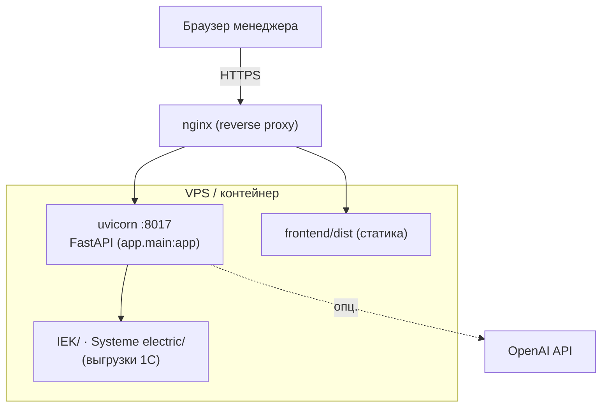

# Архитектура сервиса автозаказов поставщикам (кейс ЭКТ)

> Как система устроена и как должна выглядеть: слои, потоки данных, модель Dataset, sequence расчёта, деплой.

---

## 1. Принцип решения

Менеджер закупа считает потребность вручную в Excel — редко и неточно, из-за чего возникают избыток по одним позициям и дефицит по другим. Сервис автоматизирует расчёт: читает реальные выгрузки 1С, строит прогноз спроса с сезонностью и трендом, в дневном режиме компенсирует упущенный спрос при наличии явных интервалов, исключает разовый опт и формирует **рекомендованный заказ по каждому поставщику** с обоснованием. Итоговое решение остаётся за человеком — заказ утверждается вручную.

Ключевой архитектурный выбор: **месячные итоги 1С приняты основным источником количества до сверки с партнёром**, транзакции служат для выявления исключительных (оптовых) заказов. Все окна прогноза и ETA — полуоткрытые `[as_of, as_of + H)`, единые по всему расчёту.

---

## 2. Слоистая архитектура (целевая)



**Границы слоёв:** движок работает с контрактом `Dataset`. Новый источник должен согласовать поля, даты, единицы и полноту данных с этим контрактом. Внешний каталог не меняет учётные числа; расчёт и экспорт не запрашивают сайт. 1С не подключена напрямую. Контракты: [ИНТЕГРАЦИЯ_1С.md](ИНТЕГРАЦИЯ_1С.md), [КАТАЛОГ_EKT.md](КАТАЛОГ_EKT.md).

---

## 3. Технологический стек

| Слой | Технологии |
|---|---|
| Данные / ETL | Python, **pandas**, **openpyxl** (read-only, `data_only`) |
| Прогноз | **numpy** (линейный тренд), **scipy** (квантиль); statsmodels не используется текущей моделью |
| API | **FastAPI**, **uvicorn**, **pydantic v2** |
| LLM | **OpenAI API** (обоснования; офлайн-фолбэк без ключа) |
| Экспорт | **openpyxl** (Excel для сверки; обратная загрузка в 1С не реализована) |
| Фронтенд | **React 19**, **Vite**, нативный fetch |
| Тесты | **unittest** (импорт, расчёт, экспорт; можно запускать через pytest), **node --test** для orderUtils |

---

## 4. Поток данных end-to-end

```mermaid
flowchart LR
    A["xlsx 1С"] -->|openpyxl read-only| B["Импорт: нормализация кодов,<br/>парсинг месяцев/ETA, сверка"]
    B --> C["Dataset + warnings + metadata"]
    C -->|per SKU×склад| D["Очистка: исключить опт,<br/>stockout только в дневном режиме"]
    D --> E["Прогноз: уровень × сезонность × тренд"]
    E --> F["Потребность = прогноз(H) + SS − остаток − в пути"]
    F --> G["Группировка по поставщику + обоснование"]
    G --> H["Snapshot + JSON-ответ"]
    H --> I["React: таблица, корректировка, утверждение"]
    I -->|approved_only| J["Excel для сверки и передачи"]
```



---

## 5. Модель данных (Dataset)

Единый контейнер `app/data/adapter.py::Dataset` — набор DataFrame'ов:



Дополнительно `Dataset` несёт `as_of` (дата расчёта), `source` (`excel`/`csv`/`synthetic`), `warnings` (допущения для UI) и `metadata` (счётчики качества данных).

---

## 6. Ролевая модель

Кейс однопользовательский на MVP: основной пользователь — **менеджер отдела закупа**. Разграничение доступа/аутентификация в MVP не реализованы (см. НФТ и Roadmap). Целевая роль руководителя (утверждение крупных заказов) описана в [КОНЦЕПЦИЯ_СИСТЕМЫ_РК.md](КОНЦЕПЦИЯ_СИСТЕМЫ_РК.md).

---

## 7. Сценарий «расчёт заказа» (последовательность)



---

## 8. Схема развёртывания



Детали — в [DEPLOY.md](DEPLOY.md).

---

## 9. Структура репозитория

```
backend/app/
  main.py                 FastAPI: CORS, роутер /api
  config.py               DATA_SOURCE, DATA_DIR, сроки поставки, уровень сервиса
  schemas.py              Pydantic: Sale, Supplier, OrderLine, Rationale, Recommend/ExportRequest
  api/routes.py           /health /meta /recommend /recommend/export
  core/
    outliers.py           MH#4 — исключение разовых оптовых заказов
    stockout.py           MH#3 — компенсация упущенного спроса
    forecasting.py        MH#2 — прогноз (сезонность + тренд)
    replenishment.py      MH#1 — точка заказа + страховой запас
    recommend.py          оркестратор + MH#5 (группировка по поставщикам)
    explain.py            обоснование строки (OpenAI API + шаблон)
    export.py             экспорт заказа в Excel
    snapshots.py          хранение расчёта по calculation_id для экспорта
  data/
    adapter.py            Dataset + фабрика источника
    excel.py              импорт реальных выгрузок 1С (IEK, Systeme Electric)
    synthetic.py          генератор данных для демо/тестов
  tests/                  test_excel_import, test_calculation, test_export, validate_must_have
frontend/src/
  App.jsx, App.css        дашборд
  api.js                  клиент REST
  orderUtils.js(.test.js) утилиты подсчёта/валидации заказа
```

---

## 10. Нефункциональные требования

| НФТ | Как обеспечено |
|---|---|
| **Приватность** | Клиентские данные обезличены; в выгрузках 1С клиентов нет — опт выявляется по транзакциям |
| **Объяснимость** | Раскладка расчёта + обоснование по каждой строке; предупреждения и происхождение данных |
| **Устойчивость к выбросам** | Robust-детекция (Тьюки/медиана), клиппинг отрицательных, сверка транзакций с месяцами |
| **Обмен с учётной системой** | Чтение конкретных Excel и согласованных CSV; Excel-экспорт. Импорт заказа в конкретную 1С ещё не реализован и не проверен |
| **Безопасность решений** | Заказ не отправляется автоматически — только рекомендация + ручное утверждение |
| **Воспроизводимость** | Кеш импорта по fingerprint файлов; детерминированная синтетика (seed) |
| **Производительность** | Группировка таблиц один раз; фактическое время зависит от объёма и окружения |

## 11. Что требует отдельного внедрения

Расписание получения учётных данных, прямое чтение HTTP/OData конкретной базы 1С и обратная загрузка заказа — последующие интеграции. Наличие файлового импорта и JSON-обогащения не означает их подключения. В прототипе достаточно локальных файлов; схема согласования производственного канала приведена в [ИНТЕГРАЦИЯ_1С.md](ИНТЕГРАЦИЯ_1С.md).
