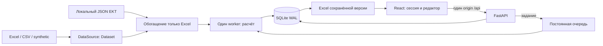
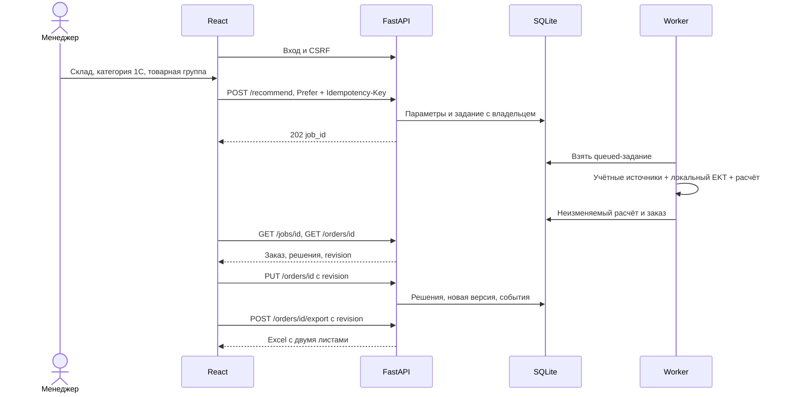

# Архитектура внутреннего сервиса Umytpa

Текущая система объединяет расчёт и описательное обогащение main с личными
аккаунтами, постоянными заказами и очередью сервисного интерфейса.

## 1. Принцип решения

Числа закупки поступают из учётных Excel/CSV. Месячные итоги выбраны основным
источником количества до согласования области отчётов с партнёром; это не
доказательство их большей точности. Транзакции помогают выявлять разовый опт,
который вычитается из месячной суммы только после численной сверки. Stockout
компенсируется лишь в дневной ветке с явными интервалами отсутствия.

Каталог ekt.kz добавляет описания по точному коду, но не меняет продажи,
остатки, единицы, MOQ, кратность и сроки. Решение о количестве и утверждении
принимает сотрудник. Обратной записи в 1С и отправки поставщику нет.

## 2. Слои и границы

Сбор JSON EKT выполняется отдельной административной командой. Браузер,
расчёт и экспорт не обходят сайт. API читает источники для метаданных;
тяжёлый расчёт запускает worker в управляемом дочернем процессе.

## 3. Технологии

| Часть | Реализация |
|---|---|
| Клиент | React 19, Vite 8, JavaScript/JSX, fetch, oxlint; Node.js 22.19, минимум 22.12 |
| API | Python 3.12, FastAPI, Uvicorn, Pydantic v2 |
| Данные | pandas, numpy, scipy, openpyxl; существующий объяснимый прогноз |
| Объяснения | Числовой шаблон; опционально OpenAI API с ограниченным временем |
| Сессии | Argon2id, HttpOnly/Secure/SameSite cookie, серверная SQLite, CSRF |
| Хранение | SQLite WAL, миграции, заказы/решения/ревизии/события/задания |
| Развёртывание | nginx TLS, systemd API + worker + backup timer, локальный диск |
| Проверки | unittest, Node unit, Vitest/jsdom, HTTP smoke и браузерная приёмка |

Точные версии закреплены в `backend/requirements.lock` и
`frontend/package-lock.json`. Наличие statsmodels в зависимостях не означает
обученную модель Holt; LightGBM/обученная ML-модель в расчёт не подключены.

## 4. Dataset и описательный каталог

`backend/app/data/adapter.py` задаёт единый контейнер `Dataset`: `sales`,
`monthly_sales`, `monthly_stock`, `stock`, `in_transit`, `suppliers`,
`sku_suppliers`, `stockouts`, `seasonality`, `catalog`, `as_of`, `source`,
`warnings`, `metadata`. Расчёт разделён по `(sku, warehouse)`.

Коды передаются строками с ведущими нулями и суффиксами. CSV-адаптер читает
шесть фиксированных файлов; дополнительные месячные таблицы и каталог
формирует Excel-импортёр. Исследовательские ML-CSV имеют другой контракт.
Строка без единицы помечается «ед. (не указана)», а не считается штукой.

`category` — категория 1С. `product_category`, `product_subcategory`,
`product_brand`, `product_url`, `product_attributes`, `catalog_fetched_at` —
отдельные описания EKT. Сопоставление только по точному SKU; артикул и известный
бренд служат проверками конфликта. Поля необязательны для старых снимков.
`EKT_CATALOG_PATH` независим от `DATA_DIR`, JSON читается после копирования
кешированного Excel Dataset. Обновлённый JSON не требует перечитывать книги.

Публичные метаданные проходят ограничение полей/типов: внутренние пути и
произвольные диагностики не раскрываются. Каталог имеет состояния disabled,
missing, invalid, empty_catalog, partial, loaded. Фильтр группы охватывает
только сопоставленные SKU. Список складов объединяет непустые строковые ключи
`sales`, `monthly_sales`, `stock`, `in_transit`, сохраняя исходное написание.
Города сайта не создают склады: [ГОРОДА_И_СКЛАДЫ.md](ГОРОДА_И_СКЛАДЫ.md).

## 5. Постоянное состояние

Сервер хранит сотрудников, хеши сессий, задания, заказы, решения, ревизии,
события и heartbeat worker в одной локальной SQLite с WAL. Миграции атомарны;
транзакции записи короткие. Исходный расчёт лежит неизменяемым JSON, решения
`{line_id,quantity,approved}` — отдельно. Изменение количества снимает
утверждение, запись требует актуальной ревизии; конфликт возвращает `409`.

Новые product-поля сохраняются в JSON и не требуют SQL-колонки для каждой
характеристики. Обновление источников не переписывает старый заказ.
Сохранённые заказы не удаляются по лимиту «7 дней / 50 снимков». Старые
совместимые снимки импортируются в архив администратора без выдуманных
утверждений. Доступ к объектам проверяется сервером.

## 6. Сессия и клиентское состояние

Менеджер работает со своими заказами; администратор управляет сотрудниками
и имеет доступ ко всем. Восьмичасовая серверная сессия, CSRF и проверка Origin
защищают действия; попытки входа ограничены. Создание первого администратора
выполняется CLI со скрытым вводом пароля. Регистрации/стандартного пароля нет.

Hash-маршруты React открывают историю, расчёт, заказ, команду и аккаунт.
`useOrderEditor` отделяет исходный заказ от строкового локального ввода:
односекундный debounce, последовательные PUT, сохранение количества до
отдельного утверждения. Ошибочный ввод остаётся локальным и блокирует экспорт.
`409` требует явного выбора версии; чужие изменения не затираются молча.
Черновик переживает повторный вход тем же сотрудником только в памяти вкладки.

## 7. Последовательность расчёта и экспорта

Один worker выполняет один расчёт, остальные ждут в SQLite. Лимит выполнения
по умолчанию — 600 секунд после начала, не включая очередь. Есть отмена,
ошибки прерванного выполнения и явный повтор. LLM выключен по умолчанию;
включённые объяснения имеют общий бюджет 120 секунд и шаблонный fallback.

Excel читает сохранённую версию и проверяет её перед выдачей; это не повторный
прогноз. Лист заказа содержит 37 столбцов, включая пять полей EKT; второй лист —
параметры/допущения и выбранную товарную группу. `product_attributes` показаны
в интерфейсе, но отдельной колонкой не экспортируются. Поиск/страницы UI
не ограничивают экспорт или утверждение всего поставщика.

## 8. Развёртывание и восстановление

Один Linux-сервер: nginx отдаёт `frontend/dist` и проксирует `/api` на
`127.0.0.1:8017` через один HTTPS-origin. API и worker запускаются systemd,
источники читаются без права записи, SQLite размещена на локальном диске.
Используются защитные заголовки, request ID и журнал без тел продаж/секретов.
`/health` показывает живость, `/ready` — доступность БД и heartbeat worker.

Backup timer делает online-копию с проверкой целостности, хранится 14 копий.
При обновлении сначала нужна копия; при откате согласуются код и схема БД.
Исходные Excel и JSON нужно хранить отдельно: backup SQLite содержит заказы,
но не файлы для будущих расчётов. Адрес, TLS и фактическая установка не заданы
репозиторием. Полные команды — [DEPLOY.md](DEPLOY.md).

## 9. Карта реализации и отдельное исследование

| Каталог / модуль | Ответственность |
|---|---|
| `backend/app/api`, `security.py` | Контракты, сессии, полномочия, CSRF |
| `storage.py`, `repositories.py` | Миграции, заказы, решения, версии, журнал |
| `jobs.py`, `worker.py` | Постоянная очередь и управляемое выполнение |
| `manage.py`, `ops.py` | Первый администратор, миграции, backup/restore |
| `backend/app/core` | Опт, stockout, прогноз, потребность, объяснение, Excel |
| `backend/app/data` | Импорт, общий Dataset и описательное обогащение |
| `backend/scripts/sync_ekt_catalog.py` | Отдельный ограниченный сбор публичного справочника |
| `frontend/src/pages`, `hooks`, `components` | Сессия, история, редактор, обоснование и сведения EKT |
| Корневой `scripts/` | Очистка IEK, ML-панель/лаги/разбиения и тесты; не рабочий DataSource |
| `qa/`, `deploy/` | HTTP smoke, проверка конфигураций и Linux-комплект |

Производные CSV/JSON исследования включены в Git для проверки. Это те же
IEK-источники; новые регионы, обученная модель и backtest не появляются.
Методология main сохранена: неизвестные месячные продажи в ML-подготовке
остаются неизвестными, что отличается от рабочего импортёра. Подробности —
[ML_И_ДАННЫЕ.md](ML_И_ДАННЫЕ.md), [АУДИТ_ВЕТКИ_ALISH.md](АУДИТ_ВЕТКИ_ALISH.md).

## 10. Нефункциональные требования и проверка

| Требование | Реализация / ограничение |
|---|---|
| Доступ | Argon2id, роли, серверная сессия, CSRF, HTTPS; право проверяется для каждого объекта |
| Объяснимость | Числовая раскладка, источник/даты, предупреждения; отсутствие stockout не маскируется |
| Сохранность | Ревизии, сериализация записи, журнал, постоянные заказы, backup/restore |
| Воспроизводимость | Lock-файлы, неизменяемый расчёт, исходники read-only, раздельные даты источников |
| Производительность | Один worker, очередь, кеш импорта с защитой холодной загрузки; время зависит от файлов/хоста |
| Совместимость | Код 1С, артикул, склад, единица и решения в Excel; универсального обратного импорта в 1С нет |
| Качество данных | Сверка месячных/транзакционных сумм; каталог не подменяет учётные числа |

Must-have на синтетике, серверные/клиентские тесты, HTTP на реальных файлах и
браузерная приёмка дополняют друг друга. Прежний PASS не считается проверкой
нового merge. Датированные результаты и нерешённые пункты (включая целевой
Linux и настоящий zoom 200%) фиксируются в [ПРИЕМКА.md](ПРИЕМКА.md).
