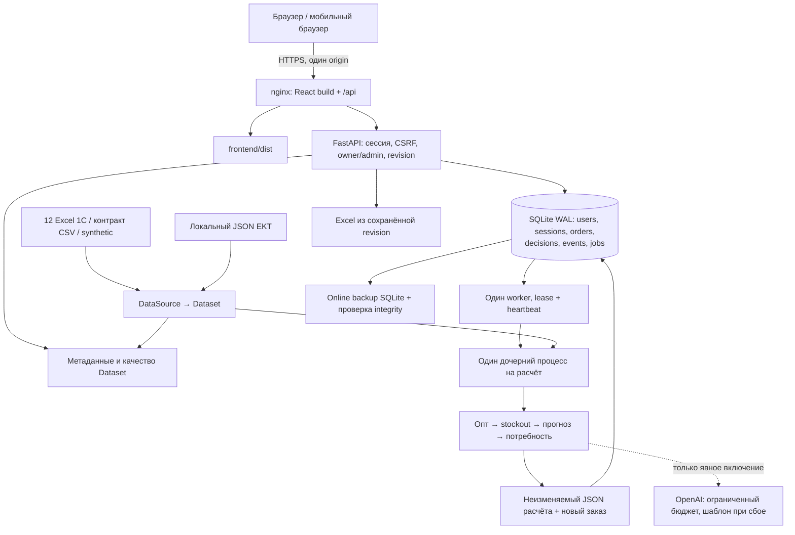
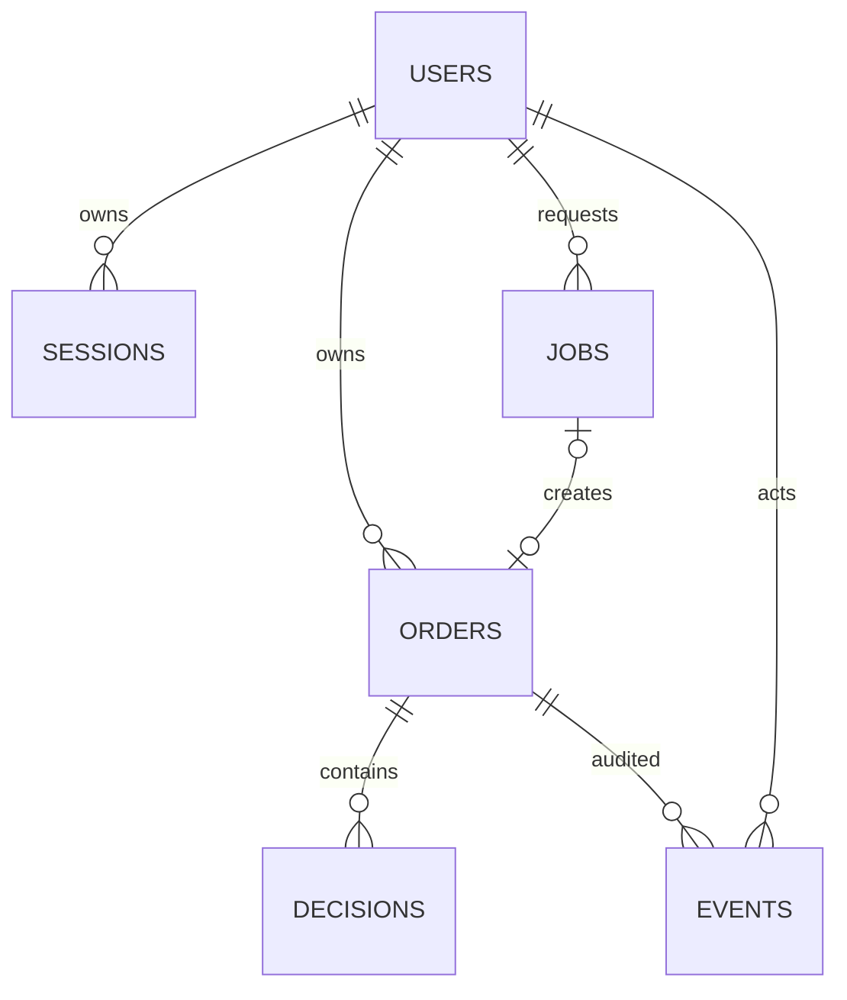
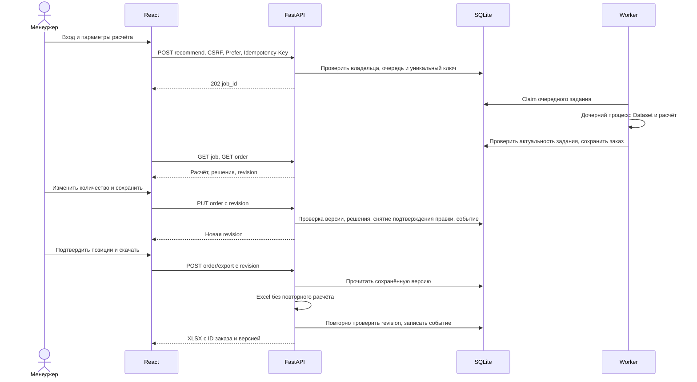

# Архитектура Umytpa

Документ описывает код после интеграции `baitc/frontend` (`5a0ace2`) и исправлений критериев. Существующий сервис отделён от следующего этапа [production-ТЗ](ТЗ_платформы.md). FastAPI и расчёт на настоящих Excel дополнены авторизацией, постоянными заказами, фоновой очередью и новым React-интерфейсом. PostgreSQL и независимое согласование пяти ролей остаются требованиями развития.

## 1. Реализованная схема

Тяжёлый расчёт выполняется вне процесса API. `/meta` читает/кеширует исходники в API, поэтому первый запрос метаданных всё ещё может ждать холодного Excel-импорта. Источники читаются без изменения файлов; Excel-кеш защищён блокировкой от параллельного холодного импорта. Копии DataFrame исключают изменение кеша фильтрами одного пользователя.

EKT обновляется отдельной CLI-командой. Сеть сайта не участвует в расчёте и экспорте. Описания товаров не заменяют учётные продажи, остатки, сроки или MOQ.

## 2. Стек и границы компонентов

| Компонент | Технология и ответственность |
|---|---|
| UI | React 19 / Vite 8, локальные шрифты, fetch, восстановление сохранённых заказов |
| API | FastAPI / Pydantic v2, Python 3.12, проверка сессии/CSRF/владельца/версии |
| Состояние | SQLite WAL на локальном диске, миграции, короткие транзакции |
| Worker | Постоянная SQLite-очередь, один supervisor и отдельный дочерний процесс |
| Расчёт | pandas, numpy, scipy; statsmodels установлен, но текущая формула его не вызывает |
| Excel | openpyxl: read-only входы, сохранённые значения формул, текстовые ячейки экспорта |
| Доступ | Argon2id, непрозрачные восьмичасовые сессии, HttpOnly/Secure/SameSite cookie |
| Объяснения | Локальный числовой шаблон; OpenAI API только при явном включении |
| Эксплуатация | Шаблоны systemd/nginx, online backup/offline restore, CI и smoke-проверки |

Движок принимает `Dataset` и не зависит от HTTP, пользователя или типа исходных файлов. Рекомендация и сохранение заказа разделены: `generate_recommendations` считает, worker публикует результат только если задание ещё активно и владелец не отключён.

## 3. Входная модель Dataset

| Таблица / поле | Назначение |
|---|---|
| `catalog` | Код SKU, название, внутренняя категория, единица, поставщик; дополнительно поля EKT |
| `sales` | Дата, SKU, склад, количество; client/document ID, если источник их содержит |
| `monthly_sales` | Подтверждаемые месячные количества по SKU×склад |
| `monthly_stock` | Разреженные снимки месячных остатков; не доказательство дневного stockout |
| `stock` | Остаток, дата и источник снимка |
| `in_transit` | SKU×склад, количество, ETA и дата источника |
| `suppliers`, `sku_suppliers` | Поставщик, lead time, MOQ и кратность |
| `seasonality` | Месячные коэффициенты поставщика |
| `stockouts` | Явно переданные интервалы отсутствия SKU×склад; в текущих партнёрских Excel отсутствуют |
| `as_of`, `source`, `warnings`, `metadata` | Дата расчёта, происхождение, ограничения и проверяемые счётчики |

Связь складов/городов не выдумывается: фильтр включает реальные непустые ключи `sales/monthly_sales/stock/in_transit`. Сейчас партнёрские данные относятся к Алматы; подключение других городов требует учётной складской аналитики.

Числовой путь использует месячные итоги как выбранный основной источник количества и транзакции для выявления опта. При расхождении объёмов вычитание опта в спорных месяцах блокируется. Для клиента/дня и документа/дня теперь проводится объединённая детекция без двойного исключения строк.

Компенсация stockout реализована для дневной и месячной истории, только по явным интервалам. В месячной ветке добавляется оценка упущенного объёма с предупреждением о предпосылках; дневные наблюдения из месячных итогов не создаются. Полный месяц без доступности использует только предыдущую пригодную историю; без неё объём не выдумывается. Методология: [ML_И_ДАННЫЕ.md](ML_И_ДАННЫЕ.md).

## 4. Постоянная модель сервиса

- `users`: имя, Argon2id-хеш, роль `admin/manager`, активность.
- `sessions`: хеш токена, пользователь, CSRF-токен, expiry.
- `orders`: неизменяемый JSON расчёта, calculation ID, владелец, название, текущая revision, archive flag и даты.
- `decisions`: текущее количество и подтверждение по line ID.
- `events`: автор, время, операция и изменения «до/после»; сохраняются вместе с изменением заказа.
- `jobs`: запрос и hash, ключ идемпотентности на владельца, статус, lease worker, результат/безопасная ошибка.
- `worker_state`, `app_state`, `login_attempts`: heartbeat, служебные маркеры и throttling.
- `recommendations`: совместимость со старыми снимками; ограничение этого legacy-хранилища не очищает постоянные заказы.

`revision` защищает текущие правки от перезаписи и экспорт от устаревшего состояния. **Отдельного неизменяемого снимка каждой исторической версии решений пока нет.** Журнал позволяет видеть изменения, но UI/API не выдают историческую версию заказа как самостоятельную сущность.

Заказ сейчас содержит несколько групп поставщиков одного расчёта. Состояния заказа — текущий документ и архивный признак; этапов независимого согласования нет.

## 5. Последовательность работы

Несохранённые изменения клиенту нужно сохранить перед экспортом. Старый `/recommend/export` принимает только решения, уже совпадающие с сохранёнными; обход истории передачей произвольного `approved` закрыт. Подтверждение позиции с неизвестной единицей запрещено на сервере; черновик остаётся доступным для проверки.

## 6. Отказы и эксплуатационные ограничения

| Событие | Реализованное поведение |
|---|---|
| Перезагрузка браузера/API | Сохранённые заказы, решения и задания остаются в SQLite |
| Одновременная правка | Команда со старой revision получает 409; молчаливого затирания нет |
| Повтор запуска с тем же ключом | Возвращается прежний job; новые параметры с тем же ключом запрещены |
| Нет worker / очередь заполнена | Новая работа не принимается: 503 / 429 |
| Отмена / таймаут | Дочерний процесс завершается; поздний результат не публикуется |
| Перезапуск worker | Running помечаются failed, queued остаются; повтор ошибки запускается явно |
| Отключение пользователя | Сессии отозваны, активные задания отменены |
| Нет OpenAI / исчерпан бюджет | Используется локальное объяснение; формула не меняется |
| Нет EKT | Расчёт продолжается по учётным данным с предупреждением |
| Нет обязательных входных файлов | Readiness 503; ошибка расчёта не заменяется synthetic |
| Сбой БД | Безопасная ошибка, request ID, отсутствие ложного сообщения об успешном сохранении |

Один worker считает **одну** задачу одновременно, очередь по умолчанию 20 и один активный расчёт на пользователя. Целевые 20 аккаунтов/10 активных пользователей/2 параллельных расчёта из ТЗ не являются измеренной мощностью текущей установки.

`/health` проверяет живость, `/ready` — БД, свежий heartbeat и доступность непустых файлов. Readiness не проверяет полноту/свежесть каждой строки. Обновление исходников выполняется согласованным комплектом при остановленных API/worker; manifest, атомарная активация партий и веб-загрузка пока отсутствуют.

В поставке есть ежедневная online-копия SQLite и проверяемое offline-восстановление. Копии на одном диске не заменяют внешнее хранение; исходные Excel и JSON нужно резервировать отдельно. Ежедневная частота не обеспечивает целевой RPO=1 час из полного ТЗ.

## 7. Граница с полной production-платформой

| Область | Сейчас | По полному ТЗ |
|---|---|---|
| Пользователи | `manager/admin`, личные заказы и полный admin-доступ | Пять ролей, области склада/поставщика, при необходимости SSO |
| Подтверждение | Самостоятельный флаг строки | Независимое согласование, запрет самоутверждения, версии и причины |
| Документ | Один расчёт, несколько групп поставщиков | Один поставщик на заказ, полная область доступа по складам |
| Данные | Файлы по известным именам, cache fingerprint | Версионированная партия, validation/activation, checksum и owner |
| Состояние | SQLite WAL, текущие решения + журнал | PostgreSQL и самостоятельные версии/согласования |
| Экспорт | Текущая сохранённая revision | Различение рабочей и исторической версии с политикой свежести |
| Отчётность | Реальные показатели текущих заказов | Разрешённые агрегаты для руководства/наблюдателя |
| Эксплуатация | Шаблоны служб и проверяемые механизмы | Приёмка на целевом сервере, мониторинг, подтверждённые SLA/RPO/RTO |

Целевая миграция сохраняет `Dataset`, движок, React и FastAPI. Добавляются модель прав/согласования, PostgreSQL, закрытые версионированные исходники и активация импорта. Redis не является обязательным требованием: надёжность определяется поведением очереди и проверками.

Отдельные `scripts/` для очистки/ML/backtest создают исследовательские артефакты. Они не подключают обученную модель и не заменяют рабочий DataSource. Развёртывание: [DEPLOY.md](DEPLOY.md). Полный API: [БЭКЕНД.md](БЭКЕНД.md). Источники и расширение: [РЕЕСТР_ДАННЫХ.md](РЕЕСТР_ДАННЫХ.md), [КАТАЛОГ_EKT.md](КАТАЛОГ_EKT.md), [ГОРОДА_И_СКЛАДЫ.md](ГОРОДА_И_СКЛАДЫ.md).
