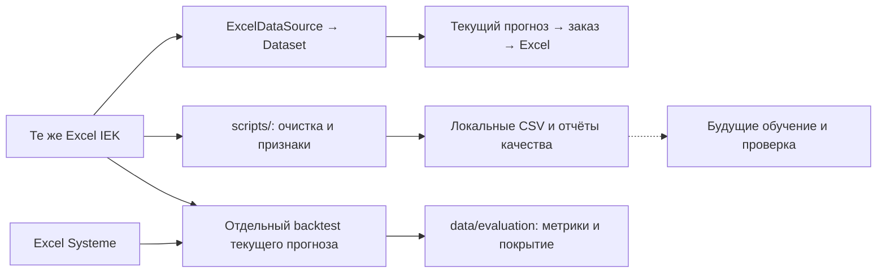

# Аудит ветки `alish` и применение её данных

Проверка выполнена 23.09.2026 **строго по коммиту `5facda2`** ветки `baitc/alish` — `Add new data files for machine learning model training and quality issues`. Скрипты подготовки появились в предшествующих коммитах `0e3401b` (`clean_dataset`) и `ebe1998` (`clean_data_2`).

При последующем обновлении remote-ссылок обнаружена новая вершина **`08a0ce0`** (`feat: подготовить входные данные для расчёта заказов IEK`). Она здесь не проверялась. Выводы, хеши и численности ниже нельзя автоматически относить к новому коммиту; `5facda2` не называется последним состоянием ветки.

**Работа полезна как воспроизводимая подготовка IEK для исследования и обучения.** Она не содержит новой первичной истории, других городов, обученной модели или измеренных метрик. SHA-256 всех шести исходных Excel IEK совпали с основной веткой.

Это описание проверенного коммита. Позднее в основной проект отдельно добавлена временная оценка действующей функции прогноза на IEK и Systeme; её результаты описаны ниже и не приписываются `5facda2` или новой вершине `alish`.

## Что перенесено в проект

Выборочно добавлены восемь файлов в `scripts/`: два рабочих скрипта, два файла тестов, два файла зависимостей и две инструкции. Основная ветка сохранила текущий импорт, расчёт, экспорт и обогащение EKT. Полное слияние старых документов ветки не выполнялось.

| Артефакт | Применение |
|---|---|
| `scripts/clean_monthly_data.py` | Очистка месячных продаж/начальных остатков, сохранение пропусков, журнал некорректных ячеек |
| `scripts/prepare_ml_data.py` | Сборка панели IEK, лагов, временных разбиений, сверки источников и отчёта с SHA-256 |
| `data/clean/iek/monthly_clean.csv` | Разбор конкретного SKU-месяца без потери исходной неизвестности |
| `data/ml/iek/training_data.csv` | Будущее обучение и последовательная историческая оценка, после согласования политик данных |
| `data/ml/iek/prediction_features.csv` | Признаки полного прогнозного месяца; отдельный fallback для короткой истории |
| `data/ml/iek/monthly_panel.csv` | Исходные и обработанные количества, присутствие строк, пропуски |
| `data/ml/iek/reconciliation.csv` | Поиск SKU-месяцев, в которых транзакции расходятся со сводным отчётом |
| `data/ml/iek/quality_issues.csv` | Разбор адресов ячеек, отрицательных значений и дублирующихся ограничений |
| Остальные справочники ML | Проверка товаров, единиц, MOQ, транзакций, пути и предоставленной сезонности |

При первоначальной интеграции пустой `clean_dataset.py`, большие производные CSV и посторонний lock-файл не переносились в отслеживаемый код. Последующий коммит `c7062f9` добавил 12 производных CSV в Git для проверки жюри; они по-прежнему воспроизводятся скриптами и не являются обученной моделью. Также сохранены отчёты: [`preparation_report.json`](../data/ml/iek/preparation_report.json), [`integration_audit.json`](../data/ml/iek/integration_audit.json), [`quality_report.json`](../data/clean/iek/quality_report.json).

## Результат проверки набора

Зафиксированные значения относятся к IEK и политике подготовки по умолчанию на `--as-of 2026-09-23`. После исправлений обе команды выполнены на реальных файлах; основные численности совпали с набором ветки, исходные Excel сохранили SHA-256. Эти значения не равны объёмам рабочего API, который объединяет IEK и Systeme Electric и применяет другие фильтры.

| Показатель | Значение | Как понимать |
|---|---:|---|
| Товары | 3 183 | Объединение справочников IEK |
| Месячная панель | 105 039 строк | Товар × месяц, включая неизвестные количества |
| Обучающие строки | 28 979 по 1 755 SKU | Известная цель и достаточная предыдущая история |
| Train | 20 907 | Целевые месяцы до конца декабря 2025 |
| Validation | 5 962 | Январь–июнь 2026 |
| Test | 2 110 | Июль–август 2026 |
| Строго положительные цели | 28 979 | Нулевых целей в этой выборке нет |
| Строки прогнозных признаков | 3 183 | Полный сентябрь 2026 из истории до августа |
| Достаточная история для прогноза | 1 898 SKU | Признак `history_sufficient`; это не измерение точности |
| Неизвестные единицы | 330 SKU | Нельзя без проверки суммировать в общую физическую величину |
| Транзакции | 171 603 | Сохранены исходные знаки и пустые/некорректные значения для аудита |
| Записи журнала качества | 379 | 361 отрицательное значение, 15 некорректных значений, 1 дубль ограничения, 2 примечания |
| Расхождения сверки | 7 414 из 21 262 | **34,87%** сопоставимых SKU-месяцев; это не процент ошибочных товаров |

Расхождение не доказывает, какой отчёт неверен. Причинами могут быть различия периода, операций, склада, единиц, возвратов или области выгрузки. Отчёт позволяет адресно передать эти вопросы владельцу учётных данных. Автоматически вычитать найденный опт из несогласованной месячной суммы нельзя; рабочий движок уже сохраняет такой месячный итог и выдаёт предупреждение.

## Исправления перед интеграцией

Проверка выявила три случая, для которых добавлены исправления и регрессии:

1. Исключение служебных строк пути теперь распознаёт конкретные комбинации полей отчёта. Реальные товары с кодами `0` или `1` не отбрасываются только из-за кода.
2. Разные непустые артикулы поставщика у одного внутреннего кода из разных источников считаются конфликтом. Подготовка останавливается с ошибкой вместо молчаливого выбора одного артикула.
3. Заголовок месяца обрабатывается как настоящая дата Excel наряду с текстовым представлением.

Отчёт дополнен областью данных: поставщик IEK, наблюдаемый склад транзакций Алматы, отсутствие складской аналитики в месячных матрицах. Сохранён профиль целей и выбранные политики обработки пустых/отрицательных продаж. Проверки исходных хешей, ключей, границ времени и числовых целей вынесены в `integration_audit.json`: все девять проверок прошли. Это датированный снимок аудита данной версии, созданный отдельно; команды подготовки не обновляют его автоматически. После изменения исходников или правил требуется новый аудит. Хронологический порядок признаков сам по себе не доказывает, что все значения отчёта были доступны в исторический момент прогноза.

## Что мешает сразу использовать это как новую модель

**Пустые продажи имеют разные допущения.** Операционный `ExcelDataSource` принимает пустую ячейку присутствующего месячного отчёта за ноль; подготовка ML по умолчанию сохраняет неизвестность. Поэтому исходная обучающая выборка не содержит нулевых целей. Оценка только по положительным месяцам смещает охват и ничего не говорит о качестве решения «не заказывать» в месяцы без продаж.

`--blank-sales zero` доступен как явная настройка, но смысл пустоты должен быть подтверждён владельцем отчёта. Нельзя автоматически объявлять её нулевым спросом, если это пропущенная выгрузка, неактивный товар или отсутствующая аналитика. Даты запуска товаров не известны. Аналогично `--negative-sales zero` — допущение о возвратах, а не восстановление валового спроса.

**Полнота будущего обучения не подтверждена.** Для SKU с короткой историей нужен отдельный fallback. Модель должна сравниваться с текущим объяснимым прогнозом и простыми базовыми прогнозами на одних временных границах, с отчётным покрытием товаров и периодов. Общая сумма ошибок по разным единицам не является корректной единой метрикой количества.

**Месячный прогноз и заказ имеют разные горизонты.** `prediction_features.csv` относится к полному сентябрю от его начала; текущий заказ рассчитывается с 23 сентября на срок поставки плюс период проверки. Готовые признаки нельзя напрямую поставить вместо потребности к заказу. Сначала требуются обучение, историческая проверка и явное преобразование прогноза к нужному горизонту.

**Склады не добавились.** Все наблюдаемые транзакционные склады — Алматы; месячные отчёты склад не указывают. Копирование этих строк на другие города создало бы вымышленные наблюдения. Региональный план: [ГОРОДА_И_СКЛАДЫ.md](ГОРОДА_И_СКЛАДЫ.md).

## Разделение рабочего сервиса и исследования



`DATA_SOURCE` по-прежнему принимает `excel`, `csv` или `synthetic`. Источника `ml` нет. Файлы `data/ml/iek/` имеют свой формат и не совместимы с шестью обязательными таблицами `CsvDataSource` и его необязательным `catalog.csv`. Наличие `in_transit.csv` среди исследовательских файлов не делает весь каталог входом операционного адаптера. Совместимый демонстрационный набор опубликован отдельно: [sample_csv](../data/sample_csv/README.md).

Подготовленные отчёты полезны уже сейчас: для списка уточнений партнёру, сверки первичных таблиц и воспроизведения будущих экспериментов. Автоматическая загрузка этих CSV в API, обучение модели и улучшение точности не заявляются.

## Что добавлено в основной проект после этого аудита

Исправлены месячная компенсация stockout по явно переданным интервалам и совместная детекция клиент/день + документ/день без двойного вычитания. Эти изменения не создают отсутствующие клиентские ID или интервалы в реальных файлах. Методика и ограничения — [ML_И_ДАННЫЕ.md](ML_И_ДАННЫЕ.md).

Отдельный [backtest](../scripts/BACKTEST.md) сравнивает текущую месячную функцию с предыдущим и прошлогодним месяцем на **3 017 SKU** IEK/Systeme, с validation январь–июнь и последовательным test июль–август 2026. Он читает реальные месячные отчёты, не обучает модель на `training_data.csv`, различает неизвестные/нулевые месяцы, считает покрытие и ошибки отдельно по единицам. [JSON-протокол](../data/evaluation/forecast_backtest.json) и [CSV метрик](../data/evaluation/forecast_metrics.csv) фиксируют результат, включая проигрыш простому предыдущему месяцу в нескольких группах. Общее преимущество текущего прогноза не подтверждено.

Это проверка прогноза на ретроспективных матрицах; она не измеряет всю закупку с исключением опта, stockout, MOQ и текущими приходами. Поздние исправления исходников и предварительное знакомство с данными нельзя исключить. Для последующего подбора метода потребуется новый будущий период и явное указание повторного использования уже увиденного test. Статус `5facda2` остаётся «проверенная подготовка», а не «обученная модель».

## Воспроизведение и проверки

Из корня проекта после установки backend-зависимостей:

```bash
OPENAI_API_KEY='' backend/.venv/bin/python scripts/clean_monthly_data.py
OPENAI_API_KEY='' backend/.venv/bin/python scripts/prepare_ml_data.py --as-of 2026-09-23
OPENAI_API_KEY='' backend/.venv/bin/python -m unittest discover -s scripts -p 'test_*.py' -v
```

Для отдельного окружения используйте `scripts/requirements-cleaning.txt` и `scripts/requirements-ml.txt`. Исходные Excel не меняются. Полные правила и параметры: [CLEANING.md](../scripts/CLEANING.md), [ML_PREPARATION.md](../scripts/ML_PREPARATION.md).

Скриптовые проверки не входят в `backend/tests` и запускаются отдельной командой. Текущий результат определяется свежим запуском; прежние количества тестов из первоначальной интеграции не выдаются за актуальные после изменения сервиса. Эти проверки подтверждают свойства очистки, контрактов и расчёта. Измерение качества текущего прогноза выполняет отдельный backtest; обученная ML-модель в проект не добавлена.
