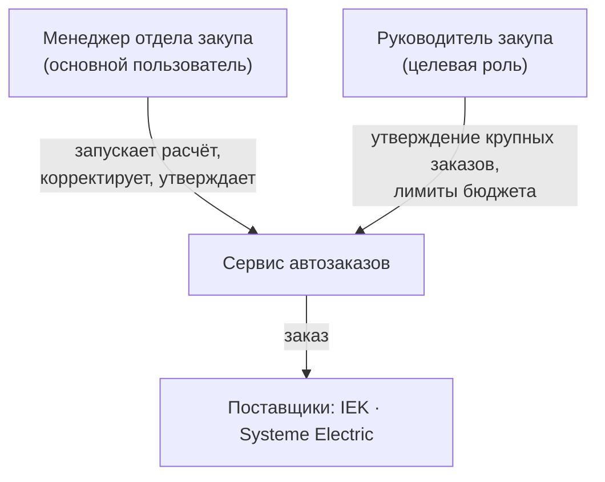
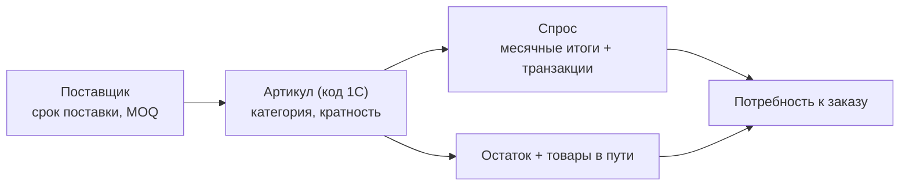

# Концепция системы автономного пополнения для дистрибьюторов РК

> HackAlem AI · трек 05 · Логистика. Кейс ТОО «Электрокомплект».

---

## 1. Введение и целеполагание

Электротехнические дистрибьюторы РК (ЭКТ и аналогичные) держат тысячи артикулов от нескольких поставщиков с разными сроками поставки и MOQ. Пополнение считается вручную в Excel — редко, без учёта сезонности и упущенного спроса. Итог: **замороженный капитал** в избыточных запасах и **упущенные продажи** из-за дефицита.

Цель системы — превратить закуп из ручного расчёта в **полуавтономный процесс**: система непрерывно считает потребность по данным 1С и предлагает готовый заказ, а человек утверждает. Это снижает издержки хранения, сокращает дефицит и делает решения объяснимыми и воспроизводимыми.

Тема созвучна повестке РК: логистика и запасы — прямой фактор себестоимости и доступности товаров. Первоисточник кейса — [../relly-problem.md](../relly-problem.md).

---

## 2. Роли (кадровая вертикаль закупа)

- **Менеджер закупа** — запускает расчёт по складу/категории, проверяет обоснование, корректирует количества, утверждает.
- **Руководитель** (Roadmap) — контроль крупных заказов, лимиты, отчётность.

В MVP реализована роль менеджера; ролевая модель/утверждение — в развитии (см. [БЭКЕНД.md](БЭКЕНД.md)).

---

## 3. Модель данных запасов

Логика пополнения строится на связке:

**Принцип истины по количеству:** сводные месячные отчёты 1С точнее разрозненных транзакций, поэтому именно они задают объём спроса; транзакции применяются для выявления исключительного опта. При расхождении сумм крупные заказы в несогласованных месяцах не вычитаются — чтобы не стереть реальный спрос.

---

## 4. Интеллектуальное ядро

1. **Очистка спроса** — исключение разового опта, компенсация упущенного спроса при отсутствии товара.
2. **Прогноз** — уровень × сезонность месяца × тренд (объяснимая декомпозиция).
3. **Потребность** — точка заказа с покрытием на `срок поставки + период проверки` и страховым запасом по уровню сервиса.
4. **Обоснование** — LLM/шаблон по каждой строке; человек-в-контуре.

Подробно — в [ML_И_ДАННЫЕ.md](ML_И_ДАННЫЕ.md).

---

## 5. Сквозной процесс: от выгрузки до заказа

**Ограничение принципа:** система никогда не отправляет заказ поставщику автоматически — только после подтверждения ответственного сотрудника.

---

## 6. Масштабирование концепции

- **Мультипоставщик / мультисклад** — модель уже разделяет расчёт по `(sku, warehouse)` и поставщикам.
- **Другие дистрибьюторы** — подключение через новый `DataSource` без изменения ядра (проверено на IEK и Systeme Electric из одной кодовой базы).
- **Развитие:** приоритизация по риску дефицита, лимиты бюджета, автоформирование черновика письма поставщику, графики трендов по категориям.

---

## 7. Техническая реализация

Архитектура и слои — [АРХИТЕКТУРА.md](АРХИТЕКТУРА.md); бэкенд — [БЭКЕНД.md](БЭКЕНД.md); фронтенд — [ФРОНТЕНД.md](ФРОНТЕНД.md); данные и модель — [ML_И_ДАННЫЕ.md](ML_И_ДАННЫЕ.md); развёртывание — [DEPLOY.md](DEPLOY.md).
