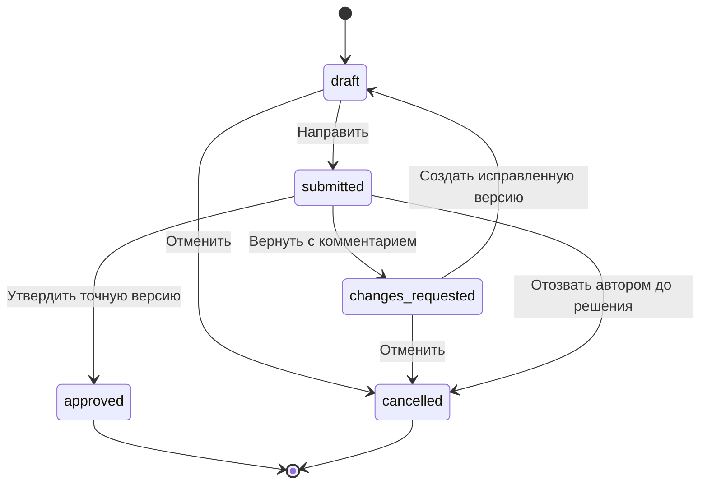

# Umytpa — техническое задание production-платформы закупок

Версия 2.0 · актуализировано 23.09.2026 после интеграции `baitc/frontend` (`5a0ace2`) · кейс ТОО «Электрокомплект».

**Назначение документа:** описать работающую многопользовательскую платформу для ежедневного планирования и согласования пополнения склада. Это задание на разработку и приёмку production-версии, а не заявление о завершении всех требований текущим сервисом. Первоначальный бизнес-кейс — [relly-problem.md](../relly-problem.md).

Пользователь подтвердил цель production и обязательность удобного мобильного интерфейса. Фактический штат, инфраструктура, политика согласований и SLA компании ещё не предоставлены. Численные параметры пилота и организационные правила ниже — **предлагаемая базовая конфигурация ТЗ**, которую необходимо утвердить с владельцем процесса до запуска; они не являются измеренными характеристиками приложения.

## 1. Как читать и согласовывать ТЗ

- **Сейчас:** подтверждённая возможность текущего кода; её границы описаны отдельно.
- **Production v1:** обязательное целевое поведение для первого рабочего выпуска.
- **Далее:** развитие после приёмки v1, не обещанное в первом выпуске.
- **На согласование:** параметр с предлагаемым значением; изменение фиксируется в журнале решений.

Основное ТЗ задаёт роли, область данных, статусы и критерии приёмки. [ИНТЕРФЕЙС_ПЛАТФОРМЫ.md](ИНТЕРФЕЙС_ПЛАТФОРМЫ.md) раскрывает каждый экран, [Дизайн_фронтенда.md](Дизайн_фронтенда.md) — визуальные и адаптивные правила. Технические документы описывают текущую реализацию и необходимые изменения. При противоречии нельзя молча выбрать удобный вариант: изменение согласуется и одновременно отражается в связанных документах.

### 1.1. Решения и границы

| ID | Решение | Основание / статус |
|---|---|---|
| D-01 | Разрабатывается production-платформа для ежедневной работы сотрудников | Подтверждено пользователем |
| D-02 | Основной результат — объяснимый рекомендованный заказ; человек принимает решение | Исходный кейс |
| D-03 | Полноценная работа на компьютере, планшете и телефоне | Подтверждено пользователем |
| D-04 | Учётные количества поступают из выгрузок компании; EKT даёт описания товаров | Уже реализованное разделение источников |
| D-05 | Начальная область — одна организация, данные Алматы, IEK и Systeme Electric | Предлагаемая граница первого выпуска, основанная на имеющихся данных |
| D-06 | Пять ролей, серверное сохранение, отдельное согласование руководителем | Предлагаемый процесс production v1 |
| D-07 | 20 аккаунтов, 10 одновременных пользователей, 2 параллельных расчёта | Проектная нагрузка пилота, требует подтверждения |
| D-08 | Представитель компании/спонсора получает обзор реальных разрешённых агрегатов | Предлагаемое применение роли наблюдателя; не публичная демонстрация |
| D-09 | Первый выпуск заканчивает процесс утверждением и Excel-экспортом | Автоотправка и запись документа в 1С вне v1 |
| D-10 | Обучаемая ML-модель подключается только после отдельной исторической оценки | Есть подготовка `alish` и backtest текущего прогноза; обученной модели и доказанного преимущества для всего ассортимента нет |

### 1.2. Что есть сейчас и что предстоит

| Область | Сейчас | Для production v1 |
|---|---|---|
| Данные | 12 Excel, проверяемый CSV-адаптер с образцом, фиксированный synthetic, локальный EKT JSON; файлы размещает оператор | Управляемые версии загрузок, проверка, активация, свежесть и восстановление |
| Пользователи | Личный вход, серверные сессии, роли `admin`/`manager`; менеджер видит свои заказы, администратор — все | Пять бизнес-ролей, отдельные назначения складов/поставщиков и полный контракт области |
| Расчёт | Фоновая очередь в SQLite, идемпотентность, состояния/отмена, отдельный worker; один выполняемый расчёт | Проверенный профиль до двух параллельных расчётов и связь задания с управляемой партией данных |
| Правки | Сохранённые решения строк, `revision`, конфликт 409; перезагрузка не удаляет сохранённые правки | Неизменяемые бизнес-версии, причины изменений и процесс пересмотра согласования |
| Утверждение | Проверяемая сервером отметка строки в сохранённом заказе; владелец может отметить свою строку | Независимый согласующий, проверка участников подготовки и переход статуса всей версии |
| История | SQLite хранит заказы, текущие решения, ревизию и события аудита; архивирование | Полные исторические версии для повторного просмотра/выгрузки и утверждённая политика хранения |
| Экспорт | XLSX сохранённых решений с проверкой владельца/администратора и ревизии; событие выгрузки | Отдельные рабочий/исторический режимы, независимое согласование и блокировки свежести |
| Интерфейс | Hash-страницы заказов, расчёта, заказа, команды и аккаунта; экран входа | Полный состав экранов ниже, бизнес-навигация по пяти ролям и приёмка всех мобильных сценариев |
| Эксплуатация | API и отдельный worker, readiness, ограничения очереди/задач, резервирование SQLite и эксплуатационные проверки | Подтверждённые инфраструктура/SLA, мониторинг, нагрузка, RPO/RTO и пользовательский пилот |

Интегрированный сервис уже сохраняет работу нескольких пользователей на сервере. Это закрывает часть технических пробелов прежнего прототипа, но не подменяет приёмку полного production-ТЗ. SQLite, две роли и ревизия конкурентного сохранения не означают реализованные PostgreSQL, пять ролей, независимое согласование или полный архив версий. Ветку `frontend` перенесли вместе с её сервисной основой и исправлениями совместимости; исходное ТЗ ниже остаётся целевым.

## 2. Цель, область и эффект

Платформа должна сократить ручной сбор данных для заказа, сделать причины закупки понятными и обеспечить контролируемое согласование. Менеджер отвечает на вопросы «что заказать, сколько, у кого, для какого склада и почему», руководитель — «что требует решения и на каких данных оно основано».

**В v1 входят:** доступы, импорт и качество данных, расчёт, реестр и версии заказов, редактирование, согласование, Excel-экспорт, товарный справочник, операционные показатели, обзор руководителя, журнал действий и эксплуатационные механизмы.

**Вне v1:** маркетплейс поставщиков, оплаты, договоры, автоматическая отправка заказа, обратная запись в 1С, оптимизация межскладских перевозок, нативные приложения, редактирование без сети, подключение городов без данных и SaaS для нескольких независимых компаний. Для них потребуется отдельное расширение ТЗ.

Эффект нельзя показывать как достигнутую экономию без измерения. До пилота фиксируются базовое время подготовки сопоставимого заказа и выбранные показатели; после пилота сравниваются одинаковые периоды и области данных. Результаты тестов формулы не заменяют проверку точности прогноза или бизнес-эффекта.

## 3. Пользователи, количество и доступы

Раздел 3 задаёт **целевую** модель production v1. Текущие роли `admin` и `manager` не являются пятью ролями этой таблицы: администратор сейчас может работать с заказами всех менеджеров, а ограничений по организации, складу и поставщику ещё нет.

### 3.1. Проектная численность пилота

| Роль | Аккаунтов в нагрузочном сценарии | Ежедневная работа | Основное устройство |
|---|---:|---|---|
| Менеджер закупок (`purchase_manager`) | 10 | Проверяет данные, рассчитывает, исправляет и направляет заказ | Компьютер; телефон для проверки и небольших правок |
| Руководитель закупок (`procurement_lead`) | 3 | Рассматривает очередь, возвращает или утверждает заказ | Компьютер и телефон |
| Аналитик / ответственный за данные (`data_analyst`) | 3 | Загружает выгрузки, разбирает ошибки, активирует проверенный набор | Компьютер; телефон для контроля состояния |
| Администратор (`admin`) | 2 | Управляет аккаунтами, областями доступа и техническими настройками | Компьютер |
| Наблюдатель компании/спонсора (`business_viewer`) | 2 | Смотрит разрешённые агрегаты и состояние процесса | Компьютер и телефон |
| **Всего** | **20** | **До 10 одновременно активных сессий** | Адаптивный веб-интерфейс |

Это 20 отдельных учётных записей, а не требование нанять 20 сотрудников. Один человек может совмещать разрешённые роли, но не вправе утверждать собственную версию заказа. Должен быть назначен минимум один другой согласующий и его заместитель. Увеличение до 100 аккаунтов рассматривается после отдельного нагрузочного испытания; поддержка такой нагрузки сейчас не подтверждена.

### 3.2. Области прав

Права вычисляются по пользователю, роли, организации, складам и поставщикам. Все списки, поиск, счётчики, фоновые задачи, прямые ссылки и скачивания обязаны соблюдать одну область доступа. Скрытая кнопка не считается ограничением доступа.

Заказ может содержать несколько складов, но просмотреть его целиком, редактировать, согласовать и экспортировать можно только при доступе **ко всем складам его строк и поставщику**. Частично скрытый заказ нельзя согласовать как целый. Если полномочия согласующих различаются, до отправки формируются отдельные черновики по области либо назначается согласующий с полной областью. Ограниченному пользователю не выдаётся скрытая часть заказа через счётчики или сообщения о конфликте.

Администратор не получает право утверждения по умолчанию. Назначение дополнительной бизнес-роли фиксируется в аудите. Наблюдатель получает только явно разрешённые агрегаты; доступ к сырым выгрузкам, SKU-строкам и клиентским данным ему не предоставляется.

### 3.3. Матрица действий

«Свои» означает созданные пользователем или явно переданные ему черновики в назначенной области; «область» — только разрешённые склады/поставщики.

| Действие | Менеджер | Руководитель | Аналитик | Администратор | Наблюдатель |
|---|---|---|---|---|---|
| Смотреть рабочие данные | Область | Область | Назначенные источники | Техническая сводка | Только опубликованные агрегаты |
| Запускать расчёт | Область | Область | Для проверки, без согласования | Нет без дополнительной роли | Нет |
| Создавать/редактировать заказ | Свои черновики | Свои черновики | Нет | Нет без дополнительной роли | Нет |
| Направлять на согласование | Свои черновики | Свои черновики | Нет | Нет | Нет |
| Утверждать / возвращать | Нет | Область, кроме собственной версии | Нет | Нет без дополнительной роли | Нет |
| Экспортировать черновик | Свои, с пометкой «Черновик» | Область | Нет | Нет | Нет |
| Экспортировать утверждённую версию | Разрешённые заказы | Область | Нет | Нет | Нет |
| Загружать/активировать данные | Нет | Читать отчёт качества | Назначенные источники | Настраивать канал | Нет |
| Публиковать управленческий обзор | Нет | Разрешённая область | Готовить показатели | Настраивать доступ | Нет |
| Скачать PDF опубликованной сводки | Нет | Область | Нет | Нет | Только разрешённый снимок |
| Читать аналитику и сводку качества | Область, без сырых файлов | Область | Назначенные источники | Техническое состояние | Только опубликованный обзор |
| Управлять пользователями | Нет | Нет | Нет | Да | Нет |
| Читать журнал | Свои заказы | Область | Импорт и качество | Технические и доступы | Нет |

### 3.4. Вход и жизненный цикл аккаунта

Production v1 использует личные корпоративные аккаунты. Предпочтительный вариант при наличии у компании провайдера — корпоративный вход OIDC; наличие такого провайдера не подтверждено. Альтернатива с локальными паролями требует отдельного решения о восстановлении, MFA и ответственном администраторе. Общий пароль отдела не допускается.

При блокировке пользователя действующие сессии и новые действия прекращаются; созданные им заказы сохраняются и передаются ответственному. Изменение ролей проверяется сервером без необходимости повторного входа в обход старых прав. При истечении сессии интерфейс предлагает вход и возвращает пользователя к сохранённой работе.

## 4. Информационная архитектура и назначение экранов

Целевые маршруты ниже задают полный состав платформы. Сейчас реализована hash-навигация `#/orders`, `#/calculate`, `#/orders/:id`, `#/users`, `#/account` и отдельный экран входа до авторизации. `/overview`, управляемый импорт, аналитика и опубликованный обзор наблюдателя пока не являются готовыми страницами. Подробные поля, кнопки, состояния и поведение на телефоне — [ИНТЕРФЕЙС_ПЛАТФОРМЫ.md](ИНТЕРФЕЙС_ПЛАТФОРМЫ.md).

| Экран | Кто использует | Что показывает | Основное действие и результат |
|---|---|---|---|
| `/login` — вход | Все | Способ входа, ошибки доступа, восстановление сессии | Открыть разрешённую стартовую страницу |
| `/overview` — рабочая сводка | Менеджер, руководитель | Задачи, свежесть данных, свои черновики, очередь согласований | Перейти к конкретному действию, а не искать его в большой таблице |
| `/orders` — заказы | Менеджер, руководитель | Номер, поставщик, склады, статус, автор, версия, дата, согласующий | Найти/открыть заказ; фильтры по разрешённой области |
| `/orders/new` — расчёт | Менеджер, руководитель, аналитик | Источник/версия/даты, параметры, ограничения и ход задачи | Рассчитать; менеджеру/руководителю — создать черновики по поставщикам, аналитику — проверить результат без создания заказа |
| `/orders/:id` — заказ | Менеджер, руководитель | Сохранённые количества, объяснения, правки, замечания, версии, согласования | Исправить, отправить на согласование, вернуть, утвердить или выгрузить согласно роли |
| `/catalog` — товары | Менеджер, руководитель, аналитик | Код 1С, артикул, единица, категории, условия, источник описания | Проверить товар и перейти к соответствующим заказам |
| `/data` — данные | Аналитик; менеджеру/руководителю чтение сводки | Партии импорта, даты, охват, проверки, ошибки, активная версия | Загрузить, проверить и активировать согласованный набор по роли |
| `/analytics` — анализ | Аналитик, руководитель; менеджеру своя область | История и качество, сверка источников, покрытие и измеренные метрики | Найти причины расхождений/дефицита и открыть подтверждающие данные |
| `/management` — обзор руководителя | Руководитель, наблюдатель | Опубликованный срез процесса, даты, охват, ограничения, показатели | За 1–2 минуты понять состояние и вопросы, требующие внимания |
| `/administration` — управление | Администратор | Пользователи, роли, области, каналы данных, состояние задач | Изменить настройки с аудитом и понятным результатом |

Стартовая страница менеджера/руководителя — `/overview`, аналитика — `/data`, администратора — `/administration`, наблюдателя — `/management`. Навигация не показывает недоступные разделы, а прямой запрос всё равно проверяется сервером.

## 5. Сквозные рабочие сценарии

### UC-01. Ежедневная закупка

1. Менеджер входит и видит дату активных данных, доступные склады и свои незавершённые заказы.
2. Открывает «Новый расчёт», выбирает разрешённый склад/поставщика/категорию, уровень сервиса и период проверки. У каждого параметра есть смысл и единица.
3. Платформа показывает, какие данные устарели или отсутствуют. Критичные пробелы запрещают отправку результата на согласование; предварительный расчёт допускается с явной пометкой.
4. Менеджер запускает расчёт. Получает идентификатор задачи и может уйти со страницы; после возвращения состояние восстановлено.
5. Система показывает результат по поставщикам: товар, склад, единицу, количество, срочность и причины. Нулевой дополнительный заказ при риске до позднего прихода отображается как задача ускорения/проверки, а не как положительная закупка.
6. Менеджер выбирает включаемые позиции, корректирует количества и добавляет причину ручного отклонения от рекомендации. Ноль означает исключение из заказа.
7. Сохраняет черновики: один поставщик — один заказ; склад остаётся у каждой строки. На экране есть время последнего успешного сохранения и версия.
8. Проверяет состав и направляет конкретную версию руководителю. После отправки редактирование этой версии закрыто.

### UC-02. Согласование с телефона

1. Руководитель открывает внутреннюю очередь и заказ; видит автора, поставщика, дату данных, число строк, изменения и блокирующие проблемы.
2. Проверяет карточки товаров; раскрывает объяснение и разницу «рекомендовано → заказано» без горизонтального поиска по таблице.
3. Утверждает всю переданную версию либо возвращает её с обязательным комментарием. Самостоятельно править количество в процессе согласования нельзя: для этого возвращается заказ.
4. Сервер проверяет полномочия, версию, запрет самоутверждения и качество данных. Успех показывается только после сохранения решения.
5. При конфликте версии руководитель видит сообщение и актуальную версию; нажатие не утверждает неизвестные ему изменения.

Частичное согласование строк в v1 не предусмотрено. Если часть позиций требуется отделить, менеджер создаёт отдельный черновик с явной связью с исходным расчётом и исключает переносимые строки из исходного заказа.

### UC-03. Уточнение и повторное согласование

Руководитель возвращает заказ → менеджер читает замечание → создаёт редактируемую новую версию → исправляет → повторно направляет. Ранее принятое решение не применяется к новой версии. При изменении уже утверждённого заказа создаётся новая черновая версия; старая утверждённая остаётся доступной только как историческая версия, пока идёт пересмотр, и не выдаётся за текущий рабочий заказ.

### UC-04. Экспорт

Менеджер или руководитель выгружает сохранённую доступную версию. Черновик имеет явную пометку, утверждённый файл — номер, версию, дату/автора согласования, склад и единицы. Параметры на другом экране не пересчитывают файл. Событие скачивания фиксируется. Скачанный Excel не означает отправку поставщику и не создаёт документ 1С.

**Рабочий экспорт** разрешён только для последней версии в статусе `approved`, без начатого пересмотра и при допустимой свежести/условиях входного снимка этой версии. **Историческая копия** доступна по правам для старой, пересматриваемой или устаревшей версии с заметной пометкой «Историческая версия — не текущий заказ» и датами. Исторические числа не пересчитываются. Новая свежая партия исходников не делает старое согласование свежим; для этого нужен новый расчёт и согласование новой версии.

### UC-05. Обновление данных

Аналитик загружает полный набор согласованной версии → получает отчёт проверки → исправляет ошибки источника → подтверждает активацию допустимого набора. Ошибка/обрыв не заменяет действующую версию частью новых файлов. Уже созданные расчёты и заказы продолжают ссылаться на прежний снимок; для актуализации нужен новый расчёт/версия.

Для регулярной эксплуатации требуется настроенная доставка выгрузок из 1С по расписанию либо подтверждённый канал чтения. Временная ручная загрузка допустима для пилота только с назначенным ответственным и контролем свежести.

### UC-06. Обзор для представителя компании/спонсора

Наблюдатель входит по персональной учётной записи и сразу видит разрешённую сводку: дата публикации и источников, область складов/поставщиков, заказы по статусам, длительность согласования, доля ручных правок, проблемы качества. Обзор строится из реальных записей, опубликованных руководителем; пустое значение сопровождается причиной. Наблюдателю не требуется понимать формат Excel, названия внутренних API или формулы модели.

Руководитель может открыть детализацию в своей области, наблюдатель — только разрешённую агрегированную детализацию. Не показываются неподтверждённая экономия, придуманная точность, остатки других городов или подробные закупочные строки за пределами прав.

## 6. Заказ, версии и состояния

### 6.1. Фоновый расчёт

`queued → running → succeeded | failed | cancelled`. Состояние и результат сохраняются на сервере. Отмена доступна создателю и уполномоченному администратору; после `succeeded` результат не удаляется кнопкой отмены. Процент показывается только при известном объёме работы; иначе — выполняемый этап и время начала.

Это целевой словарь статусов. В текущем API успешное задание называется `completed`; очередь долговечна, но один worker выполняет один расчёт за раз. Переход к двум одновременно выполняемым заданиям и целевому словарю требует изменения контракта и проверки нагрузки.

В нагрузочной конфигурации одновременно работают не более двух расчётов; остальные находятся в очереди. Повтор запроса после сетевого сбоя с тем же ключом идемпотентности не создаёт второй расчёт. Перезапуск worker не теряет очередь и не создаёт два результата одной задачи.

### 6.2. Состояния заказа

| Код | Текст в UI | Кто может изменить | Допустимые действия |
|---|---|---|---|
| `draft` | Черновик | Автор/назначенный менеджер | Правки, сохранение, предварительный экспорт, отправка, отмена |
| `submitted` | На согласовании | Руководитель; автор может отозвать | Утвердить, вернуть, отозвать; количество закрыто для правок |
| `changes_requested` | Нужны правки | Автор/назначенный менеджер | Просмотр замечаний, новая черновая версия, отмена |
| `approved` | Утверждён | Содержимое версии неизменно | Экспорт, просмотр решения, начало пересмотра в новой версии |
| `cancelled` | Отменён | Содержимое неизменно | Просмотр истории; копирование в новый черновик при необходимости |

Экспорт — событие, а не статус «отправлен». Отмена/отзыв требуют причины. Архивирование — отдельный признак видимости завершённых заказов; оно не стирает статус, версии и журнал. Отмена и утверждение одной версии выполняются атомарно: при гонке только одно действие успешно, второе получает конфликт.

### 6.3. Правила строк и сохранения

- Идентичность: заказ + версия + поставщик + склад + SKU. Одинаковый SKU на разных складах не объединяет правки.
- Участники подготовки версии — создатель заказа и все пользователи, менявшие состав или количества этой версии, включая унаследованные правки. Ни один из них не может её утвердить; передача ответственного не снимает запрет. Просмотр и комментарий согласующего без изменения состава/количеств не делают его автором правок.
- «Рекомендовано» неизменно в пределах снимка; «К заказу» редактируется в черновике. Обоснование исходной рекомендации сохраняется рядом с комментарием менеджера.
- Количество конечное, неотрицательное; ноль исключает позицию. Положительное значение удовлетворяет MOQ и кратности, включая дробные единицы. Отображение округлённого числа не должно менять сохранённое значение.
- Флажок менеджера означает «Включить в заказ», а не право согласования. Текущие локальные флажки «Утверждено» должны быть заменены в production-процессе.
- До отправки все правки сохранены сервером. Для изменённого количества требуется причина: код причины и/или текст. Недопустимые поля имеют сообщение рядом с полем.
- Сохранение передаёт ожидаемую версию; при несовпадении сервер отвечает конфликтом. UI показывает сохранённые и локальные значения, позволяет перечитать и явно повторить правки. Молчаливое перезаписывание запрещено.
- Повторное нажатие, обновление страницы и повтор HTTP-запроса не удваивают заказ, согласование или событие формирования файла.
- Пересчёт создаёт новый результат. Копирование ручных количеств в него требует явного сравнения по SKU/складу/единице; утверждения не копируются.

## 7. Данные, импорт и допустимость заказа

### 7.1. Источники и область

Учётные продажи, остатки, резервы, приходы и условия закупки принадлежат контуру компании. Для первого выпуска используются согласованные выгрузки Excel/CSV; установка 1С на сервер приложения не требуется. Канал регулярного получения согласуется с владельцем 1С: [ИНТЕГРАЦИЯ_1С.md](ИНТЕГРАЦИЯ_1С.md).

EKT — дополнительный локальный справочник категорий и характеристик, со ссылкой и датой получения. Он не заменяет остаток, цену закупки, MOQ, кратность или срок поставки. Отсутствие карточки EKT не блокирует корректный учётный товар.

Сейчас доступны только данные Алматы. Восемь других городов не создаются как расчётные склады автоматически. Для каждого региона нужны собственные данные, устойчивый `warehouse_id` и проверка области сводных отчётов: [ГОРОДА_И_СКЛАДЫ.md](ГОРОДА_И_СКЛАДЫ.md).

### 7.2. Партия импорта

Каждая партия имеет `dataset_version`, источник, организацию, область складов, даты данных и получения, автора/канал, список файлов с контрольными суммами, версию схемы/преобразования, статистику и ошибки. Состояния: `uploaded → validating → ready | rejected`, затем `ready → active`; предыдущая активная версия становится `superseded`.

Активация выполняется атомарно после проверки обязательного комплекта, ключей, единиц, дат и области. Одновременные активации не оставляют две активные версии одного набора. Повтор тех же файлов обнаруживается и предлагается как уже существующая партия. Отклонённые файлы не участвуют в новых расчётах. Возврат к прошлой версии — отдельное действие с причиной и аудитом.

### 7.3. Свежесть и блокировки

Предлагаемые пороги для пилота: остатки и путь не старше 24 часов, завершённые транзакции доступны по предыдущий день; месячный отчёт включает последний закрытый учётный месяц. Это настраиваемые правила по источнику и складу; календарь закрытия месяца и исключения обязан подтвердить владелец данных.

Дата получения файла и дата состояния остатков — разные поля. Повторная загрузка старого файла не делает остаток свежим. Production использует текущую рабочую дату и активную версию данных; исторический расчёт явно маркируется и не выдаётся за актуальный заказ.

| Условие | Поведение |
|---|---|
| Неоднозначный SKU/склад, конфликт единиц, невозможное количество, отсутствует поставщик | Блокировка затронутой позиции; ручной обход идентичности/единиц запрещён |
| Остаток отсутствует/устарел, неизвестна дата, неподтверждённый срок поставки, MOQ/кратность не определены | Предварительный расчёт с предупреждением; отправка на согласование по умолчанию блокируется |
| Несогласованные месячные и транзакционные суммы | Показать расхождение и используемую политику; не вычитать опт из несогласованного месяца |
| Нет EKT-описания | Считать по учётным данным, обозначить отсутствие справочных сведений |
| Нет истории для прогноза | Не выдумывать спрос; показать причину и маршрут проверки данных |
| Нет дневных stockout-интервалов | Не заявлять восстановление упущенного спроса по факту |

Исключение для устаревшего остатка или неподтверждённого закупочного условия возможно только по отдельной политике компании: уполномоченный сотрудник подтверждает конкретное значение, источник, дату, причину и срок действия. До утверждения такой процедуры обход блокировок выключен. Общее «я согласен с предупреждениями» не заменяет данные. Утверждение/экспорт согласованного заказа повторно проверяет актуальные ограничения; исторический файл доступен с маркировкой версии и даты.

## 8. Функциональные требования

| ID | Требование production v1 | Проверяемый результат |
|---|---|---|
| FR-01 | Личный вход и серверные права | Запрещённое действие и чужая область недоступны через UI и прямой API |
| FR-02 | Список доступных складов из фактических данных | Нет вымышленных городов; месячная история без транзакций не теряется |
| FR-03 | Версии и проверка импортов | Сбой не заменяет активный набор; происхождение каждой рекомендации известно |
| FR-04 | Фоновый расчёт и очередь | Перезагрузка страницы/worker сохраняет задачу; повтор не создаёт дубль |
| FR-05 | Объяснимый прогноз и потребность | По строке доступны спрос, горизонт, сезонность, тренд, остаток, путь, запас, MOQ/кратность |
| FR-06 | Контроль реальных ограничений модели | Месячный и дневной режимы, неподтверждённые данные и stockout различимы |
| FR-07 | Постоянные черновики и версии | Правки восстанавливаются после выхода/перезапуска; конфликт явно разрешается |
| FR-08 | Согласование точной версии | Автор не утверждает себя; изменение создаёт новую версию без прежнего согласования |
| FR-09 | Экспорт | Данные соответствуют сохранённой версии; статусы, единицы, авторы и даты указаны |
| FR-10 | Каталог и поиск | Поиск по точному SKU/артикулу/названию в разрешённой области; источник описания различим |
| FR-11 | Обзор руководителя | Показатели имеют период, область, дату и определение; неизвестные значения не равны нулю |
| FR-12 | История и внутренние уведомления | Автор видит решение/комментарий; руководитель — новую задачу; прочитанное не дублируется |
| FR-13 | Адаптивность и доступность действий | Основные рабочие сценарии выполняются на телефоне и клавиатурой |
| FR-14 | Аудит и эксплуатация | Кто/когда/что изменил устанавливается; восстановление из копии проверено |

### 8.1. Числовой расчёт

Расчёт ведётся отдельно по SKU и складу, с подтверждённым поставщиком. Горизонт — срок поставки плюс период проверки. Из прогноза и страхового запаса вычитаются доступный остаток и допустимые поступления; MOQ применяется до округления до кратности. Поздний приход не скрывает риск дефицита до его даты. Изменение исходного количественного фактора отражается на результате согласно формуле.

В месячной ветке используются завершённые месяцы; текущий неполный месяц не превращается в полный при переносе даты. Транзакции и месячные суммы не складываются как независимый спрос. Stockout по явно переданным интервалам теперь учитывается и в дневной, и в месячной ветках; месячная оценка и её допущения видны в предупреждениях. Детекции клиент/день и документ/день объединяются без двойного вычитания. Точные условия и ограничения описаны в [ML_И_ДАННЫЕ.md](ML_И_ДАННЫЕ.md).

Пять Must-have исходного кейса сохраняются, но запуск рабочих закупок требует подтверждения политики данных. На текущих реальных файлах отсутствуют клиентские идентификаторы и интервалы отсутствия; синтетический PASS не подтверждает эти возможности на данных компании. Использование текущих коэффициентов сезонности в исторической оценке требует отдельной проверки доступности коэффициентов на дату прогноза.

### 8.2. Роль ML и LLM

Материалы проверенного коммита `alish` (`5facda2`) — отдельная подготовка IEK, не новый источник рабочего заказа и не обученная модель: [АУДИТ_ВЕТКИ_ALISH.md](АУДИТ_ВЕТКИ_ALISH.md). Новая вершина `08a0ce0` не входит в тот аудит. Выполнен отдельный последовательный backtest месячного прогноза на 3 017 SKU IEK/Systeme: validation январь–июнь, test июль–август 2026, две политики пропусков, сравнение с предыдущим и прошлогодним месяцами. [Протокол и результаты](../scripts/BACKTEST.md) не подтверждают общего преимущества текущего прогноза над простым базовым методом. Это оценка функции прогноза, а не всей закупки со stockout/MOQ/приходами и не обученная модель. Замена алгоритма требует нового временного периода, оценки по единицам, отчёта покрытия и указания повторного использования уже просмотренного test.

Шаблонное объяснение доступно без сети. В текущем API/ядре `explain=false` по умолчанию; ключ сам по себе LLM не включает. Добавлены ограничение времени внешнего вызова и общий бюджет объяснений расчёта; при отказе используется локальный текст. Для production организация всё ещё должна определить допустимые поля, провайдера, доступ к включению и денежный лимит: бюджет времени не является лимитом расходов. LLM не меняет числовую рекомендацию и не является доказательством точности модели.

## 9. Понятный обзор для руководства и спонсора

Экран `/management` использует крупные понятные карточки и короткие пояснения. Верхняя строка всегда показывает: организацию/область, период, дату источников и время публикации. Обзор — отдельная разрешённая проекция данных; скрытие SKU-таблицы средствами CSS не является защитой.

| Показатель | Определение | Ограничение |
|---|---|---|
| Заказы по статусам | Число уникальных заказов по текущему статусу; версия не считается новым заказом | Всегда указаны период и область |
| Ожидают согласования | Число `submitted` и время с момента отправки текущей версии | Не смешивать с отменёнными/возвращёнными |
| Время согласования | Медиана от отправки до решения по версии за период | При отсутствии решений — «Нет завершённых согласований» |
| Доля ручных правок | Доля положительных включённых строк версии, где количество отличается от рекомендации | Показать числитель/знаменатель и единое правило допуска сравнения |
| Риск дефицита | Число пар SKU–склад с рассчитанным риском на опубликованном снимке | Это оценка риска, а не число фактически потерянных продаж |
| Качество данных | Свежесть, покрытие остатков/условий и число блокирующих проблем | Отсутствие данных не показывать зелёным нулём |
| Финансовый объём / экономия | Только при наличии согласованных цен, валют, базы сравнения и методики | Сейчас необходимых данных нет; поле «Не рассчитано», без приблизительных обещаний |

Наблюдатель видит только опубликованный руководителем снимок с выбранной областью. Если источник обновился или снимок устарел, это видно; прошлый снимок не выдаётся за оперативный. Публикация и отзыв доступа фиксируются. Разрешено скачивание PDF именно этой агрегированной сводки с периодом, областью, датами, методикой и ограничениями; подробный Excel-экспорт для наблюдателя выключен. Отзыв доступа закрывает новые просмотры/скачивания, но не удаляет ранее скачанные файлы. Карточки показывают не более 4–6 ключевых показателей первым экраном; технические детали доступны соответствующим сотрудникам глубже.

## 10. Требования к мобильному интерфейсу

Адаптивный веб-интерфейс обязателен; установка приложения не требуется. Нативное приложение и офлайн-согласование не входят в v1.

- Проверяемые ширины: 320, 360, 390, 768, 1024 и 1440 CSS px; обе ориентации, увеличение текста/страницы до 200%.
- На телефоне заказ представлен карточками: код/название, склад, единица, количество, срочность, состояние сохранения, раскрываемое объяснение. Ключевые действия не требуют горизонтального скролла страницы.
- Фильтры открываются отдельной доступной панелью; после закрытия выбранные условия и число результатов видны. Выбор «Все» ограничен правами пользователя.
- Основные сенсорные цели не меньше 44×44 CSS px, поля не меньше 16 px; содержимое не перекрывается нижней панелью, системной областью или клавиатурой.
- Клавиатура для количества цифровая/десятичная; запятая и точка корректно нормализуются с учётом единицы. Пустое поле не превращается в ноль молча.
- Кнопки доступны без hover и свайпа; все действия имеют текстовые названия, фокус виден, статус передаётся текстом, а не только цветом.
- При слабой сети видны «Сохранение…», «Сохранено», «Не сохранено». Подтверждение не показывается оптимистично до ответа сервера. При разрыве сети согласование и экспорт новой версии недоступны, локальные правки не выдаются за сохранённые.
- Переход назад восстанавливает фильтры, страницу и позицию списка; права и свежесть данных проверяются заново. Вход по прямой ссылке после авторизации возвращает к доступному заказу.
- На телефоне должны полностью работать просмотр, исправление количества/комментария, отправка и согласование, просмотр качества, поиск и скачивание файла. Массовую подготовку файлов удобнее выполнять на компьютере, но состояние импорта читаемо на телефоне.

Детальная адаптация каждого экрана и компонента обязательна по [ИНТЕРФЕЙС_ПЛАТФОРМЫ.md](ИНТЕРФЕЙС_ПЛАТФОРМЫ.md) и [Дизайн_фронтенда.md](Дизайн_фронтенда.md). Соответствие этим требованиям проверяется на реальных браузерах; наличие CSS media query само по себе не считается приёмкой.

## 11. Технический контракт production

Минимальная целевая схема: React-клиент → защищённый FastAPI → PostgreSQL для аккаунтов, прав, импортов, задач, заказов и аудита; отдельный worker обрабатывает устойчивую очередь; исходные файлы и выгрузки хранятся приватно с версиями. Сейчас сервисная схема уже перенесена в SQLite: пользователи, сессии, заказы, текущие решения, ревизии, события и задания сохраняются. Переход в PostgreSQL, реестр партий, независимые согласования и неизменяемые бизнес-версии пока не реализованы. Конкретная промышленная инфраструктура и миграция согласуются в техническом проекте.

### 11.1. Обязательные сущности

| Сущность | Минимальная информация |
|---|---|
| Пользователь и назначение | Идентификатор, роль, область, активность, автор изменения |
| Склад | Устойчивый ID учёта, имя, город, связь с источниками |
| Партия данных | Версия, файлы/хеши, даты, область, правила обработки, статус, проверки |
| Задача расчёта | Автор, параметры, версия данных/алгоритма, статус, время, ошибка, результат |
| Заказ | Постоянный ID/номер, поставщик, автор/ответственный, область и текущая версия |
| Версия заказа и строки | Снимок рекомендации, количества, единицы, причины правок, статус |
| Решение | Версия, согласующий, действие, время, комментарий |
| Событие аудита | Пользователь/сервис, объект/версия, действие, время, идентификатор запроса |
| Выгрузка | Версия заказа, тип, создатель, хеш/место файла, дата, права скачивания |
| Управленческий снимок | Период, область, определения показателей, версии данных, автор публикации |

Файлы и записи связываются по неизменяемым идентификаторам. Даты событий хранятся с часовым поясом/в UTC и отображаются в согласованной зоне компании; базовое предложение — Asia/Almaty. Количества хранятся с точностью, достаточной для единицы; штуки, метры и другие единицы не суммируются в один показатель «шт».

### 11.2. API и ограничения

Существуют защищённые `/api/auth/*`, `/api/users`, `/api/meta`, `/api/recommend`, `/api/jobs/*`, `/api/orders/*` и экспорт сохранённого заказа. Совместимые пути расчёта/экспорта также проверяют текущую сессию и права. Реальные методы и тела перечислены в [БЭКЕНД.md](БЭКЕНД.md) и OpenAPI. Для полного production-ТЗ нужны дополнительные контракты управляемых импортов, назначения областей, независимых решений по версии и опубликованного обзора. Наличие URL заказа не означает реализацию всех сущностей раздела 11.1.

В целевом контракте все изменения передают ожидаемую версию; конфликт возвращает 409, отсутствие аутентификации — 401, запрет действия — 403 либо политика скрытия недоступного объекта. Сервер не принимает клиентское `approved=true` как решение руководителя. Списки имеют пагинацию и серверную фильтрацию; нельзя отдавать весь закрытый каталог для фильтрации в браузере. Текущая проверка ревизии и сохранение отметки строки закрывают только часть этого контракта.

## 12. Эксплуатационные и качественные требования

Числа ниже — предлагаемые цели приёмки. Они не измерены на текущем приложении. Ответственный за внедрение утверждает конфигурацию стенда и воспроизводимый профиль нагрузки.

| ID | Требование / цель | Как проверить |
|---|---|---|
| NFR-01 | 20 аккаунтов, 10 активных сессий, до 2 расчётов одновременно | Смешанный сценарий чтения/правок/согласований не менее 30 минут; без потери/перезаписи чужих данных |
| NFR-02 | Обычные API чтения p95 ≤1 с, сохранение черновика p95 ≤2 с | Измерение на стенде пилота; расчёт/импорт выделены отдельно |
| NFR-03 | Принятие фоновой задачи ≤2 с; расчёт текущего набора ≤120 с без внешнего LLM | Фиксированный набор около 3 907 SKU/250 тыс. транзакций, два одновременных задания; время очереди показано отдельно |
| NFR-04 | Первый полезный экран ≤3 с на согласованном мобильном профиле | Измерение холодного открытия на среднем Android/iPhone; профиль сети фиксируется в протоколе |
| NFR-05 | Доступность 99,5% в согласованное рабочее окно | Определить окно/исключения до пилота, собирать мониторинг; не объявлять достигнутой до наблюдения |
| NFR-06 | RPO ≤1 ч, RTO ≤4 ч | Восстановление БД и связанных файлов на отдельном стенде с проверкой согласованной версии заказа |
| NFR-07 | Аккаунты, права, TLS, секреты вне репозитория, приватное хранение файлов | Негативные проверки доступа; отсутствие публичных ссылок на исходники/выгрузки |
| NFR-08 | Наблюдаемость API, worker, очереди, источников и резервных копий | Liveness/readiness, ошибки/задержки, назначенный получатель технических оповещений |
| NFR-09 | Версии и согласования не удаляются кеш-лимитом | Предложение хранения: заказы/аудит 12 месяцев, источники пилота 90 дней с сохранением зависимостей; сроки согласовать |
| NFR-10 | Поддерживаемые браузеры определены и испытаны | Chrome/Edge на компьютере, Safari iOS, Chrome Android; актуальная и предыдущая основные версии на дату приёмки |

Данные, нужные для воспроизведения сохранённой версии заказа, нельзя удалить раньше самой версии только потому, что истёк срок хранения исходного файла. Нужен неизменяемый нормализованный снимок входов/параметров либо согласованное продление хранения источника. Размеры хранилища и резервных копий измеряются на реальной загрузке.

Развёртывание идёт через тестовый стенд, миграции и план отката. Dev-сервер Vite, открытый CORS, текущий незащищённый API и формальный ответ `/health` не составляют production-развёртывание. Полный порядок подготовки — [DEPLOY.md](DEPLOY.md).

## 13. Приёмочные сценарии

| ID | Проверка | Критерий |
|---|---|---|
| AC-01 | Вход каждой роли и прямые запросы за пределы её области | Доступ соответствует матрице, включая счётчики и файлы; заказ по нескольким складам требует полной области |
| AC-02 | Заблокированный аккаунт со старой сессией | Новые чтения/изменения закрыты, заказы не потеряны |
| AC-03 | Корректный/ошибочный/повторный импорт и обрыв загрузки | Активация только целостной проверенной версии, предыдущая остаётся рабочей |
| AC-04 | Новый источник во время открытого заказа | Старый расчёт воспроизводим, новый использует новую версию |
| AC-05 | Неполный месяц, даты будущих снимков, поздние ETA, разные склады | Нет утечки будущего, двойного спроса и смешивания складов |
| AC-06 | Изменение спроса/остатка/пути/срока/MOQ | Количество и объяснение меняются согласованно с формулой |
| AC-07 | Ноль, дробная кратность, отрицательное/пустое/нечисловое количество | Корректная проверка UI и API; ноль исключён, неверное не отправляется |
| AC-08 | Сохранение, выход и перезапуск сервера | Черновик и правки восстановлены с той же версией |
| AC-09 | Два сотрудника меняют один черновик | Один сохраняет, второй видит конфликт и не затирает данные |
| AC-10 | Автор и руководитель согласуют заказ, в том числе после переназначения | Создатель и участники правок не могут утвердить свою версию; передача ответственного не снимает запрет |
| AC-11 | Возврат, исправление и пересмотр утверждённого | Комментарий сохранён, новая версия требует нового согласования |
| AC-12 | Двойной клик, повтор HTTP, гонка отзыва/утверждения | Одно согласованное действие, понятный конфликт, нет дублей |
| AC-13 | Устаревшие/неизвестные остатки, единицы и условия | Применяются блокировки и только утверждённая процедура исключений |
| AC-14 | Выгрузка после смены фильтров, исходников, начала пересмотра и устаревания | XLSX соответствует сохранённой версии; рабочий и исторический файлы различимы; новая партия не обновляет старое согласование |
| AC-15 | Наблюдатель открывает обзор и пытается получить детали | Разрешённые реальные агрегаты доступны; закрытые данные не отдаются |
| AC-16 | Пустая/неполная база для KPI | Явная причина отсутствия; нет выдуманной экономии/точности |
| AC-17 | Весь UC-02 на телефоне; UC-01 с правкой; клавиатура/200% zoom | Действия доступны, нет перекрытий, потерянного фокуса или ложного сохранения |
| AC-18 | Обрыв сети и повторный вход | Сохранённые данные целы; несохранённые явно обозначены; нет офлайн-утверждения |
| AC-19 | Падение worker и восстановление резервной копии | Задачи восстановлены без дублей, RPO/RTO и связность файлов подтверждены |
| AC-20 | Профиль нагрузки и регрессии текущего ядра | Выполнены цели NFR и сценарии формулы/экспорта; результаты зафиксированы |

Протокол приёмки содержит версию кода/схемы/данных, стенд, браузеры, шаги, ожидание, факт и дефекты. Закупщик, руководитель и ответственный за данные проходят свои сценарии на данных пилота. Наличие документа, мокапа или зелёных модульных тестов не закрывает проверку production-процесса.

## 14. Этапы выпуска

| Этап | Результат | Условие завершения |
|---|---|---|
| P0 — согласование и данные | Роли/численность, владелец процесса, словарь складов, политики пустот/сроков/свежести, способ входа | Закрыты блокирующие вопросы раздела 15 |
| P1 — надёжная основа | Аккаунты/RBAC, PostgreSQL, реестр партий, серверные заказы/версии/аудит, очередь | Контрактные проверки доступа, сохранения и конкуренции |
| P2 — рабочие сценарии | Реестр, расчёт, карточка заказа, согласование, данные/каталог, мобильная версия | UC-01–05 и AC-01–14, AC-17–18 пройдены |
| P3 — управленческий обзор | Реальные KPI, публикация и ограниченный доступ наблюдателя | UC-06 и AC-15–16 пройдены |
| P4 — эксплуатация и пилот | Мониторинг, резервирование/восстановление, нагрузка, регламент поддержки | AC-19–20 и пользовательская приёмка; решение о запуске |

Плановые даты и стоимость устанавливаются после оценки объёма и инфраструктуры; этот документ не обещает срок без оценки. Первый рабочий выпуск включает P0–P4. Следом могут идти регионы с подтверждёнными данными, проверенная ML-модель, маршрутные сроки и отдельная интеграция создания документов 1С.

## 15. Вопросы, которые необходимо закрыть до production

| Вопрос | Предлагаемая основа | Кто подтверждает |
|---|---|---|
| Реальное число сотрудников и пиковая нагрузка | Пилот 20 аккаунтов/10 сессий/2 расчёта | Руководитель закупок и ИТ |
| Спонсор/представитель: внутренний или внешний, какие показатели доступны | Наблюдатель разрешённых опубликованных агрегатов | Владелец бизнеса/данных |
| Разделение автора и согласующего, заместители | Согласование всей версии другим сотрудником | Руководитель закупок |
| Финансовые лимиты и цены | Денежные согласования выключены до получения данных и политики | Финансы и закупки |
| Свежесть, календарь месячного закрытия, допустимые исключения | 24 ч для остатков/пути; обход выключен до согласования | Владелец 1С и закупки |
| Пустые/отрицательные продажи, область месячных отчётов, возвраты | Сохранить происхождение; подтвердить политику отдельно | Владелец учёта и аналитик |
| Подтверждённые сроки, MOQ, кратность и единицы | Текущие 21/35 дней не считать договорными условиями | Закупки/поставщики |
| Канал регулярных данных и ответственный | Выгрузки по расписанию, ручной резервный процесс | ИТ/1С |
| Корпоративный вход, размещение, доступы, хранение, резервирование | Изолированный контур компании, OIDC при наличии | ИТ/владелец данных |
| Внешний LLM | Выключен; локальное объяснение всегда доступно | Владелец данных/ИТ |
| Базовые показатели эффекта и критерии прогноза | Сопоставимые периоды, измеренное время, определённое покрытие | Руководитель и аналитик |

Неизвестное бизнес-решение не заменяется вымышленным фактом. До закрытия критичных вопросов допустим внутренний тестовый стенд с явным статусом; production-запуск и реальные утверждённые закупки требуют выполнения согласованных условий.

## 16. Связанные документы

- [ИНТЕРФЕЙС_ПЛАТФОРМЫ.md](ИНТЕРФЕЙС_ПЛАТФОРМЫ.md) — экраны, поля, действия, состояния и мобильная адаптация.
- [Дизайн_фронтенда.md](Дизайн_фронтенда.md) — визуальная система Umytpa и проверка интерфейса.
- [АРХИТЕКТУРА.md](АРХИТЕКТУРА.md), [БЭКЕНД.md](БЭКЕНД.md), [ФРОНТЕНД.md](ФРОНТЕНД.md) — реализация и технический переход.
- [ИНТЕГРАЦИЯ_1С.md](ИНТЕГРАЦИЯ_1С.md), [РЕЕСТР_ДАННЫХ.md](РЕЕСТР_ДАННЫХ.md), [ГОРОДА_И_СКЛАДЫ.md](ГОРОДА_И_СКЛАДЫ.md) — источники и расширение области.
- [ML_И_ДАННЫЕ.md](ML_И_ДАННЫЕ.md), [АУДИТ_ВЕТКИ_ALISH.md](АУДИТ_ВЕТКИ_ALISH.md), [КАТАЛОГ_EKT.md](КАТАЛОГ_EKT.md) — расчёт и ограничения дополнительных данных.
- [DEPLOY.md](DEPLOY.md) — локальный запуск и условия production-развёртывания.
