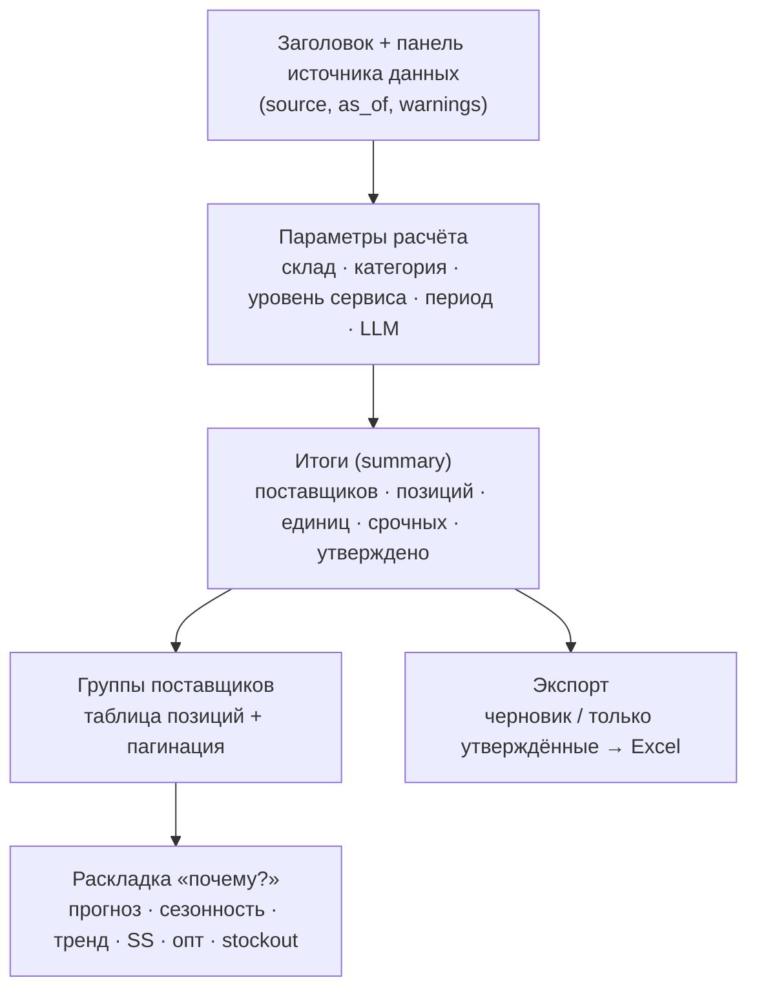

# Фронтенд — спецификация

Дашборд менеджера закупа: запуск расчёта, просмотр заказов по поставщикам, корректировка, утверждение и экспорт.

---

## 1. Стек (зафиксирован)

- **React 19** + **Vite 8**, нативный `fetch` (без тяжёлых UI-библиотек).
- **oxlint** — статический анализ.
- Прокси `/api → http://localhost:8017` (`vite.config.js`), CORS на бэкенде открыт.
- Одно приложение (`src/App.jsx`) + выделенные утилиты (`src/orderUtils.js`) и клиент API (`src/api.js`).

---

## 2. Карта экранов

MVP — одноэкранный дашборд с логическими блоками:

---

## 3. Блоки интерфейса

### Панель источника данных (`.data-info`)
Показывает `data_source` (excel/csv/synthetic), `as_of` и **предупреждения о качестве данных** из `/api/meta` (сроки-допущения, устаревшие остатки, отсутствие клиентов и т.д.) — прозрачность допущений прямо в UI.

### Параметры расчёта (`.controls`)
Фильтры: склад, категория, уровень сервиса (90/95/98/99 %), период проверки (дн), тумблер LLM-обоснований. Кнопка «Рассчитать заказ» → `POST /api/recommend`.

### Итоги (`.summary`)
Агрегаты по текущему расчёту с учётом ручных правок: число поставщиков, позиций, суммарные единицы, срочные, утверждённые. Считаются в `orderUtils.summarizeLines`.

### Группы поставщиков (`.group`)
Заголовок с итогами поставщика (срок поставки, единицы, позиции) + таблица позиций с **пагинацией**. Колонки: чекбокс утверждения, артикул, наименование, срочность (бейдж), покрытие (дн), к заказу (редактируемое поле), «почему?».

### Раскладка «почему?» (`.explain-row`)
Разворачивается по строке: текст обоснования + чипы раскладки (прогноз спроса, спрос/день, сезонность ×, тренд ×, страховой запас, остаток, в пути, упущенный спрос, исключённый опт).

### Экспорт (`.export-controls`)
Черновик или только утверждённые строки → `POST /api/recommend/export` (по `calculation_id`) → скачивание `order_draft.xlsx` / `approved_order.xlsx`.

---

## 4. Клиент API (`src/api.js`)

Обёртка `request()` с безопасной обработкой ошибок: сетевые сбои и внутренние ответы сервера (HTML/трейсбеки) не показываются пользователю — только валидные русскоязычные `detail` при статусах < 500. Функции: `fetchMeta()`, `recommend(params)`, `exportExcel(payload)` (скачивание blob).

---

## 5. Утилиты заказа (`src/orderUtils.js`)

Чистые функции, покрытые unit-тестами (`orderUtils.test.js`):

| Функция | Назначение |
|---|---|
| `getQuantity(line, edits)` | Итоговое кол-во с учётом ручной правки |
| `quantityError(line, rawQuantity)` | Валидация введённого количества (неотрицательное число, кратность/MOQ) |
| `summarizeLines(lines, edits, approvals)` | Агрегаты для блока итогов |
| `buildExportPayload(result, edits, approvals, approvedOnly)` | Сборка тела запроса экспорта |

---

## 6. Состояния и адаптив

- Пустое состояние (расчёт не запущен), загрузка («Считаю…»), ошибка (безопасное сообщение).
- Доступность: `aria-label` на секциях, `sr-only`, видимый `:focus-visible`.
- Адаптив: сетка контролов и итогов перестраивается под мобильный (`@media max-width: 640px`), таблица со скроллом (`.table-scroll`).

---

## 7. Что фронтенду нужно от бэкенда

- `GET /api/meta` — справочники фильтров + `warnings` + `as_of`.
- `POST /api/recommend` — заказы по поставщикам + `calculation_id`.
- `POST /api/recommend/export` — Excel по `calculation_id` и списку утверждённых строк.

Дизайн-система и токены — в [Дизайн_фронтенда.md](Дизайн_фронтенда.md).
