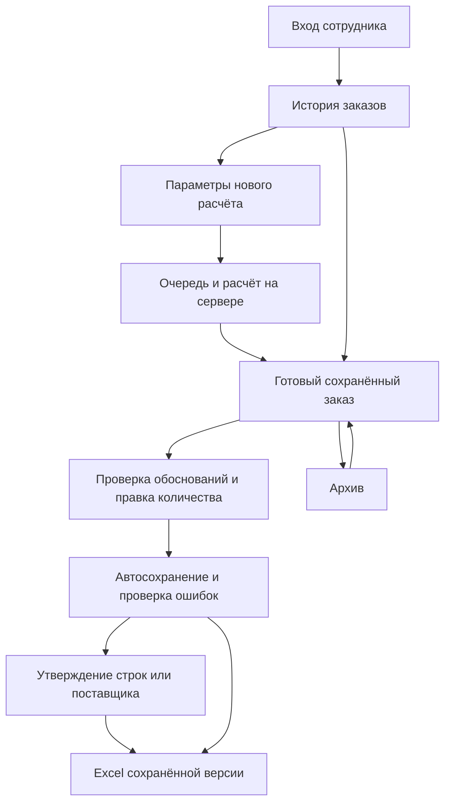

# Фронтенд Umytpa

Это обзор реализованного интерфейса и точка входа в документацию. Описание
сверено с кодом ветки `frontend` 23.09.2026. Возможности из первоначальных
планов, которых нет в приложении, не считаются доступными пользователю.

## С чего начать

| Читатель | Документ | Что внутри |
|---|---|---|
| Менеджер закупок | [Руководство пользователя](РУКОВОДСТВО_ПОЛЬЗОВАТЕЛЯ.md) | Первый вход, полный рабочий день, параметры, таблица, обоснования, правки, утверждение, Excel и ошибки |
| Администратор сотрудников | [Руководство пользователя](РУКОВОДСТВО_ПОЛЬЗОВАТЕЛЯ.md) | Команда, создание и отключение аккаунтов, роли, пароли, доступ ко всем заказам |
| Разработчик фронтенда | [Техническое руководство](ФРОНТЕНД_РАЗРАБОТЧИКУ.md) | Установка, компоненты, состояние, API, стили, доступность, тесты и изменение кода |
| Администратор сервера | [DEPLOY.md](DEPLOY.md) | Linux, nginx, systemd, HTTPS, источники, резервное копирование и восстановление |
| Тестировщик | [ПРИЕМКА.md](ПРИЕМКА.md) | Требования, сценарии, выполненные проверки и оставшиеся ограничения |

## Что делает сайт

Интерфейс менеджера закупок: вход → сохранённые заказы → расчёт → просмотр
обоснования → корректировка → утверждение → Excel. Администратор дополнительно
управляет сотрудниками. Прямые ссылки восстанавливают выбранный заказ.

Стрелка из проверки сразу в Excel означает выгрузку черновика без утверждения.
Утверждённый Excel содержит только положительные утверждённые позиции. Перед
обоими вариантами все локальные правки должны быть корректны и сохранены.

Заказ не отправляется поставщику автоматически. Сайт не выполняет оплату,
не содержит бюджетного согласования руководителем и не загружает заказ в 1С.
Дальнейшая обработка файла остаётся рабочим действием сотрудника.

## Карта страниц

Адреса ниже — часть URL после домена. В локальной разработке перед ними
стоит `http://localhost:5173/`, на сервере — адрес организации.

| Адрес | Экран | Кто видит |
|---|---|---|
| Текущий адрес без активной сессии | Вход для сотрудников | Любой посетитель; рабочие данные закрыты |
| `#/orders` | Заказы под контролем: «В работе» и «Архив» | Менеджер — свои; администратор — все |
| `#/calculate` | Настройте расчёт | Менеджер и администратор |
| `#/calculate?job=ID` | Состояние выбранного расчёта | Владелец задания и администратор |
| `#/orders/ID` | Сохранённый заказ | Владелец заказа и администратор |
| `#/users` | Команда | Только администратор |
| `#/account` | Ваш рабочий доступ | Вошедший сотрудник |

`ID` заменяется настоящим идентификатором из адресной строки. Передача ссылки
не выдаёт прав на заказ. Отдельного публичного экрана регистрации нет.
Неизвестный адрес показывает «Страница не найдена» и кнопку «К заказам».

## Стек и оформление

- React 19, Vite 8, нативный `fetch`, oxlint; Node.js 22.19 (минимум 22.12).
- Компоненты экрана, сессии и состояние заказа выделены из `App.jsx`.
- Один origin: Vite проксирует `/api` в локальный API, production nginx —
  в закрытый `127.0.0.1:8017`. Широкий CORS не требуется.
- Салатовый акцент, тёмная оболочка, белые карточки, скругления; основной
  текст 16–18 px, подписи 12–14 px. Golos Text и Caveat — локально с лицензиями.
- Заказ и действия менеджера занимают основное место, промо компактное.
  Карты, автомобили и маршруты из визуальных примеров не входят в продукт.

Дизайн-токены и примеры — [Дизайн_фронтенда.md](Дизайн_фронтенда.md).

## Экраны и рабочий сценарий

**Вход:** личные аккаунты без регистрации. Истёкшая сессия требует повторного
входа. Пароль, токен сессии и решения не записываются в
`localStorage`/`sessionStorage`. Cookie сессии хранится браузером как
`HttpOnly` и недоступна JavaScript; CSRF-токен из `/api/auth/session`
держится в памяти.

**История:** список доступных заказов, архив и переход к сохранённому заказу.
Неудачный новый расчёт не уничтожает ранее открытый результат. Состояния
очереди/расчёта/ошибки/отмены отражают ответ сервера; ожидание можно отменить.

**Рабочий экран:** сведения об источниках с датой и предупреждениями; склад,
категория, уровень сервиса, период проверки, выключенный по умолчанию LLM.
Значения по умолчанию и доступность LLM поступают из `/api/meta`.

В таблицах по поставщикам доступны поиск, фильтры, пагинация, код 1С,
артикул поставщика, склад, единица, срочность, исходная рекомендация и
редактируемое количество. Нулевой заказ с риском дефицита остаётся видимым.
Итоги единиц разделены по единицам измерения; поставщики к заказу считаются
по положительным валидным количествам после правок.

Утверждение поставщика действует на все его строки, в том числе скрытые
поиском и пагинацией; область действия явно подписана.

**Обоснование:** горизонт, прогноз и дневной спрос, сезонность/тренд, страховой
запас, остаток с датой, учтённые/исключённые приходы, исключённый опт,
компенсация спроса, потребность до округления и условия партии. Отсутствие
stockout-интервалов не выдаётся за выполненное восстановление спроса.

**Сотрудники:** доступно только администратору; создание, блокировка,
смена роли и пароля. Проверки прав дублируются сервером.

**Архив:** просмотр и выгрузка сохранённого заказа; редактирование отключено.
«Вернуть в работу» снова разрешает правки. Постоянные заказы не удаляются
по сроку хранения временных расчётных снимков. Восстановление из архива
не запускает новый прогноз.

## Сохранение, ошибки и экспорт

- Автосохранение валидного количества через секунду, утверждения — сразу.
  Состояния «Сохраняем», «Сохранено» и ошибка видимы рядом с действиями.
- Невалидный промежуточный ввод остаётся локально. Экспорт блокируется до
  исправления всех ошибок и подтверждённого сохранения.
- Правка количества снимает утверждение. Сохранение содержит `revision`;
  `409` сохраняет локальную работу и открывает сравнение с серверной версией.
- Расчёт, сохранение и экспорт имеют независимые состояния и сообщения.
  Отмена ожидания и защита от запоздалых ответов предотвращают подмену
  выбранного заказа результатом старого запроса. Автоповтор — только чтение.
- API-клиент проверяет форму JSON до изменения состояния. HTML/traceback
  не показываются пользователю. Error boundary предлагает восстановление
  после ошибки отображения.
- `/api/orders/{id}/export` получает сохранённую `revision` и режим.
  Клиент проверяет MIME, непустой файл и ZIP-сигнатуру XLSX до скачивания.
  JSON/HTML под расширением Excel не скачивается.

## Адаптив и доступность

На мобильном таблица прокручивается внутри контейнера; обоснование — нижняя
панель с закрытием кнопкой, Escape и жестом. Фокус удерживается в диалоге и
возвращается на открывшую кнопку. Есть видимый фокус, семантические подписи,
клавиатурная навигация и области нажатия от 44 px. Проверяются ширины 320,
375, 768, 1440 px, масштаб 200% и длинные названия.

## Проверки

`npm ci`, `npm test`, `npm run lint`, `npm run build` — из `frontend`.
Тесты API и состояния не заменяют браузерную проверку реального API,
скачивания Excel и адаптива. Сценарии: [ПРИЕМКА.md](ПРИЕМКА.md).

## Где искать реализацию

| Область | Файлы |
|---|---|
| Сессия, навигация, профиль, выход | [App.jsx](../frontend/src/App.jsx), [LoginPage.jsx](../frontend/src/pages/LoginPage.jsx) |
| История и архив | [HistoryPage.jsx](../frontend/src/pages/HistoryPage.jsx) |
| Параметры и состояние фонового расчёта | [CalculatePage.jsx](../frontend/src/pages/CalculatePage.jsx) |
| Заказ, фильтры, конфликты, выгрузка, журнал | [OrderPage.jsx](../frontend/src/pages/OrderPage.jsx) |
| Таблица и объяснение позиции | [SupplierGroup.jsx](../frontend/src/components/SupplierGroup.jsx), [RationaleDialog.jsx](../frontend/src/components/RationaleDialog.jsx) |
| Локальные правки и последовательное сохранение | [useOrderEditor.js](../frontend/src/hooks/useOrderEditor.js), [orderState.js](../frontend/src/orderState.js) |
| Количества, MOQ, кратность и итоги | [orderUtils.js](../frontend/src/orderUtils.js) |
| Проверка ответа сервера и скачивание файла | [api.js](../frontend/src/api.js) |
| Управление сотрудниками | [UsersPage.jsx](../frontend/src/pages/UsersPage.jsx) |
| Восстановление после ошибки отображения | [Common.jsx](../frontend/src/components/Common.jsx), [main.jsx](../frontend/src/main.jsx) |
| Токены, шрифты, адаптивная компоновка | [index.css](../frontend/src/index.css), [App.css](../frontend/src/App.css) |

Подробные контракты и правила доработки собраны в
[руководстве разработчика](ФРОНТЕНД_РАЗРАБОТЧИКУ.md). Файлы
[FRONTEND_PLAN.md](../FRONTEND_PLAN.md) и [frontend/PLAN.md](../frontend/PLAN.md)
сохранены для истории: их дорожная карта не заменяет описание готовых функций.
