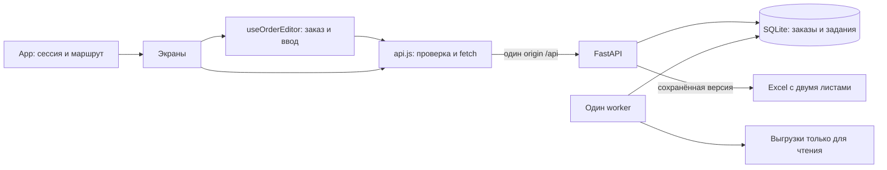

# Umytpa: руководство разработчику фронтенда

Документ описывает существующий код внутреннего сервиса закупок: React-клиент,
контракты FastAPI, сохранение решений менеджера, очередь расчётов и проверку
результата. Основной рабочий объект — **сохранённый серверный заказ**. Исходный
расчёт внутри заказа неизменяем; количество и утверждение хранятся отдельно.

Для работы сотрудника предназначено
[руководство пользователя](РУКОВОДСТВО_ПОЛЬЗОВАТЕЛЯ.md). Краткий обзор и требования
к интерфейсу находятся в [ФРОНТЕНД.md](ФРОНТЕНД.md), установка сервиса на сервер —
в [DEPLOY.md](DEPLOY.md), выполненные проверки и ограничения приёмки —
в [ПРИЕМКА.md](ПРИЕМКА.md). Настоящее руководство нужно читать вместе с этими
файлами; состояние исходников и тестов определяет фактическое поведение.

## Содержание

1. [Стек и поддерживаемая среда](#stack)
2. [Устройство проекта и ответственность модулей](#modules)
3. [Маршрутизация и жизненный цикл сессии](#session)
4. [Модель заказа и количества](#order-model)
5. [API: авторизация и общие правила](#api-common)
6. [API: методы и структуры ответов](#api-contracts)
7. [Сетевой клиент, проверки и ошибки](#network)
8. [Редактор: автосохранение и утверждение](#editor)
9. [Конфликты, уход со страницы и восстановление](#conflicts)
10. [Расчёты: очередь, идемпотентность и отмена](#jobs)
11. [Поиск, таблицы, обоснование и экспорт](#workspace)
12. [Оформление, шрифты и доступность](#design)
13. [Настройки окружения](#environment)
14. [Локальный запуск в Windows PowerShell](#windows)
15. [Локальный запуск в Linux](#linux)
16. [Тесты и проверка на настоящем API](#tests)
17. [Production: nginx и systemd](#production)
18. [Диагностика, сопровождение и ограничения](#maintenance)

<a id="stack"></a>

## 1. Стек и поддерживаемая среда

| Часть | Используется в проекте | Источник версии |
|---|---|---|
| Среда фронтенда | Node.js 22.19.0; минимально допустимая версия 22.12.0 | `frontend/package.json`, workflow CI |
| Представление | React и React DOM 19.3.0 по lock-файлу; диапазон `^19.2.8`, JavaScript/JSX, ES modules | `frontend/package.json`, `package-lock.json` |
| Сборка | Vite 8.3.0, `@vitejs/plugin-react` 6.1.1 | Те же файлы |
| Проверка кода | oxlint 1.85.0 по lock-файлу; диапазон `^1.81.0` | Те же файлы |
| Чистые модульные тесты | Встроенный `node:test` | `npm run test:unit` |
| Компонентные тесты | Vitest 5.0.1, jsdom 29.1.1, Testing Library React 16.3.3 и user-event 14.6.7 | `npm run test:ui` |
| Шрифты | Golos Text и Caveat, локальные variable font пакеты Fontsource 5.3.0 | `index.css`, `package-lock.json` |
| API | Python 3.12, FastAPI 0.124.4, Uvicorn 0.38.0, Pydantic 2.10.6 | `backend/requirements.txt`, `requirements.lock` |
| Данные и экспорт | SQLite WAL, pandas 2.2.3, numpy 1.26.4, openpyxl 3.1.5 | Серверный lock-файл |
| Административный сборщик EKT | BeautifulSoup 4.15.0, soupsieve 2.9.2; не браузерная зависимость | Серверный lock-файл |

Диапазоны с `^` в `package.json` не заменяют фиксацию зависимостей. Для
воспроизводимой установки используйте **`npm ci`**, который берёт точные версии
из `package-lock.json`. Python production-зависимости устанавливаются из
`requirements.lock`, зависимости для разработки — из `requirements-dev.txt`,
который включает этот lock-файл.

В клиенте нет TypeScript, React Router, Axios, Redux, отдельного query-cache,
WebSocket, service worker или хранения заказов в браузерной БД. Запросы выполняет
нативный `fetch`; состояние принадлежит React-компонентам и хуку редактора.
Наличие `@types/react` в зависимостях не означает, что проект проверяется `tsc`.

<a id="modules"></a>

## 2. Устройство проекта и ответственность модулей

```text
frontend/
├── index.html                    # lang=ru, viewport, favicon, точка входа
├── package.json / package-lock.json
├── vite.config.js                # React, dev port 5173, proxy /api
├── vitest.config.js              # jsdom и выбор UI-тестов
├── public/
│   ├── favicon.svg
│   ├── icons.svg                 # имеющийся статический ресурс
│   └── licenses/
│       ├── Golos-Text-OFL.txt
│       └── Caveat-OFL.txt
└── src/
    ├── main.jsx                  # createRoot, StrictMode, ErrorBoundary
    ├── App.jsx                   # сессия, рабочая оболочка, hash-навигация
    ├── App.css                   # экраны, таблицы, адаптив, диалог
    ├── index.css                 # шрифты, токены, базовые состояния
    ├── api.js                    # HTTP, CSRF, runtime-валидация, XLSX
    ├── format.js                 # русские числа/даты, извлечение строк
    ├── orderUtils.js             # правила количества и итоговые показатели
    ├── orderState.js             # draft, различия, явный перенос правок
    ├── Icons.jsx                 # inline SVG-компонент
    ├── api.test.js
    ├── orderUtils.test.js
    ├── orderState.test.js
    ├── hooks/
    │   └── useOrderEditor.js      # чтение, очередь сохранений, конфликт
    ├── pages/
    │   ├── LoginPage.jsx
    │   ├── HistoryPage.jsx
    │   ├── CalculatePage.jsx
    │   ├── OrderPage.jsx
    │   └── UsersPage.jsx
    ├── components/
    │   ├── Common.jsx
    │   ├── DataInfo.jsx
    │   ├── SupplierGroup.jsx
    │   ├── RationaleDialog.jsx
    │   └── ProductReference.jsx   # сведения EKT, характеристики, безопасная ссылка
    ├── test/
    │   ├── setup.js
    │   ├── fixtures.js
    │   ├── auth.ui.test.jsx
    │   ├── components.ui.test.jsx
    │   ├── editor.ui.test.jsx
    │   └── jobs.ui.test.jsx
    └── assets/
        ├── hero.png
        ├── react.svg
        └── vite.svg
```

Файлы `src/assets/*` и `public/icons.svg` присутствуют в дереве, но текущие
JSX/CSS их не подключают. Используемые интерфейсные иконки определены в
`Icons.jsx`; действующая иконка вкладки — `public/favicon.svg`. Не следует
принимать оставшиеся ресурсы за отдельные реализованные экраны.

| Модуль | Ответственность и граница |
|---|---|
| `App.jsx` | Получает сессию, открывает вход или рабочее пространство, различает роли, согласует навигацию с редактором; экран аккаунта реализован здесь же |
| `LoginPage.jsx` | Форма входа, отправка учётных данных, сообщения; пароль очищается после завершения попытки |
| `HistoryPage.jsx` | Серверный список активных/архивных заказов по 20, переключение страниц и прямые ссылки |
| `CalculatePage.jsx` | Метаданные и параметры, запуск задания, опрос статуса, отмена и недавние задания |
| `OrderPage.jsx` | Соединяет редактор, фильтры, показатели, таблицы, обоснование, экспорт, название/архив и журнал |
| `UsersPage.jsx` | Создание сотрудников, изменение роли, блокировка и установка нового пароля администратором |
| `useOrderEditor.js` | Владеет серверным заказом и локальным вводом, последовательно сохраняет, обрабатывает `401`/`409` |
| `orderState.js` | Чистые функции преобразования сохранённых решений в draft, построения PUT и сравнения версий |
| `orderUtils.js` | Проверка MOQ/кратности, состав экспорта, показатели по единицам и `safeEktUrl` для внешней карточки |
| `SupplierGroup.jsx` | Строки одного поставщика, локальная пагинация, ввод и утверждение; не делает HTTP-запросов |
| `RationaleDialog.jsx` | Числовое обоснование в модальном `dialog`, мобильная нижняя панель и возврат фокуса |
| `ProductReference.jsx` | Учётные поля отдельно от описаний EKT; характеристики, дата и проверенная внешняя ссылка внутри обоснования |
| `DataInfo.jsx` | Источник, дата, дедуплицированные предупреждения и сводка покрытия EKT; не заменяет полный реестр качества данных |
| `Common.jsx` | Повторяемые сообщения, загрузка, пустое состояние и ErrorBoundary |
| `api.js` | Единственное место сетевых контрактов; не решает бизнес-конфликты и не управляет маршрутами |

Расчёт прогноза, проверка доступа, проверка количества перед записью и
формирование Excel принадлежат серверу. Фронтенд не повторяет прогноз и не
собирает XLSX из видимой страницы таблицы.



<a id="session"></a>

## 3. Маршрутизация и жизненный цикл сессии

### Hash-маршруты

Маршрут разбирает `routeFromHash` в `App.jsx`. Внешней библиотеки маршрутизации
нет. Пустой hash открывает историю.

| Адрес после origin | Экран |
|---|---|
| `/#/orders` | История заказов |
| `/#/orders/{id}` | Конкретный сохранённый заказ |
| `/#/calculate` | Новый расчёт и недавние задания |
| `/#/calculate?job={id}` | Состояние конкретного задания |
| `/#/users` | Сотрудники; только администратор |
| `/#/account` | Логин, роль, состояние аккаунта и выход |

Идентификаторы при построении адресов кодируются; неправильный URI или
неизвестный маршрут приводит к экрану отсутствующей страницы. Hash не отправляется
в HTTP-запросе серверу: прямая ссылка на заказ сначала загружает SPA, затем
проверяет сессию и запрашивает заказ с сервера.

Внутренний `navigate` вызывает guard активного редактора, затем меняет адрес через
`history.pushState` и обновляет React-состояние. `hashchange` обрабатывает
навигацию браузера и обычные hash-ссылки; при отказе guard восстанавливает прежний
hash через `replaceState`. `OrderPage` получает `key` по ID заказа: переход к
другому заказу создаёт отдельный экземпляр редактора.

### Сессия

При открытии страницы `App` выполняет `GET /api/auth/session`. Пока ответ не
получен, отображается загрузка. `401` открывает форму входа; сетевой сбой и другие
ошибки дают состояние восстановления с повтором. Запрос первого чтения
отменяется при очистке эффекта.

После успешного входа API отдаёт пользователя и CSRF-токен. Секрет сессии
передаётся серверной HttpOnly-cookie; JavaScript не читает его. CSRF-токен
сохраняется только в переменной модуля `api.js`. Ни токен, ни решения менеджера
не записываются в `localStorage`/`sessionStorage`.

При истечении сессии во время работы сохраняется **смонтированный, но скрытый**
экземпляр рабочего пространства. `active=false` приостанавливает связанные
действия и опрос. Повторный вход тем же сотрудником возвращает его локальный
ввод; вход другим сотрудником меняет ключ рабочего пространства по `user.id`,
сбрасывает прежний draft и ведёт в историю. Это состояние живёт только в памяти
вкладки и не переживает её перезагрузку или закрытие.

Явный выход сначала согласуется с guard заказа, затем выполняет
`POST /api/auth/logout`, очищает сессию и рабочее пространство. Ответ `401` при
выходе означает, что сессия уже закончилась. Самостоятельной регистрации и
смены собственного пароля на странице аккаунта нет: пароль устанавливает
администратор через экран сотрудников.

Меню администратора и защита `#/users` на клиенте помогают пользователю, но
полномочия определяет сервер. Менеджер работает со своими заказами/заданиями;
администратор имеет доступ ко всем. Изменение любого аккаунта через PATCH
завершает его серверные сессии, включая изменение собственной записи
администратором. Последнего активного администратора нельзя заблокировать или
понизить до менеджера.

<a id="order-model"></a>

## 4. Модель заказа и количества

`order.calculation` — сохранённый исходный результат. Его
`groups[].lines[].recommended_qty` остаётся первоначальной рекомендацией.
`order.decisions[]` — текущие решения: `{line_id, quantity, approved}`.
`order.revision` — положительное целое число версии всего заказа.

Связь выполняется по **`line_id`**, а не по названию или SKU. Один SKU у разных
поставщиков или на разных складах имеет самостоятельное решение. ID нужно
считать непрозрачной строкой: не вычислять заново и не разбирать на клиенте.
`api.js` проверяет отсутствие повторяющихся ID и точное соответствие набора
решений строкам расчёта.

Локальный draft состоит из двух отображений:

```js
{
  quantities: { [lineId]: rawInputString },
  approvals: { [lineId]: boolean },
}
```

Количество хранится строкой, чтобы пустое поле и незавершённый ввод не
превращались в ноль. Преобразование в число выполняется после проверки.

Правила `quantityError` в `orderUtils.js`:

1. Пустая/пробельная строка, нечисловое, бесконечное или отрицательное значение
   недопустимы.
2. Ноль допустим: позиция не заказывается и не может быть утверждена.
3. Положительное значение должно быть не меньше `min_order_qty` и кратно
   положительному `pack_size` с допуском вычислений `1e-8`.
4. Интерфейс показывает ошибку, а не округляет исправление менеджера молча.
   Сервер повторно проверяет эти ограничения перед записью/экспортом.

`input` использует `type="number"`, `min=0`, `step=pack_size` и
`inputMode="decimal"`. Отображение чисел локализовано для русского языка и
обычно ограничено двумя знаками после запятой; сохранённое значение этим
форматированием не округляется. Поддержка ввода десятичного разделителя зависит
от браузера, а не от собственного парсера русских чисел.

Общие количества выводятся **по единицам измерения** через `unitsByUnit` и
`approvedByUnit`. Метры и штуки нельзя складывать в одно бизнес-значимое число.
Служебные числовые суммы, сохранившиеся в старых контрактах, не следует выводить
как такой общий итог. Поставщик считается «к заказу», когда у него есть хотя бы
одна строка с положительным валидным количеством после правок.

`urgency` и `days_of_cover` относятся к исходному расчёту. Установка нулевого
заказа не устраняет риск дефицита: бейдж и счётчик срочных строк сохраняются.
Неизвестную исходную единицу нельзя заменять догадкой; сервер добавляет явную
пометку/предупреждение о неизвестной единице.

<a id="api-common"></a>

## 5. API: авторизация и общие правила

Все клиентские URL начинаются с `/api`. Vite в разработке и nginx в production
проксируют их на API. `fetch` использует `credentials: 'same-origin'`.
Отдельный домен API и CORS не нужны для штатной конфигурации.

Серверная cookie `umytpa_session` имеет `HttpOnly`, `SameSite=Strict`, путь `/`
и срок восемь часов. `Secure` включён по умолчанию; только явный
`APP_ENV=development` разрешает локальный HTTP. Пароли хешируются Argon2id,
сессии находятся в SQLite. Истечение, выход и изменение/блокировка аккаунта
проверяются сервером.

Для изменяющих запросов клиент добавляет `X-CSRF-Token` из последней успешной
сессии. Сервер также проверяет `Origin`, если браузер его прислал. В production
он должен совпадать с `APP_ORIGIN`; при пустой настройке используется origin
самого запроса. Вход выполняется без предварительного CSRF-токена, но с
проверкой origin и ограничением попыток. После 5 неудачных попыток для логина
или 20 для IP за 15 минут возможен `429` с `Retry-After: 900`.

Ошибки имеют JSON-оболочку `{"detail": "сообщение"}`. Сервер не возвращает
исходный traceback в интерфейс. Для диагностики есть заголовок
`X-Request-ID`; API также устанавливает `Cache-Control: no-store`.
Секреты, пароль и данные продаж не нужно добавлять в браузерные или серверные
отладочные логи.

| Статус | Значение для интерфейса |
|---|---|
| `200` | Чтение, успешное изменение, вход или готовый файл |
| `201` | Создан сотрудник |
| `202` | Задание принято/найдено; сам заказ ещё нужно получить по результату задания |
| `204` | Успешный выход без JSON-тела |
| `401` | Нет действующей сессии; открыть повторный вход, сохранить локальный draft в памяти |
| `403` | Нет прав на объект/роль либо не прошла проверка CSRF/origin |
| `404` | Указанный заказ, сотрудник или задание не найден |
| `409` | Конфликт версии/состояния; также дубликат логина, активное задание или повтор ключа с другими параметрами |
| `410` | Старый экспорт по `calculation_id` не может найти сохранённый расчёт |
| `422` | Неверные поля, состав строк, количество, пустой экспорт или ошибка чтения источников |
| `429` | Лимит входа либо заполненная очередь |
| `500`–`504` | Внутренняя ошибка, недоступный worker/API или reverse proxy; показывать безопасное сообщение |

Не каждый `409` означает конкурентную правку заказа: обработку надо выбирать
по операции. В редакторе такой ответ ведёт к сравнению заказа; при создании
задания или пользователя — к сообщению рядом с соответствующей формой.

<a id="api-contracts"></a>

## 6. API: методы и структуры ответов

Точные серверные определения находятся в
[`api/models.py`](../backend/app/api/models.py),
[`schemas.py`](../backend/app/schemas.py) и
[`api/routes.py`](../backend/app/api/routes.py), транзакции — в
[`repositories.py`](../backend/app/repositories.py), очередь — в
[`jobs.py`](../backend/app/jobs.py). Клиентские проверки находятся в
[`api.js`](../frontend/src/api.js).

### Сессия и сотрудники

| Метод | Тело / параметры | Успешный ответ |
|---|---|---|
| `POST /api/auth/login` | `username: string`, `password: string` | `200`, `{user, csrf_token}` и cookie |
| `GET /api/auth/session` | — | `200`, `{user, csrf_token}` |
| `POST /api/auth/logout` | Без тела | `204` |
| `GET /api/users` | Только admin | `200`, `{items: User[]}` |
| `POST /api/users` | `username`, `password`, `role` | `201`, `User` |
| `PATCH /api/users/{id}` | Одно или несколько полей `role`, `active`, `password` | `200`, обновлённый `User` |

`User` содержит `id`, `username`, `role: 'admin' | 'manager'`, `active: boolean`.
API создаёт строковые идентификаторы; клиент допускает также положительный
безопасный целочисленный ID ради совместимости проверки. Хеш пароля и
секрет сессии в объект пользователя не входят.

Новый логин — 3–80 символов из латинских букв, цифр, `_ . @ -`; сервер сохраняет
его в нижнем регистре. Новый пароль — 12–256 символов. Вход допускает поля длиной
1–80 и 1–256 соответственно. UI не предоставляет переименование или удаление
пользователя. Изменение роли, активности и пароля требует admin; любые успешные
изменения через этот PATCH отзывают сессии изменяемого пользователя.

### Метаданные и расчёты

`GET /api/meta` возвращает:

| Поле | Смысл |
|---|---|
| `warehouses: string[]` | Непустые строковые склады из объединения sales, monthly_sales, stock, in_transit, без изменения ключей |
| `categories: string[]` | Внутренние категории 1С из каталога, либо продаж при пустом каталоге |
| `product_categories: string[]` | Отдельные товарные группы ekt.kz; пусто при отсутствии обогащения |
| `suppliers: object[]` | Как минимум `supplier_id`, `name`; сервер также передаёт сведения поставщика |
| `sku_count: number`, `data_source: string` | Размер каталога и тип источника |
| `as_of: string`, `warnings: string[]` | Дата расчёта и ограничения источников |
| `data_quality: object` | Разрешённые показатели качества без внутренних путей; `catalog_enrichment` — ограниченная сводка состояния и покрытия EKT |
| `defaults` | `service_level`, `review_period_days` |
| `capabilities` | `llm_available: boolean` |

Новый интерфейс всегда отправляет `POST /api/recommend` с заголовками
`Prefer: respond-async` и `Idempotency-Key`. Пример **параметров**, без привязки
к конкретным данным:

```json
{
  "warehouse": null,
  "category": null,
  "product_category": null,
  "service_level": 0.95,
  "review_period_days": 14,
  "explain": false
}
```

Пустые фильтры UI превращаются в `null`. Поле «Категория 1С» передаёт `category`,
«Товарная группа ЭКТ» — `product_category`; это независимые классификации.
При выборе товарной группы в расчёт входят только сопоставленные позиции;
при «Все товарные группы» отсутствие описания не исключает товар. Сервер
сохраняет фильтр в `calculation.product_category`, очередь — в параметрах и
хеше идемпотентности. Сервер допускает уровень сервиса
0.5–0.999, период 1–120 дней; `null` у этих параметров означает серверное
значение по умолчанию. UI предлагает 90%, 95%, 98% и 99%. Ответ `202` содержит
`job_id` и `status`; это не `RecommendationResponse`.

Без `Prefer: respond-async` совместимый endpoint использует ту же очередь и
ожидает её результат: `200` с расчётом при успехе, `422` при ошибке, `409` при
отмене или `202` с заданием после окончания HTTP-ожидания. Новый клиент не
использует этот синхронный режим.

| Метод заданий | Успешный ответ |
|---|---|
| `GET /api/jobs` | `{items: Job[]}`, до 100 последних доступных записей |
| `GET /api/jobs/{id}` | `Job` |
| `POST /api/jobs/{id}/cancel` | `Job` после запроса отмены |

`Job` содержит `id`, `status`, `created_at`, `updated_at`, `order_id`, `error`.
Статусы: `queued`, `running`, `completed`, `failed`, `cancelled`. У завершённого
задания обязателен `order_id`; до этого он может быть `null`. Сообщение `error`
может отсутствовать/быть `null`. После `completed` заказ читается отдельно
через `/api/orders/{order_id}`.

### История, заказ и решения

| Метод | Тело / параметры | Успешный ответ |
|---|---|---|
| `GET /api/orders` | `offset>=0`, `limit=1..100`, `archived=false/true` | `{items: OrderSummary[], total}` |
| `GET /api/orders/{id}` | — | Полный `Order` |
| `PUT /api/orders/{id}` | `{revision, lines}` | Полный актуальный `Order` |
| `PATCH /api/orders/{id}` | `{revision, title? , archived?}` | Полный актуальный `Order` |
| `GET /api/orders/{id}/events` | — | `{items: Event[]}`, новые события первыми |
| `POST /api/orders/{id}/export` | `{revision, approved_only}` | XLSX-файл |

История UI запрашивает 20 заказов; серверное значение по умолчанию — 50.
`OrderSummary` содержит `id`, `title`, `owner_id`, `owner_name`, `revision`,
`archived`, `created_at`, `updated_at`, `positions`, `approved`.
Последние два поля — число положительных позиций и число положительных
утверждённых позиций, а не сумма физических единиц.

`Order` содержит те же идентификационные поля, но вместо агрегатов —
`calculation` и `decisions`. PUT передаёт **полный набор строк** расчёта:

```json
{
  "revision": 1,
  "lines": [
    {"line_id": "идентификатор-из-ответа-API", "quantity": 0, "approved": false}
  ]
}
```

Это схема запроса, а не готовое тело для произвольного заказа: ID, версию,
количество и все остальные строки нужно брать из открытого заказа. Пустой
массив допустим только для действительно пустого расчёта. Пропущенные,
посторонние и повторяющиеся строки дают `422`; JSON-числа и boolean должны
оставаться числами и boolean, а не строками.

Ревизия сверяется атомарно до записи. При реальном изменении решений она
увеличивается, при PUT без изменений может остаться прежней. Изменение
количества всегда снимает утверждение на сервере, даже если в том же PUT
прислано `approved: true`. Для архивного заказа изменение решений даёт `409`.
PATCH свойств увеличивает ревизию; название после trim должно быть непустым,
не длиннее 160 символов. Архивирование обратимо, удаления заказа через API нет.

`Event` содержит `id`, `actor_name`, `created_at`, `action`, `changes`.
Клиент отображает известные действия: создание/импорт, изменения решений,
свойств и экспорт. Изменения решений содержат `line_id`, `before` и `after`
с количеством и утверждением; экспорт — ревизию и режим.

### Неизменяемый расчёт

`calculation` включает `calculation_id`, `generated_at`, `as_of`, `data_source`,
`warnings`, `data_quality`, `warehouse`, `category`, `product_category`, `service_level`,
`review_period_days`, `sku_count`, `groups`.

Группа содержит `supplier_id`, `supplier_name`, `lead_time_days`, `total_units`,
`lines`. Строка содержит:

- `line_id`, `sku` (код 1С), `supplier_sku` (артикул поставщика, необязательный);
- `name`, `category`, `warehouse` (необязательный), `unit`;
- необязательные `product_category`, `product_subcategory`, `product_brand`,
  `product_url`, `catalog_fetched_at`, а также `product_attributes` (словарь строк);
- `supplier_id`, `supplier_name`, `recommended_qty`;
- `urgency: high | medium | low`, `days_of_cover`;
- `pack_size`, `min_order_qty`, `warnings`, `explanation`, `rationale`.

`rationale` содержит `avg_daily_demand`, `seasonality_factor`, `trend_factor`,
`horizon_days`, `forecast_demand`, `safety_stock`, `on_hand`, `in_transit`,
`lost_demand_uplift`, `excluded_bulk_units`, `excluded_bulk_orders`, `raw_need`,
а также `ignored_in_transit` и необязательную `stock_as_of`.
Поля EKT имеют defaults (`null` для необязательных строк, `{}` для характеристик):
старые заказы без обогащения продолжают читаться. Описания сохраняются внутри
JSON расчёта, дополнительная SQL-колонка под каждую характеристику не нужна.
Не переименовывайте поля контракта только на фронтенде: это нарушит проверку
ответа и совместимость сохранённых снимков.

### Экспорт и служебные endpoints

Новый экспорт принимает ревизию **сохранённого** заказа и `approved_only`:
`true` — положительные утверждённые строки, `false` — все положительные строки.
Выбранные фильтры/страницы UI не входят в запрос. Сервер проверяет ревизию до
формирования файла и перед регистрацией экспорта: конкурентная запись может
привести к `409` вместо выдачи устаревшего файла. Экспорт не увеличивает ревизию.

Совместимый `POST /api/recommend/export` принимает `calculation_id`, `lines`,
`approved_only`. Он проверяет владельца и читает сохранённый снимок, но
экспортирует переданные решения без протокола ревизии нового заказа. Функция
`exportExcel` оставлена в `api.js`; новый экран заказа использует
`exportSavedOrder` и не должен возвращаться к старой схеме.

`GET /api/health` без сессии отвечает `200 {status: 'ok'}`.
`GET /api/ready` проверяет БД и свежесть heartbeat worker: `200` либо `503`,
`{status: 'ok' | 'unavailable', worker: boolean}`. Это разные проверки:
живой HTTP-процесс ещё не означает возможность выполнить расчёт.

<a id="network"></a>

## 7. Сетевой клиент, проверки и ошибки

### `request` и отмена

Каждая попытка HTTP-запроса в `api.js` создаёт собственный `AbortController`,
таймер и связь с внешним `signal`. При завершении таймер и слушатель снимаются.
Заранее отменённый внешний сигнал не допускает отправки запроса.

| Операция | Таймаут одной попытки |
|---|---|
| Обычные запросы, включая запуск задания и сохранение | 30 секунд |
| `/api/meta`, где возможна загрузка Excel | 120 секунд |
| Скачивание Excel | 60 секунд |

Только GET получает максимум **две попытки всего**: повтор разрешён при сетевой
ошибке или `502`/`503`/`504`. Паузы между попытками нет. Таймаут, явная отмена,
плохой JSON/структура ответа, `401`, `409` и остальные статусы не повторяются
автоматически. POST/PUT/PATCH не повторяются HTTP-клиентом.

`AbortController` прекращает ожидание браузера. Он не откатывает уже выполненный
PUT и не отменяет серверное задание. Поэтому сетевой сбой сохранения может
означать как отсутствие записи, так и запись без полученного ответа. Повтор с
прежней ревизией безопасно обнаружит конфликт; нельзя объявлять «Сохранено»
только потому, что отправка началась.

Эффекты чтения используют AbortController и/или флаг актуальности результата;
редактор дополнительно использует refs актуального состояния и признак
смонтированного компонента. Опрос очищает таймер при смене задания/экрана.
Смена ID заказа и пользователя создаёт новый экземпляр состояния. При новых
эффектах нужно сохранять эти меры, чтобы запоздалый ответ не заменил текущий
экран чужим результатом. Отмена всех возможных серверных записей при unmount
этим механизмом не обещается.

### Runtime-проверка ответов

Перед обновлением состояния `json` разбирает JSON и вызывает predicate нужного
контракта. Проверяются объектные оболочки, строки, конечные числа, boolean,
списки, допустимые статусы/роли, уникальность строк и поставщиков, наличие
`order_id` у завершённого задания, полнота набора решений.

Невалидный ответ становится `ApiError` с `code='invalid_response'`; частично
восстановленный заказ не применяется. Это ручная runtime-валидация, а не
полный сгенерированный JSON Schema: даты проверяются как строки. Новые product-поля проверяются как строки/словарь
строк; `catalog_enrichment` — как сводка известных статусов и неотрицательных
целых счётчиков, включая `matched <= total_catalog`. Остальные части
`data_quality` и содержимое `events[].changes` не имеют такой же глубокой проверки. При
расширении отображаемых полей нужно расширять predicates и отрицательные тесты.

`ApiError` несёт `message`, HTTP `status` и `code`. Возможные клиентские коды:
`http`, `network`, `timeout`, `aborted`, `invalid_response`, `download`.
Явная отмена не должна показываться пользователю как сбой сервера.

Сообщение `detail` используется только для HTTP <500, если это короткая русская
строка без признаков HTML, traceback и внутренних путей. В остальных случаях
показывается сообщение операции/статуса. Не выводите `error.stack`, HTML тела
proxy или произвольный `JSON.stringify(response)` в пользовательский экран.

### Защита скачивания

Перед созданием браузерной загрузки клиент проверяет:

1. MIME `application/vnd.openxmlformats-officedocument.spreadsheetml.sheet`;
2. размер хотя бы четыре байта;
3. первые байты ZIP-контейнера `50 4B 03 04`.

JSON, HTML, пустой ответ и очевидно повреждённый файл не скачиваются как XLSX.
После проверки создаётся Blob URL и временная ссылка, затем ссылка удаляется,
а URL освобождается через секунду. Имена — `approved_order.xlsx` и
`order_draft.xlsx`.

Проверка ZIP-сигнатуры не доказывает наличие корректных листов Excel. Это
проверяют серверные тесты и HTTP smoke через openpyxl. Браузер также не даёт
этому коду подтверждения, что пользователь окончательно сохранил файл на диск.

<a id="editor"></a>

## 8. Редактор: автосохранение и утверждение

Хук `useOrderEditor(orderId, active, onAuthRequired)` отделяет серверный
`order` от локального `draft`. Состояния чтения, записи, ошибки и конфликта
независимы от состояний запуска расчёта и экспорта на экранах.

Основной путь редактирования:

1. `edit` записывает исходную строку ввода и сразу сбрасывает локальное
   утверждение; увеличивается счётчик версии локального ввода.
2. Чистые функции вычисляют `dirty` (есть сохраняемые отличия) и отдельно
   `invalid` (есть невалидный ввод).
3. При активном экране без ошибки/конфликта запускается debounce на одну секунду.
   Следующая правка перезапускает таймер.
4. `flush` строит полный `lines` и отправляет PUT с текущей серверной ревизией.
5. После успеха запоминается ответ с новой ревизией. Если во время запроса
   появилась следующая правка, её draft остаётся, а цикл отправляет её уже с
   полученной ревизией.

Ref `flight` сериализует сохранения: следующий вызов ждёт текущий Promise.
Параллельных PUT одного редактора быть не должно. Это особенно важно для
React StrictMode, быстрых правок и нажатия «утвердить» сразу после ввода.

Промежуточное невалидное поле остаётся локальным. В PUT такой строки идёт
**предыдущее сохранённое количество и `approved: false`**; валидные изменения
других строк можно сохранить. После ответа сервера невалидная строка ввода
восстанавливается в draft. Следовательно, отсутствие `dirty` не означает
отсутствия несохранённого ввода: нужно учитывать `invalid` отдельно.

Ошибка записи останавливает автоматические повторы. Пользователь исправляет
ввод или явно повторяет сохранение. UI различает «Сохраняем», «Сохранено» и
ошибку; ошибка не должна исчезать из-за самого факта очередной перерисовки.

### Почему утверждение сохраняется в два шага

Сервер атомарно снимает утверждение при любом изменении количества. Поэтому
`approve(lineIds, true)` сначала вызывает `flush` для количеств, затем меняет
флаги утверждения и немедленно вызывает второй `flush`. Если первая запись
не прошла, утверждение не продолжается. Объединение этих действий в один PUT
приведёт к законному снятию флага сервером.

Снятие утверждения сохраняется немедленно. Утвердить можно только положительную
валидную позицию. Утверждение поставщика относится ко всему поставщику, включая
скрытые поиском и пагинацией строки; область подписана в UI.

Экспорт заблокирован при невалидном вводе, ожидающей/ошибочной записи, конфликте,
неактивной сессии, другой текущей операции или отсутствии подходящих строк.
Обработчик экспорта дополнительно выполняет `flush` и использует ID/ревизию
из подтверждённого серверного результата.

<a id="conflicts"></a>

## 9. Конфликты, уход со страницы и восстановление

При `409` редактор сохраняет базовый заказ и локальный ввод, затем читает
актуальный заказ с сервера. Пока конфликт не разрешён, новые автоматические
записи прекращены. Таблица сравнения показывает строки, изменённые локально
или на сервере; если чтение актуальной версии не удалось, доступен повтор.

Два явных решения:

- **Принять серверную версию:** заменить draft актуальными решениями.
- **Перенести мои изменения:** взять актуальную серверную версию и наложить
  только изменённые локально поля относительно базы конфликта.

`rebaseDraft` сохраняет чужие изменения нетронутых строк. Локальное изменение
количества переносит исходную строку ввода и снимает утверждение. Если локально
изменено только утверждение, оно переносится лишь когда серверное количество
осталось равным базовому; старое утверждение нельзя применить к новому
количеству другого пользователя. Сравнение локального количества использует
строковое представление — изменение формата строки также может считаться
локальной правкой. Повторный конкурентный конфликт обрабатывается тем же путём.

Перенос своих правок в архивную серверную версию недоступен. Архивный заказ
нужно сначала восстановить. UI запрещает редактирование строк и названия в
архиве, но допускает экспорт уже сохранённой версии.

Guard перед сменой страницы/выходом пытается сохранить валидные правки. При
ошибке, конфликте или невалидном вводе требуется явное решение пользователя
об уходе; незавершённая операция может временно не допустить навигацию.
`beforeunload` предупреждает о `dirty` или `invalid` при закрытии/перезагрузке
вкладки. Текст и показ системного предупреждения контролирует браузер.

ErrorBoundary вокруг приложения ловит ошибки React-отображения и предлагает
перезагрузку. Сохранённые заказы после неё читаются с сервера; несохранённый
draft не имеет отдельной устойчивой копии. ErrorBoundary не заменяет обработку
ошибок Promise и обработчиков событий — они остаются в экранах/хуке.

<a id="jobs"></a>

## 10. Расчёты: очередь, идемпотентность и отмена

Первое успешное чтение метаданных подставляет серверные значения формы.
До него локальные значения — 95%, 14 дней и `explain=false`. Фильтры передаются
в серверный расчёт, а не применяются к старому заказу.

`CalculatePage` генерирует `crypto.randomUUID()` для новой попытки. Если ответ
на запуск потерян, повтор с теми же сериализованными параметрами использует
тот же ключ. Изменение параметров создаёт новый ключ, подтверждённый запуск
очищает текущую попытку. Эта память ограничена экземпляром компонента: после
обновления страницы следует найти задание по прямой ссылке или списку, а не
рассчитывать на прежний ключ в браузерном хранилище.

Сервер связывает ключ с владельцем и хешем параметров. Повтор того же ключа
и параметров возвращает существующее задание, другой набор параметров даёт
`409`. Без ключа сервер создаёт собственный. Одновременно у сотрудника может
быть одно задание `queued/running`; общий лимит этих заданий по умолчанию — 20.
При отсутствии живого worker запуск даёт `503`.

```text
queued → running → completed → открыть сохранённый order_id
   │        ├──→ failed
   └────────┴──→ cancelled
```

Один worker выбирает задания последовательно. По умолчанию выполняющийся
расчёт ограничен 600 секундами **с начала выполнения**, без времени в очереди.
Worker управляет отдельным дочерним процессом: отменённое/просроченное задание
не должно опубликовать запоздалый заказ. После аварии worker прерванное
выполнение отмечается ошибкой; повтор запускает пользователь. Очередь хранится
в SQLite, а не в памяти веб-процесса.

`product_category` включён в параметры попытки и серверный хеш. Замена группы
после неясного ответа создаёт другую попытку; прежнее задание нужно найти
в списке, не считать отменённым.

UI опрашивает конкретное задание через две секунды после получения предыдущего
ответа. После `completed`, `failed`, `cancelled` опрос останавливается. При
сетевой ошибке также нужен явный повтор; бесконечного скрытого опроса нет.
При смене `job` в адресе прежний результат убирается, таймер/ожидание отменяются.
Список недавних заданий показывает первые 10 из ответа API.

Кнопка отмены отправляет `POST /api/jobs/{id}/cancel`, затем клиент заново
проверяет состояние. Уход со страницы только прекращает опрос и не означает
отмену. По окончании отображается кнопка открытия заказа; предыдущие
сохранённые заказы не заменяются и не удаляются при неудачном новом расчёте.

LLM по умолчанию выключен. Флажок доступен только при
`meta.capabilities.llm_available`; это наличие серверной настройки, а не
проверка доступности провайдера. Сервер ограничивает отдельные обращения и
общий бюджет объяснений 120 секундами; при сбое/исчерпании бюджета использует
числовое шаблонное объяснение. Ключ OpenAI не передаётся фронтенду.

<a id="workspace"></a>

## 11. Поиск, таблицы, обоснование и экспорт

`OrderPage` хранит поиск, фильтр поставщика и срочности отдельно от решений.
Поиск проверяет код 1С, артикул поставщика, наименование и склад; регистр
игнорируется. Фильтры меняют отображение, но не состав заказа, его суммарные
показатели, область утверждения поставщика или экспорт.

`SupplierGroup` отображает по 20 строк на странице каждого поставщика.
Переключение страниц локальное. В истории заказов пагинация, напротив,
серверная. Поиск по истории заказов в текущем интерфейсе не реализован.
Переход к первой ошибке количества снимает мешающие фильтры, открывает нужную
страницу и переносит фокус на поле; после этого обычная пагинация сохраняется.

Таблица показывает код 1С, артикул, склад, единицу, количество, срочность и
обоснование. При изменении под полем остаётся исходная рекомендация. Значения
расчёта и его объяснение не пересчитываются от ручной правки.

В `RationaleDialog` выводятся горизонт, прогноз, средний спрос, сезонность,
тренд, страховой запас, остаток/его дата, учтённые и исключённые приходы,
исключённые оптовые единицы/заказы, компенсация спроса, потребность до
округления, MOQ и кратность. Предупреждения источника нельзя заменять обещанием
точности: без явных интервалов отсутствия товара система не доказывает
восстановление упущенного спроса.

### Сведения о товаре и покрытие EKT

`DataInfo` показывает блок «Справочник ekt.kz», состояние, число сопоставленных
товаров из полного учётного каталога, дату сборки JSON, пропуски и конфликты.
Для старого снимка без сводки отображается отсутствие сведений о покрытии,
а не выдуманный нулевой процент. Статусы: disabled/missing/invalid/empty_catalog/
partial/loaded. Счётчик `crawl_failures` означает записи аудита, а не обязательно
число недоступных страниц; сырые ошибки сборщика в UI не передаются.

`SupplierGroup` показывает группу и подгруппу под названием. `ProductReference`
внутри обоснования выводит «Сведения о товаре»: категорию 1С и артикул из учётных
данных отдельно от группы/подгруппы/бренда EKT, пары характеристика–значение и
дату получения карточки. `safeEktUrl` разрешает только допустимый HTTPS URL
карточки ekt.kz; ссылка открывается в новой вкладке с `noopener noreferrer`.
Текст/характеристики не вставляются как HTML. При отсутствии карточки или
характеристик показано честное пустое состояние. Дата описания не является
датой складского остатка.

Обогащение читается только из локального JSON после получения копии Excel
Dataset. Оно не меняет спрос, единицы, MOQ/кратность или остатки; CSV/synthetic
не подключают его автоматически. Обновление JSON влияет на следующий расчёт,
но не переписывает сохранённый заказ. Подробнее: [КАТАЛОГ_EKT.md](КАТАЛОГ_EKT.md),
[ГОРОДА_И_СКЛАДЫ.md](ГОРОДА_И_СКЛАДЫ.md).

Журнал заказа загружается по раскрытию панели и обновляется после изменения
ревизии/успешного экспорта. Он показывает автора, время и известные изменения.
Это серверная история, а не локальная история действий мышью.

Формат Excel сохраняется сервером: листы **«Заказ поставщикам»** и
**«Параметры расчёта»**. Первый содержит 37 столбцов заказа и объяснения,
второй — настройки и допущения, включая выбранную товарную группу EKT. Пять
добавленных столбцов: «Товарная группа ekt.kz», «Подкатегория ekt.kz»,
«Бренд ekt.kz», «Карточка ekt.kz», «Дата справочника ekt.kz». Характеристики
не экспортируются отдельным столбцом. Файл использует снимок и решения сохранённой
ревизии; изменение исходных Excel после расчёта не должно менять этот экспорт.
Наличие файла не означает универсальную готовность его загрузки в любую
конфигурацию 1С — конкретная обработка импорта вне этого интерфейса.

<a id="design"></a>

## 12. Оформление, шрифты и доступность

Базовые токены находятся в `index.css`, компоновка — в `App.css`.

| Токен | Значение / назначение |
|---|---|
| `--primary-green` | `#bced00`, основной салатовый акцент |
| `--bg-dark` | `#2a2a2b`, тёмная оболочка |
| `--text-main-black` | `#171918`, основной текст светлых карточек |
| `--bg-promo-light` | `#fbfbea`, светлая выделенная область |
| `--bg-selected-blue` | `#e5f2ff`, светлое выделение |
| `--accent-blue` | `#3a75df`, акцент/фокус |
| `--muted` | `#62665d`, второстепенный текст |
| `--line` | `#e3e6db`, границы |
| `--danger`, `--warn`, `--ok` | `#a82f23`, `#795016`, `#345319`, состояния |

Основной шрифт — Golos Text Variable, рукописный акцент — Caveat Variable.
CSS импортирует пакеты Fontsource, Vite кладёт нужные font assets в сборку.
В браузере нет runtime-запросов к Google Fonts. Лицензии OFL лежат в
`public/licenses` и копируются в `dist/licenses`. Не удаляйте лицензии при
оптимизации статических ресурсов.

Базовый текст — 16 px; основные описания/значения достигают 18 px,
второстепенные подписи — 12–14 px. Оболочка ограничена по ширине, карточки
светлые со скруглениями. Главную площадь занимает заказ; рукописная подпись
на экране расчёта компактна. Автомобили, карты и другие примеры исходного
дизайн-документа не являются функциями закупочного сервиса.

Адаптивные пороги: 1100, 760 и 480 px. Таблица имеет минимальную ширину 1040 px
и прокручивается внутри контейнера. На ширине до 760 px обоснование становится
нижней панелью высотой до `92dvh`, с учётом нижней safe area. Не устраняйте
табличный скролл сжатием колонок до нечитаемого текста.

В реализации предусмотрены:

- `lang="ru"`, skip-link к основному содержимому, подписи полей и таблиц;
- заметный `:focus-visible`, клавиатурный доступ к области прокрутки;
- `aria-invalid` и связь поля с ошибкой, `role="alert"` для ошибки,
  `role="status"` для фонового сообщения;
- основные элементы ввода/кнопки от 44 px; чекбокс имеет область 44×44 px;
- нативный `<dialog>.showModal()` с браузерной модальностью и удержанием фокуса,
  Escape, кнопками закрытия, кликом по фону и возвратом прежнего фокуса;
- закрытие мобильной панели движением ручки вниз более 100 px, с обработкой
  `pointercancel`; ручка также доступна как кнопка;
- отключение анимаций/переходов при `prefers-reduced-motion`.

Приложение рассчитано на современные браузеры с `dialog`, `fetch`,
`AbortController`, `crypto.randomUUID`, Pointer Events и поддержкой используемого
CSS. `randomUUID` требует безопасного контекста: HTTPS в production или
доверенного браузером localhost. jsdom подменяет `showModal`/`close`; прохождение
компонентных тестов не доказывает нативное поведение фокуса и жестов браузера.

<a id="environment"></a>

## 13. Настройки окружения

Конфигурация Python читает `backend/.env`; относительный `DATA_DIR` разрешается
от корня репозитория, а не от текущей папки терминала. Уже заданные переменные
процесса имеют приоритет над `.env`. API, worker и административные команды
должны использовать одну конфигурацию БД. После изменения серверных настроек
перезапускайте API и worker: часть настроек кешируется в процессе.

| Переменная | Назначение и штатное значение |
|---|---|
| `APP_ENV` | По умолчанию `production`; для локального HTTP явно `development` |
| `APP_ORIGIN` | Публичный HTTPS-origin сервера; локально можно оставить пустым при штатном proxy |
| `APP_DB_PATH` | Постоянная SQLite; без настройки — `backend/.cache/orders.sqlite3` |
| `ORDER_DB_PATH` | Совместимый резервный путь при отсутствии `APP_DB_PATH`; учитывается при переносе старых снимков |
| `DATA_SOURCE` | `excel` по умолчанию, также `csv` или `synthetic` |
| `DATA_DIR` | Каталог источников; для Excel по умолчанию корень с `IEK/` и `Systeme electric/` |
| `EKT_CATALOG_ENABLED` | `true` по умолчанию; `false`, `0`, `no`, `off` отключают описательное обогащение Excel |
| `EKT_CATALOG_PATH` | Локальный `data/ekt/catalog.json`; относительный путь от корня, отдельно от `DATA_DIR` |
| `DATA_AS_OF` | Необязательная дата `YYYY-MM-DD`; иначе для выгрузок день после последней продажи |
| `IEK_LEAD_TIME_DAYS`, `SYSTEME_LEAD_TIME_DAYS` | Допущения о сроке новой поставки: 21 и 35 дней |
| `SERVICE_LEVEL` | Значение формы/расчёта по умолчанию: `0.95` |
| `REVIEW_PERIOD_DAYS` | Период по умолчанию: `14` |
| `OPENAI_API_KEY`, `OPENAI_MODEL` | Только сервер; ключ необязателен, модель по умолчанию `gpt-4o-mini` |
| `CORS_ORIGINS` | Пусто при одном origin; при необходимости перечисление конкретных доверенных origins, `*` запрещён |
| `JOB_TIMEOUT_SECONDS` | По умолчанию `600` секунд выполнения |
| `WORKER_STALE_SECONDS` | По умолчанию `30`, допустимый возраст heartbeat |
| `JOB_QUEUE_LIMIT` | По умолчанию `20`, общий лимит queued/running |
| `API_PROXY_TARGET` | Переменная процесса Vite: `http://127.0.0.1:8017` по умолчанию |
| `PYTHONUTF8` | Для терминала Windows полезно `1`, чтобы диагностический текст печатался в UTF-8 |

Отдельных `VITE_API_URL`, JWT-настроек или ключей интеграции во фронтенде нет.
`API_PROXY_TARGET` читается конфигом Vite при запуске, а не приложением в
браузере. Переменные с секретами нельзя добавлять под префиксом `VITE_`:
клиентские переменные становятся частью доступной пользователю сборки.

Текущий список уровней сервиса в UI фиксирован: 0.90, 0.95, 0.98, 0.99.
Если настроить серверный default вне списка, соответствующей опции select не
будет. Для штатной работы выбирайте одно из этих значений либо одновременно
дорабатывайте клиент и тесты, если продукту нужны другие уровни.

<a id="windows"></a>

## 14. Локальный запуск в Windows PowerShell

Нужны установленные Python 3.12, Node.js 22.19.0 и npm. Работайте из корня
репозитория; команды не зависят от имени пользователя или пути его папки.
Для рабочей серверной БД синхронизируемые папки не подходят; локальные проверки
можно выполнять на отдельной тестовой БД вне синхронизации через `APP_DB_PATH`.

### Первичная подготовка

```powershell
py -3.12 --version
node --version
npm.cmd --version
py -3.12 -m venv backend/.venv
./backend/.venv/Scripts/python.exe -m pip install -r backend/requirements-dev.txt
```

Создайте `backend/.env` из примера **только если своего файла ещё нет**:

```powershell
if (-not (Test-Path -LiteralPath 'backend/.env')) {
    Copy-Item -LiteralPath 'backend/.env.example' -Destination 'backend/.env'
}
```

В `backend/.env` установите `APP_ENV=development`, оставьте `APP_ORIGIN` пустым
для штатного Vite proxy. Для приложенных выгрузок оставьте `DATA_SOURCE=excel`
и `DATA_DIR=.`. Если выгрузок нет и нужна только разработка интерфейса,
осознанно выберите `DATA_SOURCE=synthetic`; это не проверка реальных данных.
OpenAI-ключ для запуска не требуется.

Создайте схему и первый личный аккаунт администратора. Команда запросит логин
и пароль интерактивно, без стандартного пароля:

```powershell
Set-Location backend
$env:PYTHONUTF8 = '1'
./.venv/Scripts/python.exe -m app.manage migrate
./.venv/Scripts/python.exe -m app.manage create-admin
Set-Location ../frontend
npm.cmd ci
Set-Location ..
```

Команду создания администратора не нужно повторять при каждом запуске.
Остальные аккаунты создаются через экран «Команда». В PowerShell используется
`npm.cmd`, чтобы запуск npm не зависел от политики выполнения `npm.ps1`;
активация виртуальной среды для этих команд не требуется.

### Три отдельных терминала

Каждый блок ниже начинается **из корня репозитория**.

API:

```powershell
Set-Location backend
$env:PYTHONUTF8 = '1'
./.venv/Scripts/python.exe -m uvicorn app.main:app --host 127.0.0.1 --port 8017 --reload
```

Worker:

```powershell
Set-Location backend
$env:PYTHONUTF8 = '1'
./.venv/Scripts/python.exe -m app.worker
```

Фронтенд:

```powershell
Set-Location frontend
npm.cmd run dev -- --host 127.0.0.1
```

Откройте `http://127.0.0.1:5173`. Если порт занят, Vite может выбрать следующий;
проверяйте адрес, напечатанный при запуске. Используйте один и тот же hostname
в браузере, не чередуя `localhost` и `127.0.0.1` для одной сессии.
В development OpenAPI находится на `http://127.0.0.1:8017/docs`;
`/docs` не входит в настроенный Vite proxy `/api`.

Проверить доступность после запуска API и worker можно из четвёртого терминала:

```powershell
Invoke-RestMethod 'http://127.0.0.1:8017/api/health'
Invoke-RestMethod 'http://127.0.0.1:8017/api/ready'
```

Для другого порта API меняйте одновременно параметр Uvicorn и
`$env:API_PROXY_TARGET` в терминале Vite **до его запуска**. Все процессы
останавливаются в своих терминалах через Ctrl+C. `--reload` относится только
к API: после изменения кода worker перезапускайте его отдельно.

<a id="linux"></a>

## 15. Локальный запуск в Linux

Это запуск для разработки по HTTP; production описан отдельно. Предполагаются
Python 3.12 с модулем venv и Node.js 22.19.0. Из корня репозитория:

```bash
python3.12 --version
node --version
npm --version
python3.12 -m venv backend/.venv
backend/.venv/bin/python -m pip install -r backend/requirements-dev.txt
```

Если `backend/.env` ещё нет, скопируйте пример:

```bash
if [ ! -e backend/.env ]; then
  cp backend/.env.example backend/.env
fi
```

Установите в нём `APP_ENV=development`, оставьте `APP_ORIGIN` пустым, проверьте
источник и каталог данных. Затем:

```bash
cd backend
.venv/bin/python -m app.manage migrate
.venv/bin/python -m app.manage create-admin
cd ../frontend
npm ci
cd ..
```

Далее три отдельных терминала, каждый из корня:

```bash
cd backend
.venv/bin/python -m uvicorn app.main:app --host 127.0.0.1 --port 8017 --reload
```

```bash
cd backend
.venv/bin/python -m app.worker
```

```bash
cd frontend
npm run dev -- --host 127.0.0.1
```

Адрес интерфейса — `http://127.0.0.1:5173`, проверки —
`http://127.0.0.1:8017/api/health` и `/api/ready`.
Первое чтение реальных Excel может занимать заметное время: не заменяйте
метаданные в коде произвольным списком ради ускорения разработки.

<a id="tests"></a>

## 16. Тесты и проверка на настоящем API

### Что проверяют тесты клиента

| Набор | Основные сценарии |
|---|---|
| `api.test.js` | Плохие JSON/структуры, безопасные ошибки, правила повтора, таймаут/отмена, CSRF, `401`/`409`, скачивание и освобождение Blob URL |
| `orderUtils.test.js` | Независимость SKU по поставщикам/складам, ноль, MOQ и дробная кратность, количество после правок, единицы и риск |
| `orderState.test.js` | Невалидный локальный ввод, отсутствие лишних записей, перенос своих полей без потери чужих правок |
| `editor.ui.test.jsx` | Debounce, сериализация запросов, правка во время сохранения, два шага утверждения, конфликт, истечение сессии, ошибка сети |
| `jobs.ui.test.jsx` | Серверные defaults, доступность LLM, повтор ключа, опрос и отмена задания |
| `components.ui.test.jsx` | Утверждение скрытых страниц, переход к ошибке и дальнейшая пагинация, обоснование/Escape/фокус |
| `auth.ui.test.jsx` | Возврат draft тому же сотруднику, смена сотрудника, запрет admin-экрана менеджеру |

`src/test/fixtures.js` содержит тестовые объекты. `setup.js` очищает DOM и
таймеры между тестами, подменяет отсутствующие в jsdom методы диалога и
`scrollTo`. UI-тесты используют подмену API; они не заменяют проверку сервера.

Из `frontend`:

```bash
npm ci
npm test
npm run lint
npm run build
```

В PowerShell используйте те же команды с `npm.cmd`. Отдельно доступны
`npm run test:unit` и `npm run test:ui`. Результат сборки — `frontend/dist`.
`npm run preview` помогает осмотреть собранную статику, но не является
production-сервером и не поднимает Python API/worker.

### Серверные регрессии

Windows, из корня:

```powershell
Set-Location backend
$env:PYTHONUTF8 = '1'
./.venv/Scripts/python.exe -m unittest discover -s tests -v
./.venv/Scripts/python.exe -m tests.validate_must_have
$env:RUN_REAL_EXCEL_TESTS = '1'
./.venv/Scripts/python.exe -m unittest tests.test_excel_import -v
Set-Location ..
```

Linux, из корня:

```bash
cd backend
.venv/bin/python -m unittest discover -s tests -v
.venv/bin/python -m tests.validate_must_have
RUN_REAL_EXCEL_TESTS=1 .venv/bin/python -m unittest tests.test_excel_import -v
cd ..
```

Флаг реальных файлов имеет смысл, когда приложенные выгрузки присутствуют.
Не выдавайте условный skip или синтетический прогон за проверку Excel.

### Настоящий HTTP и отдельный worker

`qa/smoke_service.py` сам создаёт временную БД и учётные записи, запускает
отдельные API/worker, проверяет HTTP-действия и завершает принадлежащие тесту
процессы. Он не требует использовать аккаунт рабочей системы.

Windows, из корня:

```powershell
./backend/.venv/Scripts/python.exe -X utf8 qa/smoke_service.py
./backend/.venv/Scripts/python.exe -X utf8 qa/smoke_service.py --real-data
```

Linux, из корня:

```bash
backend/.venv/bin/python qa/smoke_service.py
backend/.venv/bin/python qa/smoke_service.py --real-data
```

Сценарий проверяет роли, владение, CSRF, ревизии, сброс утверждения, отзыв
сессии, лимит входа, отмену, сохранность после фактического перезапуска API
и содержимое двух Excel. В режиме `--real-data` используются приложенные
выгрузки. Проверяются листы и значения количества, единиц, склада и артикула,
а не только MIME/статус ответа. Этот HTTP-тест не управляет браузером.

Для Linux-конфигураций есть `qa/check_linux_deploy.py`; ему нужны Linux,
nginx, OpenSSL и `systemd-analyze`. Он проверяет синтаксис во временном
окружении, а не устанавливает и не запускает production-службы.

Отдельные исследовательские скрипты проверяются из корня:

```bash
backend/.venv/bin/python -m unittest discover -s scripts -p 'test_*.py' -v
```

В Windows тот же модуль запускайте через
`./backend/.venv/Scripts/python.exe -X utf8`. Новые регрессии сервера:
`test_catalog_enrichment`, `test_catalog_flow`, `test_ekt_sync`,
`test_warehouse_metadata`. Они дополняют проверку ролей/версий/очереди:
нужен именно авторизованный путь до сохранённого заказа и его Excel,
а не прежний анонимный синхронный сценарий main.

Workflow `.github/workflows/ci.yml` задаёт Ubuntu 24.04, Python 3.12,
Node.js 22.19.0, серверные регрессии, синтетический HTTP smoke, тесты скриптов подготовки, тесты клиента,
lint, build и проверку Linux-конфигурации. Наличие workflow в репозитории
само по себе не доказывает успешный запуск CI для конкретного коммита.

### Браузерная проверка

Перед выпуском пройти сценарии из [ПРИЕМКА.md](ПРИЕМКА.md) на настоящем API:
вход, расчёт, правка/ожидание записи, утверждение/его сброс, refresh, две
вкладки с конфликтом, истечение сессии с локальным вводом, поиск/страницы,
экспорт обоих режимов с чтением фактически скачанных файлов.

Отдельно проверяются 320, 375, 768 и 1440 px, длинные наименования, таблица без
горизонтальной прокрутки всей страницы, клавиатура, Escape, focus return и
жест мобильной панели. Настоящий browser zoom 200% требует отдельной проверки:
уменьшенный CSS viewport не полностью заменяет масштабирование браузера.

<a id="production"></a>

## 17. Production: nginx и systemd

Текущий комплект запускается на Linux без контейнеров. Полная последовательность
и права каталогов приведены в [DEPLOY.md](DEPLOY.md); здесь перечислены связи,
которые важно учитывать фронтенд-разработчику.

| Артефакт | Назначение |
|---|---|
| `deploy/nginx.conf` | HTTPS, статика `frontend/dist`, proxy `/api`, заголовки, кеш ресурсов |
| `deploy/umytpa-api.service` | Один Uvicorn на `127.0.0.1:8017`, миграция перед запуском |
| `deploy/umytpa-worker.service` | Один `python -m app.worker`, управление дочерними процессами |
| `deploy/umytpa.env.example` | Шаблон общей конфигурации API/worker/backup |
| `deploy/umytpa-backup.service` | Проверенная online-копия SQLite |
| `deploy/umytpa-backup.timer` | Ежедневно около 02:00 UTC, хранение 14 копий |

nginx слушает HTTPS, перенаправляет HTTP на HTTPS и отдаёт UI и `/api` с одного
origin. Домен и доверенный TLS-сертификат задаёт администратор реального
сервера. API не публикуется отдельным внешним портом. Для нового сервера нужно
настроить `APP_ORIGIN`, локальный постоянный путь SQLite, источник read-only и
реальный сертификат; пример конфигурации не означает выполненную установку.

Статика устанавливается из `npm ci` + `npm run build`. Хешированные `/assets/`
кешируются надолго; `index.html` получает режим обновления, чтобы после
релиза загрузить актуальные имена ресурсов. API возвращает `no-store`.
Приложение использует корневые `/api` и пути ресурсов: развёртывание под
произвольным URL-префиксом потребует согласованных правок Vite, клиента и nginx.

nginx задаёт HSTS, `nosniff`, запрет встраивания, ограничение referrer и CSP.
Шрифты/скрипты загружаются с собственного origin; inline style разрешён
текущей политикой для существующих стилевых свойств компонентов. Добавление
внешних CDN, inline-скриптов или другого API-origin требует проверки CSP,
сессии и модели доверия, а не только изменения URL в `fetch`.

SQLite должна лежать на локальном диске, не SMB/NFS и не в синхронизируемой
папке. API и worker используют один путь; источники доступны сервису только
на чтение. Службы работают отдельным системным пользователем с ограничениями
systemd. Расчётный режим — один выполняющийся расчёт и очередь для небольшого
отдела; несколько worker или несколько серверов не являются штатной схемой.

Перед обновлением выполняется online backup через `app.ops`, затем
останавливаются службы, устанавливаются согласованные зависимости/сборка,
выполняются проверки, запускаются API/worker и проверяется readiness.
При откате согласованно восстанавливаются версия кода и её БД. Копирование
одного живого `.sqlite3` без учёта WAL не является корректным backup.
Команды копирования, проверки и восстановления см. в `DEPLOY.md`.

<a id="maintenance"></a>

## 18. Диагностика, сопровождение и ограничения

### Частые причины проблем

| Симптом | Что проверить |
|---|---|
| Вход успешен, но следующий запрос снова `401` | На локальном HTTP требуется `APP_ENV=development`; проверить cookie, hostname, фактическую конфигурацию процесса и перезапуск |
| `403` при входе/сохранении | Origin браузера, `APP_ORIGIN`, сохранение Host reverse proxy, свежий CSRF после входа, роль и владельца |
| `/health` работает, расчёт не стартует | `/ready`, отдельный worker, одна БД у API/worker, heartbeat, очередь; API не выполняет задания сам |
| Метаданные `422` или долго грузятся | `DATA_SOURCE`, `DATA_DIR`, наличие и исходные имена файлов, права чтения, дата/формат выгрузок |
| `409` при новом расчёте | Найти уже активное задание; не генерировать бесконечно новые ключи для одного незавершённого запуска |
| «Сохранено» не появляется | Локальная ошибка количества, сохранение в полёте, сессия, сеть или конфликт; проверить сообщение у заказа |
| Правка сохранена, утверждение снялось | Это обязательное поведение; утвердить после сохранения нового количества |
| Сравнение версий появляется после сетевого сбоя | Первый PUT мог сохраниться; прочитать актуальную версию и принять осознанное решение |
| Экспорт недоступен | Дождаться записи, исправить все ошибки, разрешить конфликт, проверить положительные/утверждённые строки |
| Ответ экспорта HTML/JSON | Проверить путь proxy и серверный статус; клиент правильно отказывается скачивать такой файл |
| Не виден LLM-флажок/он недоступен | Серверная capability зависит от ключа; настройка только на сервере, затем перезапуск API/worker |
| Изменён `.env`, поведение прежнее | Переменные оболочки могут иметь приоритет; настройки кешируются, оба Python-процесса нужно перезапустить |
| После релиза пустой экран или старые assets | Проверить целостность `dist`, кеш `index.html`, CSP и ответы загрузки модулей; не копировать только один JS-файл |
| `npm` не запускается в PowerShell | Использовать `npm.cmd`, проверить установленную версию Node; не снижать версию до Node 18 |
| Изменён worker-код, расчёт работает по-старому | Uvicorn `--reload` не перезапускает отдельный worker |

При диагностике API сопоставляйте `X-Request-ID` в Network и записи journal
API. Логировать нужно статус, операцию и ID запроса, а не тело продаж,
пароли, cookie или ключ OpenAI. Request ID сейчас не выведен отдельным элементом
пользовательского интерфейса — он доступен в HTTP-заголовках.

### Как вносить изменения

1. Новое поле ответа сначала согласуйте с серверной схемой и хранением старых
   заказов, затем добавьте runtime-проверку `api.js`, fixtures и сценарий UI.
2. Правило количества меняйте согласованно в `orderUtils.js` и серверном
   валидаторе; проверьте MOQ, дробную кратность, ноль и независимые склады.
3. Новое действие редактора пропускайте через сериализованный `flush` и
   ревизию. Не отправляйте параллельный PUT прямо из компонента строки.
4. Новый GET снабжайте обработкой отмены/устаревшего результата. Для mutation
   определите поведение при неизвестном исходе запроса и конфликте; не
   включайте общий автоматический retry.
5. При изменении маршрутов сохраните guard и изоляцию по пользователю/заказу.
   Проверяйте прямую ссылку, back/forward и повторный вход с локальным draft.
6. При изменении зависимости обновляйте соответствующий lock-файл намеренно,
   выполняйте тесты, lint и production build в поддерживаемой среде.
7. При изменении CSS проверяйте ширины, zoom, длинный текст, клавиатуру,
   диалог и локальные шрифты. Успешный build не подтверждает доступность.

### Подтверждения и границы готовности

Подробный датированный протокол находится в [ПРИЕМКА.md](ПРИЕМКА.md).
В нём зафиксированы локальные проверки Python 3.12.14 с точным lock-файлом,
31 модульный и 16 компонентных тестов клиента до интеграции main, lint/build, HTTP smoke на
приложенных выгрузках и браузерные сценарии, включая реально скачанные Excel.
Число строк выгрузки и тестов не является константой продукта; после изменения
кода нужно фиксировать новый прогон, а не переносить прежний результат на него.

Оставшиеся практические ограничения:

- Linux-службы, доверенный HTTPS, корпоративный доступ/VPN и восстановление
  на целевом сервере требуют отдельной серверной приёмки; локальный Windows
  прогон и синтаксическая проверка не означают выполненное развёртывание.
- Для настоящего browser zoom 200% в протоколе оставлена ручная проверка;
  эквивалентный CSS viewport проверен, но не заявлен её заменой.
- Расчётные допущения зависят от исходных файлов. Точность прогноза на
  отложенном периоде не подтверждается успешным интерфейсным тестом;
  отсутствие stockout-интервалов ограничивает компенсацию спроса.
- Несохранённый ввод переживает повторный вход тем же сотрудником только в
  текущей памяти вкладки; offline-режима и восстановления draft после reload нет.
- Изменения другого сотрудника/вкладки обнаруживаются при чтении или конфликте
  записи/экспорта; постоянной синхронизации открытого заказа через push нет.
- Нет роли руководителя, отдельного этапа согласования, бюджетных лимитов,
  автоматической рассылки, браузерной загрузки источников или прямого
  подключения к 1С. Самостоятельной регистрации и восстановления пароля по
  email также нет.
- Метаданные складов объединяют четыре учётных таблицы и не создают склады
  из городов сайта. `category` 1С и `product_category` EKT — разные фильтры.
  Справочник EKT покрывает лишь часть ассортимента; отсутствие карточки не
  доказывает отсутствие товара, спроса или запаса.

Эти границы нужно сохранять в пользовательских текстах и в описании релиза:
интерфейс должен показывать фактическое состояние сохранения, расчёта и данных.
